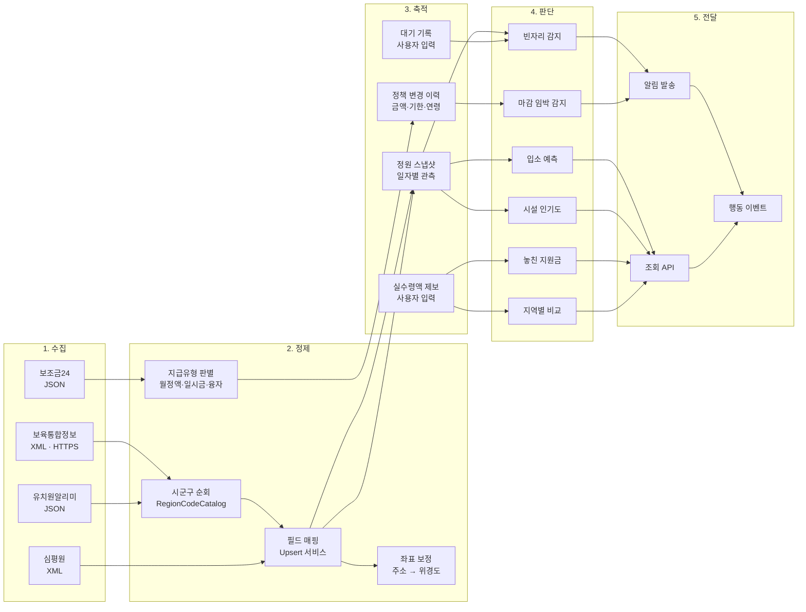
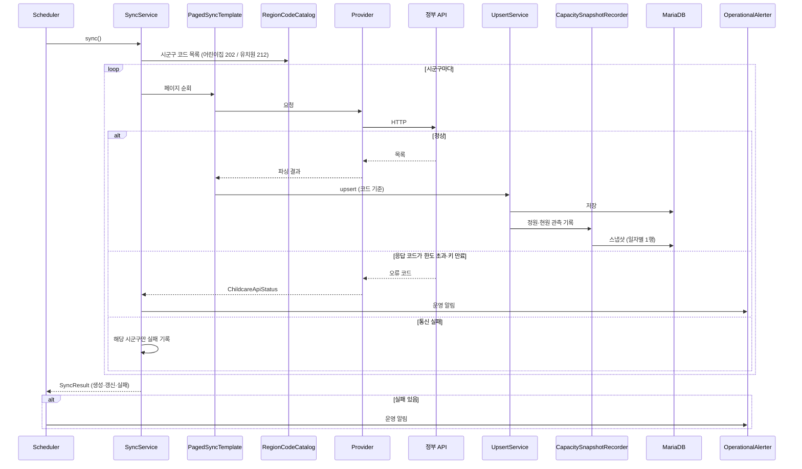
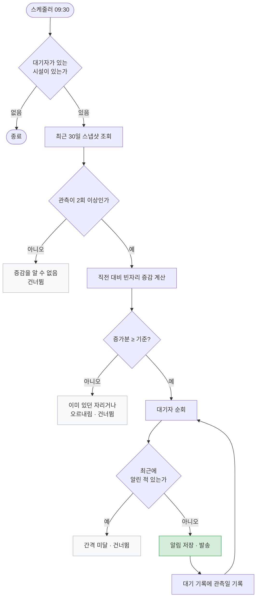
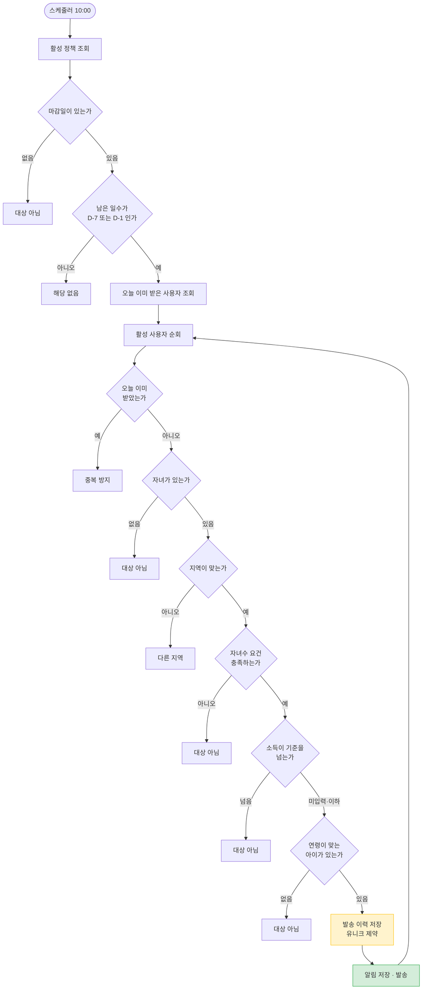
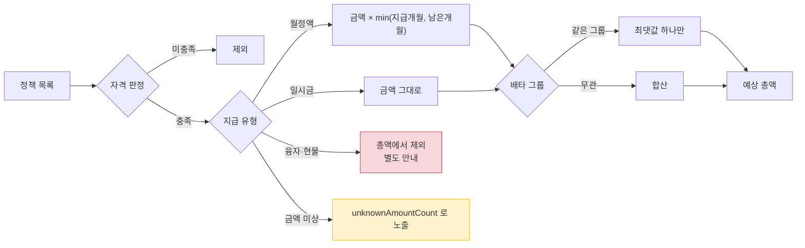

# 데이터 흐름

이 서비스의 가치는 **정부가 흩어놓은 데이터를 한 사람 기준으로 다시 조립하는 것**에서 나옵니다.
그 조립 과정을 단계별로 정리합니다.

## 전체 파이프라인

**3단계(축적)가 이 구조의 핵심**입니다. 정부 API 는 "지금 이 순간" 만 알려주고 과거를 주지 않습니다.
매일 관측해서 쌓아야만 "자리가 늘었다", "금액이 바뀌었다" 를 말할 수 있습니다.
그래서 스냅샷과 변경 이력은 기능이 아니라 **다른 모든 판단의 재료**입니다.

## 공공데이터 수집 상세

한 시군구가 실패해도 **나머지는 계속 돕니다.** 전국 데이터는 일부가 비어도 쓸 수 있지만,
하나 때문에 전체가 멈추면 아무것도 못 씁니다.

## 빈자리 알림 판단

**"빈자리가 있다" 가 아니라 "빈자리가 늘었다" 로 판단합니다.**
계속 자리가 있는 시설은 사용자도 이미 알고 있어서, 매일 알리면 그냥 스팸이 됩니다.

## 마감 임박 알림 판단

**소득 미입력은 탈락시키지 않습니다.** 놓친 사람의 손해가 잘못 받은 알림의 성가심보다 훨씬 크기
때문입니다. 반대로 소득이 기준을 명확히 넘으면 보내지 않습니다.

발송 이력을 **먼저** 저장하는 것도 의도적입니다. 이 서비스는 Blue/Green 배포라 인스턴스가 잠깐
2대가 될 수 있고, 그러면 유니크 제약만이 중복을 막습니다.

## 지원금 총액 계산

이 계산은 처음에 **2억 9,506만 원** 이라는 값을 냈습니다. 원인이 두 가지였습니다.

1. 자격 요건(자녀수·소득)을 보지 않고 전부 더했습니다.
2. **대상 연령 상한을 지급 기간으로 착각**했습니다. 아빠육아휴직보너스 250만 원을 60개월 곱하면
   1억 5천만 원이 됩니다.

지급 기간 컬럼을 분리하고 자격 판정을 넣어 **8,056만 원**이 되었습니다.
자세한 내용은 [지원금 지능화 문서](../features/benefit-intelligence.md)에 있습니다.
