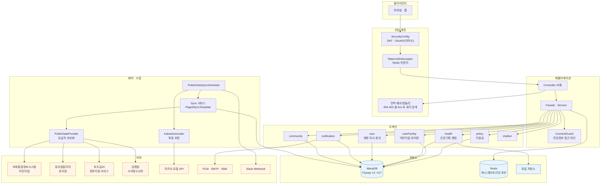
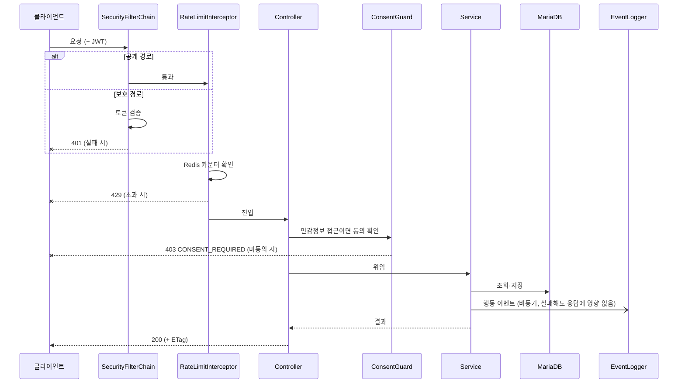

# 시스템 개요

## 한 장으로 보는 구성

## 계층 구조

| 계층 | 패키지 | 책임 |
|------|--------|------|
| 진입 | `core.security`, `core.RateLimitInterceptor`, `core.handler` | 인증·인가, 호출 제한, 예외의 상태코드 변환 |
| 표현 | `domain.*.controller` | HTTP 계약. 비즈니스 판단은 하지 않음 |
| 조합 | `domain.*.facade` | 여러 서비스를 묶어 화면 단위 응답을 만듦 |
| 도메인 | `domain.*.service` | 판단과 계산. 대부분의 설계 결정이 여기 있음 |
| 수집 | `core.client` | 공공데이터 공급자 추상화와 동기화 |
| 지표 | `core.analytics` | 행동 이벤트 적재와 퍼널·리텐션 집계 |
| 운영 | `core.ops`, `core.scheduler` | 알림, 주기 실행 |

## 요청 처리 흐름

`EventLogger` 는 **비동기이고 큐가 차면 버립니다**. 지표 수집이 사용자 응답을 느리게 하거나
실패시키면 본말이 전도되기 때문입니다. 지표는 유실을 감수하고, 응답은 감수하지 않습니다.

## 배치 실행 시각

모두 `Asia/Seoul` 기준이며 프로퍼티로 덮어쓸 수 있습니다.

```mermaid
gantt
    title 일일 배치 순서
    dateFormat HH:mm
    axisFormat %H:%M

    section 수집
    어린이집 동기화 (월)      :03:00, 30m
    정부지원 서비스 동기화     :03:30, 30m
    유치원 동기화 (월)        :04:00, 30m
    병원 동기화 (화)          :03:00, 30m

    section 정제
    좌표 보정                :05:00, 30m

    section 발송
    정책 변경 알림            :09:00, 30m
    빈자리 알림              :09:30, 30m
    마감 임박 알림            :10:00, 30m
    실수령액 제보 요청 (수)    :10:00, 30m
```

순서에는 이유가 있습니다.

- **수집이 먼저, 발송이 나중**입니다. 알림은 그날 들어온 데이터를 근거로 나가야 합니다.
- **좌표 보정은 수집 뒤**입니다. 새로 들어온 시설이 보정 대상에 포함되어야 합니다.
- **빈자리 알림은 시설 동기화 뒤**입니다. 새 정원이 반영되어야 그날 난 자리가 잡힙니다.
- **어린이집과 유치원은 1시간 벌립니다.** 둘 다 전국 200여 개 시군구를 순회해서 오래 걸립니다.

자세한 내용은 [운영 문서](../features/operations.md)를 보세요.

## 저장소 사용 구분

| 저장소 | 용도 | 없으면 |
|--------|------|--------|
| MariaDB | 모든 영속 데이터 | 기동 불가 |
| Redis | 캐시, 레이트리밋, 리프레시 토큰 | **기동 불가** — `RateLimitingAspect` 가 `StringRedisTemplate` 을 요구 |
| 파일 저장소 | 건강기록 첨부 | 첨부 기능만 실패 |

Redis 가 필수라는 점은 로컬 개발에서 자주 걸립니다. 캐시는 `spring.cache.type=none` 으로 끌 수 있지만
레이트리밋은 끌 수 없습니다. 이건 [기동 안정화 문서](../quality/runtime-hardening.md)에 기록해 두었습니다.
