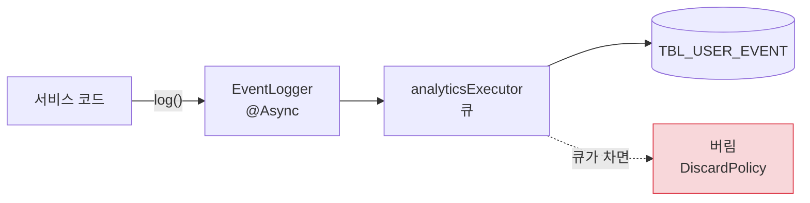
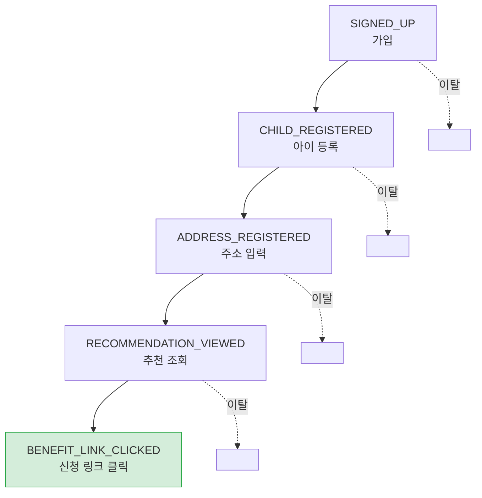

# 지표 수집

> 관련 이슈: #68 · 관련 마이그레이션: V8

## 문제

"사용자가 늘고 있다" 는 말은 아무것도 설명하지 못합니다.

- 가입한 사람 중 몇 명이 **아이를 등록**했는가
- 아이를 등록한 사람 중 몇 명이 **주소를 넣었는가**
- 주소를 넣은 사람 중 몇 명이 **추천을 봤는가**
- 추천을 본 사람 중 몇 명이 **신청 링크를 눌렀는가**

이걸 모르면 어디를 고쳐야 할지 알 수 없습니다.
개선은 짐작이 아니라 **어느 단계에서 사람이 빠져나가는지** 를 보고 결정해야 합니다.

## 이벤트 수집

**비동기이고, 큐가 차면 버립니다.**

지표 수집이 사용자 응답을 느리게 하거나 실패시키면 본말이 전도됩니다.
지표는 유실을 감수하고, 응답은 감수하지 않습니다.
트래픽이 몰릴 때 지표 몇 건을 잃는 것은 서비스가 느려지는 것보다 훨씬 낫습니다.

## 수집하는 이벤트

| 분류 | 이벤트 |
|------|--------|
| 온보딩 | `SIGNED_UP`, `CHILD_REGISTERED`, `ADDRESS_REGISTERED`, `INCOME_REGISTERED` |
| 지원금 | `MISSED_BENEFIT_VIEWED`, `BENEFIT_LINK_CLICKED`, `RECOMMENDATION_VIEWED`, `REGIONAL_COMPARISON_VIEWED` |
| 시설 | `FACILITY_VIEWED`, `ADMISSION_FORECAST_VIEWED`, `FACILITY_POPULARITY_VIEWED`, `WAITLIST_REGISTERED` |
| 알림 | `NOTIFICATION_SENT`, `NOTIFICATION_CLICKED` |
| 참여 | `BENEFIT_AMOUNT_REPORTED`, `APP_OPENED`, `BOOKING_CREATED`, `CHATBOT_ASKED` |

## 온보딩 퍼널

### 전환율 계산 방식

각 단계의 전환율은 **직전 단계를 통과한 사용자만** 분모로 씁니다.

전체 가입자를 분모로 쓰면 "주소 입력률 30%" 같은 숫자가 나오는데,
이건 아이 등록에서 빠진 사람까지 포함한 값이라 **주소 입력 화면의 문제인지 아이 등록의 문제인지
구분할 수 없습니다.**

## 알림 전환 퍼널

`NOTIFICATION_SENT` → `NOTIFICATION_CLICKED` 를 알림 종류별로 봅니다.

이게 [알림 기능](notification-and-retention.md)의 효과를 판단하는 유일한 방법입니다.
발송 수만 세면 "많이 보냈다" 는 것 외에 아무것도 알 수 없습니다.

어떤 알림의 클릭률이 낮다면 그 알림은 **가치가 없거나 문구가 잘못된 것**이고,
그건 발송을 줄여야 한다는 신호입니다.

## 코호트 리텐션

가입 주차별로 묶어 이후 재방문을 봅니다.

응답 형태 (수치는 **설명용 예시**이며 실측값이 아닙니다):

| 가입 코호트 | D1 | D7 | D30 |
|-------------|----|----|-----|
| 5주 전 가입 | 값 | 값 | 값 |
| 2주 전 가입 | 값 | 값 | **null** |
| 이번 주 가입 | 값 | **null** | **null** |

**아직 오지 않은 시점은 0이 아니라 `null`** 입니다.

가입 1주일 된 코호트의 D30 리텐션을 0%로 표시하면 "리텐션이 무너지고 있다" 는 착시가 생깁니다.
측정할 수 없는 것과 0인 것은 다릅니다.

## 관련 API

| 메서드 | 경로 | 인증 |
|--------|------|------|
| GET | `/api/admin/analytics/funnel` | 관리자 |
| GET | `/api/admin/analytics/events` | 관리자 |
| GET | `/api/admin/analytics/notification-funnel` | 관리자 |
| GET | `/api/admin/analytics/retention` | 관리자 |

## 개인정보 관점

이벤트에는 사용자 ID 와 대상 식별자만 남기고 **개인 식별 정보는 담지 않습니다.**
회원 탈퇴 시 익명화 대상에 포함됩니다. 자세한 내용은 [개인정보 문서](privacy-and-legal.md)를 보세요.

## 미해결

| 항목 | 내용 |
|------|------|
| 검색어 로그 | 사용자가 무엇을 찾는지 = 다음에 무엇을 만들지의 근거인데, 아직 수집하지 않습니다 |
| 이벤트 보존 기간 | 무한 적재 중입니다. 파티셔닝이나 아카이빙 정책이 필요합니다 |
