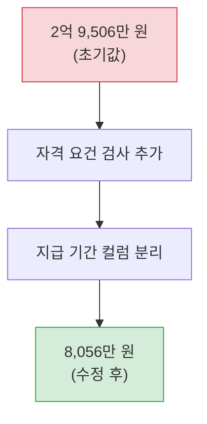
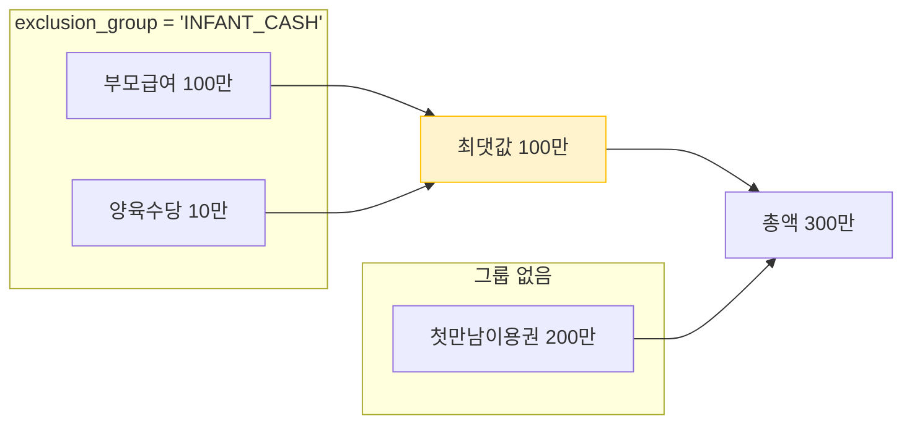
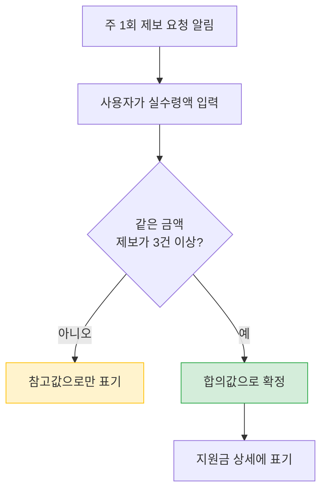
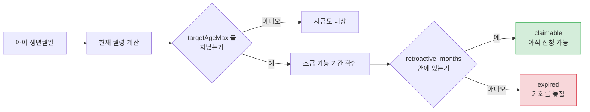

# 지원금 지능화

> 관련 이슈: #65 #67 #69 · 관련 마이그레이션: V6, V7, V9, V11, V12, V14

## 문제

육아 지원금은 **중앙정부와 지자체가 따로 운영**합니다.
받을 수 있는데 몰라서 못 받는 경우가 흔하고, 조건이 복잡해 본인이 대상인지 판단하기 어렵습니다.

"목록을 보여준다" 는 검색만으로는 이 문제를 풀지 못합니다.
**이 사람이 얼마를 받을 수 있는지**를 계산해야 합니다.

## 기능 구성

```mermaid
mindmap
  root((지원금 지능화))
    맞춤 추천
      자녀 월령
      거주지
      소득분위
      자녀수
    놓친 지원금
      지나온 월령 구간 역추적
      소급 신청 가능 여부
      마감까지 남은 개월
    지역 비교
      현재 거주지 총액
      다른 지역 총액
      차액과 근거
    금액 신뢰도
      수기 검증
      실수령액 제보
      3인 합의
    변경 감지
      금액·기한·연령
      지역별 알림
```

## 자격 판정

세 가지를 봅니다. 판정 결과는 **세 갈래**입니다.

| 결과 | 조건 | 처리 |
|------|------|------|
| `ELIGIBLE` | 요건을 모두 충족 | 총액에 포함 |
| `NOT_ELIGIBLE` | 자녀수 미달 또는 소득 초과 | 제외 |
| `UNKNOWN` | 소득을 입력하지 않음 | **제외하지 않고 보류로 표기** |

소득 미입력을 탈락으로 처리하면 **받을 수 있었던 지원금이 통째로 사라집니다.**
사용자는 자기가 왜 목록에서 그걸 못 봤는지도 모릅니다.

## 수령액 계산 — 두 번의 큰 오류

### 처음 결과: 2억 9,506만 원

지역 비교 기능을 붙이고 실행했더니 한 지역의 예상 총액이 **2억 9,506만 원**으로 나왔습니다.
명백히 틀린 값입니다.

### 원인 1 — 자격 요건을 보지 않았다

`minChildren`(최소 자녀수)과 `incomeThresholdPercent`(소득 기준)를 검사하지 않고
지역에 있는 정책을 전부 더하고 있었습니다. 다자녀 전용 지원금이 외동 가정에도 합산됐습니다.

### 원인 2 — 대상 연령을 지급 기간으로 착각했다

이쪽이 더 컸습니다. `targetAgeMax`(대상 연령 상한, 개월)를 **지급 개월 수**로 쓰고 있었습니다.

> 아빠육아휴직보너스: 월 250만 원 × `targetAgeMax` 60 = **1억 5천만 원**

실제로는 최대 3개월만 지급됩니다. `max_payment_months` 컬럼을 분리(V7)하고
지급 유형을 판별하도록 고쳤습니다.

### 수정 후: 8,056만 원

## 지급 유형 판별

`BenefitPaymentType` 이 정책 설명에서 지급 방식을 구분합니다.

| 유형 | 계산 | 이유 |
|------|------|------|
| 월정액 | 금액 × min(지급개월, 남은 대상 개월) | 실제 받을 기간만큼만 |
| 일시금 | 금액 그대로 | 한 번 받고 끝 |
| 융자 | **총액에서 제외** | 갚아야 하는 돈이라 "받는 돈" 이 아님 |
| 현물·바우처 | 총액에서 제외 | 현금 총액과 섞으면 오해를 부름 |
| 미상 | `unknownAmountCount` 로 노출 | 버리면 존재 자체를 모름 |

**융자를 지원금 총액에 넣으면 안 됩니다.** 연 1.5% 대출 3천만 원을 "받을 수 있는 돈" 이라고
표시하면 그건 거짓말입니다.

## 중복 수급 배타 그룹 (V14)

같은 목적의 지원금은 **동시에 받을 수 없습니다.** 예를 들어 부모급여와 양육수당은 택일입니다.
전부 더하면 실제로 받을 수 없는 금액이 나옵니다.

`exclusion_group` 컬럼으로 묶고, 같은 그룹 안에서는 **가장 큰 금액 하나만** 총액에 넣습니다.

## 금액 신뢰도 — 두 가지 경로

정책 금액은 자유 텍스트에서 추출하므로 틀릴 수 있습니다.
**자동 파싱을 신뢰하지 않기로** 하고, 대신 두 가지를 만들었습니다.

### 1. 수기 검증 (V9)

관리자가 확인한 정책에 `verified_at`, `verified_by` 를 남깁니다.
응답에 **지역별 검증 비율**을 함께 노출해서 사용자가 얼마나 믿을지 판단할 수 있게 합니다.

### 2. 실수령액 제보와 합의 (V12)

실제로 받은 사람에게 금액을 묻습니다.

3인 합의를 기준으로 삼는 이유는, 한 사람의 오타나 착각이 전체 금액을 흔들면 안 되기 때문입니다.

제보 요청은 **주 1회(수요일)** 만 보냅니다. 매일 물으면 소음이 됩니다.

## 놓친 지원금

아이가 **이미 지나온 월령 구간**을 훑어 대상이었던 지원금을 찾습니다.

놓친 것을 `claimable`(아직 받을 수 있음)과 `expired`(놓침)로 나눠서 보여줍니다.
`expired` 를 굳이 보여주는 이유는, 둘째를 준비하는 부모에게는 그게 중요한 정보이기 때문입니다.

> 이 기능은 사후 대응입니다. 놓치기 **전에** 막는 쪽이 낫다는 판단으로
> [마감 임박 알림](notification-and-retention.md#신청-마감-임박-알림)을 추가했습니다.

## 지역별 비교

같은 조건에서 **다른 지역에 살면 얼마를 더 받는지** 계산합니다.
이사를 고민하는 가정에게는 실질적인 판단 재료이고, 지자체 간 격차를 드러내는 데이터이기도 합니다.

응답에는 총액만이 아니라 **차액의 근거가 되는 정책 목록**을 함께 담습니다.
숫자만 주면 믿을 이유가 없습니다.

## 정책 변경 감지 (V11)

동기화할 때마다 이전 값과 비교해 변경을 기록합니다.

| 변경 유형 | 감지 대상 |
|-----------|-----------|
| `CREATED` | 새 정책 등록 |
| `AMOUNT_CHANGED` | 지원 금액 변경 |
| `DEADLINE_CHANGED` | 신청 기한 변경 |
| `AGE_RANGE_CHANGED` | 대상 연령 변경 |

기록된 변경은 [해당 지역 사용자에게 알림](notification-and-retention.md)으로 나갑니다.

## 관련 API

| 메서드 | 경로 | 인증 |
|--------|------|------|
| GET | `/policies` | 공개 |
| GET | `/policies/search` | 공개 |
| GET | `/policies/categories` | 공개 |
| GET | `/policies/statistics` | 공개 |
| GET | `/policies/{id}` | 공개 |
| GET | `/policies/recommendations` | 인증 |
| GET | `/policies/missed-benefits` | 인증 |
| GET | `/policies/regional-comparison` | 인증 |
| POST | `/policies/{id}/amount-reports` | 인증 |
| GET/POST/DELETE | `/policies/bookmarks` | 인증 |

## 미해결

| 항목 | 내용 |
|------|------|
| 상위 30개 지자체 금액 수기 검증 | 자동 파싱 값은 참고용입니다. 사람이 확인해야 신뢰할 수 있습니다 |
| 배타 그룹 데이터 입력 | `exclusion_group` 은 구조만 있고 실제 그룹 지정은 수기 작업이 필요합니다 |
