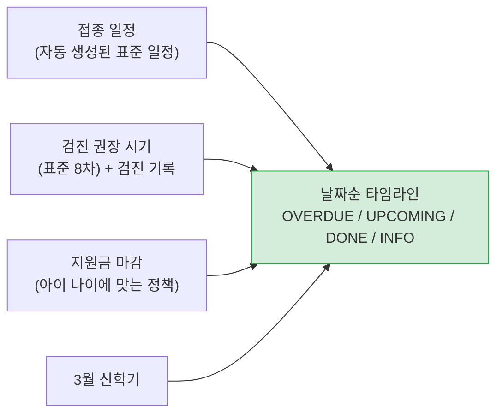

# 아이 할 일 타임라인

> 관련 이슈: #128

## 문제

부모가 "다음에 뭘 해야 하나" 를 알려면 화면 세 곳을 돌아야 했습니다.

| 할 일 | 있던 곳 |
|-------|---------|
| 예방접종 | 아이 상세 > 접종 일정 |
| 건강검진 | 건강 기록 (그나마 **받은 것만** 보였습니다) |
| 지원금 신청 마감 | 정책 화면 |
| 시설 입소 시기 | 어디에도 없음 |

특히 검진이 문제였습니다. `GET /health/checkups/schedule` 은 이름과 달리 **이미 기록된 검진을 나열**할
뿐이어서, 아직 받지 않은 검진은 화면에 나타나지 않았습니다. 놓쳐도 아무도 알려주지 않습니다.

## 해결 — 이미 있는 데이터를 한 축에 놓는다

`GET /children/{childId}/timeline?months=12`

새로 수집하는 데이터는 없습니다. 흩어져 있던 것을 날짜 하나로 정렬해 돌려줍니다.

| 항목 | 출처 | 상태 판단 |
|------|------|-----------|
| `VACCINATION` | `TBL_VACCINATION_SCHEDULE` | 완료·건너뜀은 제외. 기한이 지났으면 `OVERDUE` |
| `CHECKUP` | 표준 시기(`CheckupStandard`) + `TBL_HEALTH_RECORD` 의 검진 기록 | 그 시기에 기록이 있으면 `DONE`, 없이 지났으면 `OVERDUE` |
| `POLICY_DEADLINE` | `TBL_POLICIES` 의 신청 마감 | 마감일에 `UPCOMING` |
| `NEW_TERM` | 달력(3월) | 참고(`INFO`) |

## 판단 세 가지

### 놓친 항목을 감추지 않는다

지난 일이라고 목록에서 빼면 사용자는 놓친 사실 자체를 모릅니다. 조회 구간이 오늘부터여도
**기한이 지난 접종·검진은 담아** `OVERDUE` 로 표시하고, 개수를 `overdueCount` 로 함께 줍니다.

### 없는 날짜를 만들지 않는다

3월 신학기는 시설 입소가 몰리는 시점이지만 **신청 일정은 시설마다 다릅니다.** 그럴듯한 날짜를 적으면
그걸 믿고 놓치는 사람이 생기므로, 참고 항목으로만 두고 "시설에 직접 확인하세요" 라고 밝힙니다.

검증되지 않은 지원금 금액에도 같은 원칙을 적용합니다 — `verifiedAt` 이 없으면 설명에 추정치임을 붙입니다.

### 검진 회차는 날짜로 맞춘다

검진 기록에 회차 정보가 없어서, 권장 시기 구간 안에 기록이 있으면 받은 것으로 봅니다.
지금 데이터로 할 수 있는 최선이고, 회차를 받게 되면 `ChildTimelineService` 한 곳만 고치면 됩니다.

## 표준 검진 시기

국민건강보험 영유아 건강검진(생후 14일~71개월, 8차)을 `CheckupStandard` 에 담았습니다.
예방접종 일정(`VaccineType`)과 같은 방식입니다. 구강검진은 별도 회차라 넣지 않았습니다.
제도가 바뀔 수 있으므로 화면에는 "권장 시기" 로 표시합니다.

## 접근제어

아이 개인정보이므로 `/children/**` 인증 규칙을 따르고, 서비스에서 **보호자 본인 것만** 반환합니다.
남의 아이면 403 이 아니라 **404** 입니다 — 403 은 "그 아이가 존재한다" 는 사실을 알려 줍니다.

소유권 검증은 `ChildService.requireOwned` 하나만 씁니다. 검증을 복사하면 한쪽만 고쳐져 구멍이 남습니다.

## 한계

| 항목 | 내용 |
|------|------|
| 조회 기간 | 기본 12개월, 최대 36개월. 더 길게 보면 정책 마감이 의미 없어집니다 |
| 지원금 대상 판정 | 나이만 봅니다. 소득·다자녀 조건은 [지원금 지능화](benefit-intelligence.md)의 추천 API 가 봅니다 |
| 시설 신청 일정 | 공공데이터에 없습니다. 시설별 신청 일정을 받으면 `NEW_TERM` 을 실제 날짜로 바꿀 수 있습니다 |
