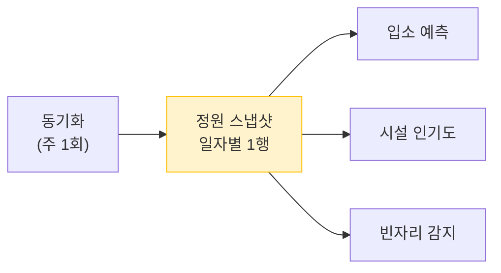
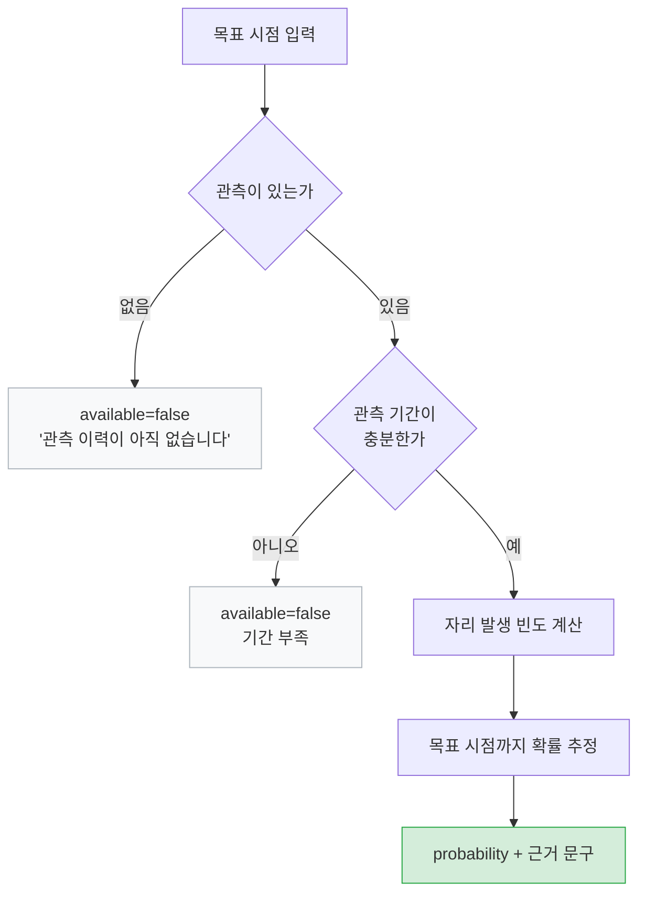
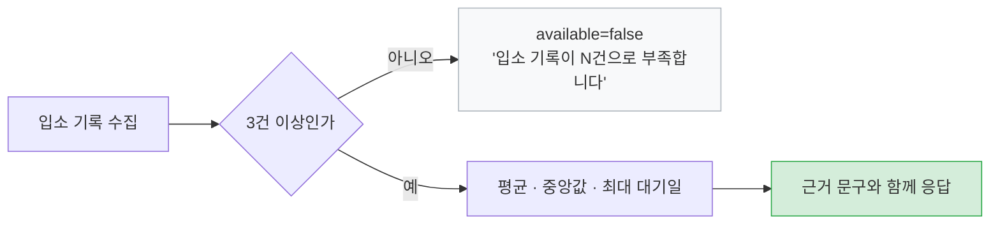
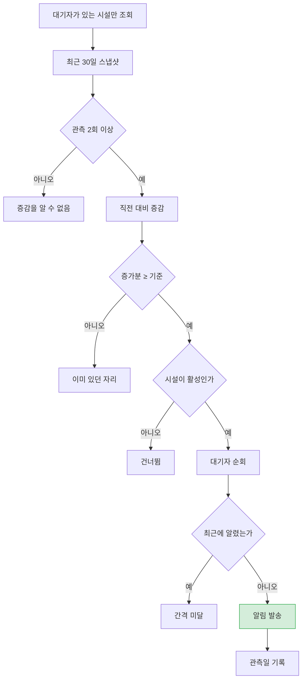

# 시설 지능화

> 관련 이슈: #65 #67 #69 #73 · 관련 마이그레이션: V5, V13, V16

## 문제

어린이집 대기는 부모가 겪는 가장 답답한 일 중 하나입니다.
**언제 자리가 나는지 아무도 알려주지 않습니다.** 시설에 전화해도 "기다려 보세요" 가 전부입니다.

정부 API 는 지금 이 순간의 정원과 현원을 줍니다. 그런데 그것만으로는
"이 시설은 자리가 잘 나는 곳인가" 를 알 수 없습니다. **과거를 주지 않기 때문입니다.**

## 해결의 출발점 — 관측을 쌓는다

`FacilityCapacitySnapshot`(V5)은 기능이 아니라 **다른 세 기능의 재료**입니다.
시설 행은 최신값만 갖고, 추이는 여기에 쌓입니다.

하루에 여러 번 동기화해도 같은 날짜면 갱신만 하므로 일자별로 한 행만 남습니다.

## 입소 가능 시점 예측

관측 이력에서 자리가 났던 횟수를 세어 확률을 추정합니다.

**근거가 부족하면 확률을 만들어내지 않습니다.** `available=false` 와 이유를 돌려줍니다.

이건 테스트로 고정해 두었습니다 — "관측이 없으면 확률을 만들어내지 않는다".
그럴듯한 숫자를 보여주는 쪽이 사용자 경험은 좋아 보이지만, 그 숫자를 믿고 다른 시설을 포기한
부모에게는 피해입니다.

## 시설 인기도

충원율 **추이**로 판단합니다. 현재 충원율만 보면 정원이 작은 시설이 항상 높게 나옵니다.

- 충원율이 계속 높게 유지 → 인기 있음
- 자리가 나도 금방 채워짐 → 인기 있음
- 정원 대비 대기 등록이 많음 → 인기 있음

## 대기 기록 (V13)

정원 관측은 "자리가 났는가" 만 알려줍니다. **대기 순번이 언제 도는지는 겪은 사람만 압니다.**
그래서 사용자가 직접 기록하게 합니다.

| 상태 | 의미 |
|------|------|
| `WAITING` | 대기 중 |
| `ADMITTED` | 입소 |
| `GAVE_UP` | 포기 |

입소·포기 시점이 찍혀야 **대기 기간 데이터가 완성**됩니다.

### 통계는 표본이 모여야 낸다

표본이 3건 미만이면 평균이 우연에 좌우됩니다. 그럴 때는 숫자 대신 이유를 돌려줍니다.

응답에는 "입소한 N명의 실제 기록 기준입니다", "절반이 N개월 안에 입소했습니다" 처럼
**근거를 문장으로** 함께 담습니다. 숫자만으로는 얼마나 믿을지 판단할 수 없습니다.

## 빈자리 알림 (V16) — 끊겨 있던 루프

여기가 이 도메인에서 가장 큰 구멍이었습니다.

**정원 스냅샷은 자리가 났다는 사실을 알고 있었고 대기 명단도 있었는데, 둘을 잇는 코드가 없었습니다.**
입소 예측까지 만들어 놓고 정작 그 예측이 맞았을 때 알려주지 않았습니다.
사용자는 직접 들어와 확인해야만 알 수 있었습니다.

### 판단 기준: "있다" 가 아니라 "늘었다"

빈자리가 **계속 있는** 시설은 사용자도 이미 압니다. 매일 알리면 그냥 스팸입니다.
그래서 새로 늘어난 자리만 알립니다.

### 빈자리 계산 — 두 가지 경로

공공데이터는 빈자리를 직접 주기도 하고 정원·현원만 주기도 합니다.

1. `availableSpots` 가 있으면 그대로 사용
2. 없으면 `capacity - currentEnrollment`
3. 둘 다 없으면 **판단하지 않음** (0으로 간주하지 않음)

없는 값을 0으로 채우면 "자리가 났다" 는 잘못된 알림이 나갑니다.

### 알리지 않는 것도 설계다

| 상황 | 처리 | 이유 |
|------|------|------|
| 관측 1회 | 발송 안 함 | 늘었는지 줄었는지 알 수 없음 |
| 빈자리 동일 | 발송 안 함 | 이미 알고 있음 |
| 빈자리 감소 | 발송 안 함 | 알릴 내용이 아님 |
| 최근 14일 내 발송 | 발송 안 함 | 같은 자리 반복 알림은 신뢰를 잃음 |
| 대기자 없음 | 시설 조회조차 안 함 | 전국 시설을 다 뒤지면 대부분이 헛일 |

### 알림 문구에 한계를 밝힌다

공공데이터는 **시설 전체 정원만** 줍니다. 어느 반에 자리가 났는지는 알 수 없습니다.
0세반이 찼는데 5세반에 자리가 난 것일 수도 있습니다.

> "대기 등록해 두신 행복어린이집의 빈자리가 2자리 늘어 현재 3자리입니다. (2026-08-06 관측 기준)
> **시설 전체 기준이라 해당 반에 자리가 있는지는 시설에 확인해 보세요.**"

이 한 문장이 없으면 부모가 헛걸음합니다. 정확한 척하지 않는 것이 더 나은 제품입니다.

### 실기동 검증

| 시나리오 | 결과 |
|----------|------|
| 빈자리 0 → 3 변화, 대기자 1명 | **알림 1건 발송** |
| 같은 조건 재실행 | **0건** (중복 방지 동작) |
| 대기 기록 `VACANCY_NOTIFIED_AT` | 관측일 기록 확인 |

## 관련 API

| 메서드 | 경로 | 인증 |
|--------|------|------|
| GET | `/facilities` | 공개 |
| GET | `/facilities/radius` | 공개 |
| GET | `/facilities/popular` | 공개 |
| GET | `/facilities/statistics` | 공개 |
| GET | `/facilities/{facilityId}/admission-forecast` | 공개 |
| GET | `/facilities/search` | 인증 |
| POST | `/facilities/{facilityId}/waitlist` | 인증 |
| GET | `/facilities/waitlist/me` | 인증 |
| PATCH | `/facilities/waitlist/{waitlistId}` | 인증 |
| GET | `/facilities/{facilityId}/waitlist/stats` | 공개 |
| POST | `/api/admin/public-data/facilities/notify-vacancy` | 관리자 |

## 설정

| 프로퍼티 | 기본값 | 설명 |
|----------|--------|------|
| `app.facility-vacancy.min-interval-days` | 14 | 같은 사람에게 다시 알리기까지 최소 간격 |
| `app.facility-vacancy.min-increase` | 1 | 이만큼 늘어야 알림 |
| `app.scheduler.public-data.vacancy-cron` | `0 30 9 * * *` | 실행 시각 (시설 동기화 이후) |

## 미해결

| 항목 | 내용 |
|------|------|
| 반별 정원 | 공공데이터가 주지 않습니다. 시설 직접 입력이나 크라우드 제보가 필요합니다 |
| 대기 순번 검증 | 사용자가 입력한 순번을 검증할 방법이 없습니다 |
