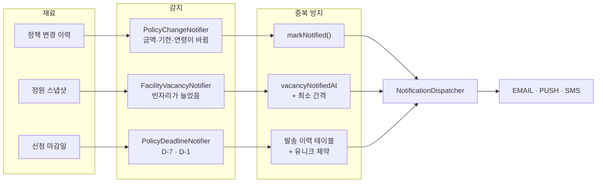
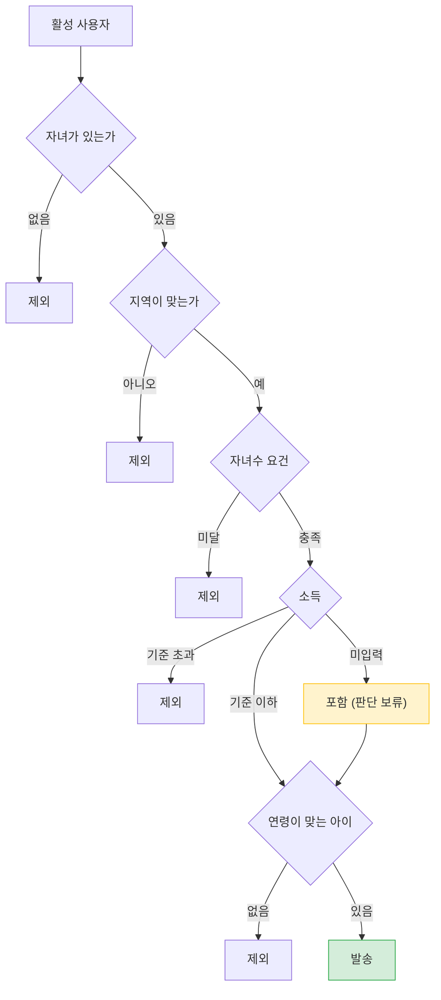
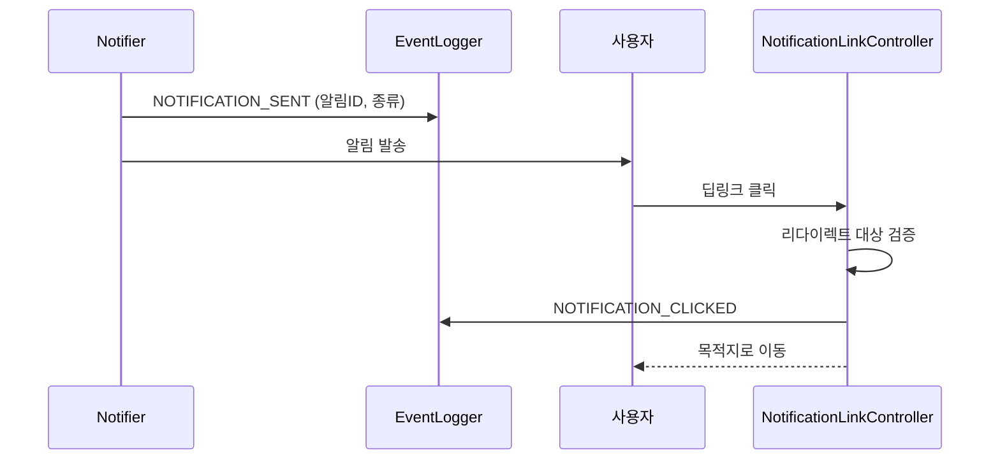

# 알림과 리텐션

> 관련 이슈: #69 #73 #74 · 관련 마이그레이션: V11, V16, V17

## 문제

이 앱은 **"한 번 보고 끝"** 이 되기 쉽습니다.
지원금을 한 번 조회하고 나면 다시 열 이유가 없습니다.

알림은 다시 열 이유를 만드는 **유일한 경로**입니다. 그런데 알림이 성가시면 앱을 지웁니다.
그래서 이 도메인의 설계는 대부분 **"언제 보내지 않을 것인가"** 에 대한 것입니다.

## 알림 3종



| 알림 | 계기 | 대상 | 실행 |
|------|------|------|------|
| 정책 변경 | 동기화에서 금액·기한·연령 변경 감지 | 해당 지역 사용자 | 매일 09:00 |
| 빈자리 | 대기 시설의 빈자리 **증가** | 그 시설 대기자 | 매일 09:30 |
| 마감 임박 | 신청 마감 D-7, D-1 | 조건이 맞는 사용자 | 매일 10:00 |
| 제보 요청 | 지원금 수령 여부 확인 | 대상자 | 주 1회 (수 10:00) |

## 신청 마감 임박 알림

### 왜 필요했나

`MissedBenefitService` 는 **이미 놓친 것을 사후에** 알려줍니다.
놓치기 전에 막는 쪽이 훨씬 낫고, 사용자가 실제로 돈을 받게 되는 순간이 이 서비스의 유일한 증명입니다.

`applicationEndDate` 컬럼도 있고 `DEADLINE_CHANGED` 변경 감지도 있었는데,
정작 "내 조건에 맞는 지원금이 D-7" 을 알려주는 기능은 없었습니다.

### 언제 보내는가

남은 일수가 **정확히** D-7 또는 D-1 인 날에만 보냅니다. (`app.policy-deadline.lead-days`)

- **D-7** — 서류를 준비할 시간을 줍니다.
- **D-1** — 그날 스케줄러가 실패했거나 알림을 놓친 사람에게 마지막 기회입니다.

### 대상 판단 — 넓게, 그러나 명확히 아닌 건 제외



마감 알림은 성격상 **조금 넓게 보내는 편이 낫습니다.**
놓친 사람의 손해가 잘못 받은 알림의 성가심보다 훨씬 크기 때문입니다.
그래서 소득 미입력은 배제하지 않습니다. 반대로 소득이 기준을 명확히 넘으면 보내지 않습니다.

### 중복 방지 — Blue/Green 에서 드러난 결함

처음 설계는 **"남은 일수가 D-7 인 날에만 보내니 하루 한 번"** 이었습니다.
별도 이력 테이블 없이 중복을 막는 깔끔한 방법이라고 생각했습니다.

그런데 이 서비스는 **Blue/Green 배포**입니다. 배포 중에는 인스턴스가 잠깐 2대가 되고,
각 인스턴스의 스케줄러가 모두 돌면 **모든 알림이 두 번씩** 나갑니다.

지원금 알림은 한 번 더 오는 순간 신뢰를 잃습니다. 그래서 발송 이력 테이블(V17)을 추가했습니다.

```sql
CONSTRAINT UK_POLICY_DEADLINE_NOTICE UNIQUE (POLICY_ID, USER_ID, NOTIFIED_ON)
```

발송 이력을 **먼저** 저장하고 알림을 보냅니다.
존재 확인은 반복 실행을 막고, 유니크 제약은 동시 실행을 막습니다.

### 실기동 검증

| 시나리오 | 결과 |
|----------|------|
| D-7 정책 2건 (청주·제주), 사용자는 청주 거주 | 지역이 맞는 **1건만 발송** |
| D-5 정책 | 대상에서 제외 |
| 같은 조건 **15회 재실행** | 모두 **0건** |
| 발송 이력 테이블 | 1행만 존재 |

## 딥링크와 클릭 측정

알림을 보내는 것과 **알림이 효과가 있는 것**은 다릅니다.
발송 수만 세면 아무것도 알 수 없습니다.



`NOTIFICATION_SENT` → `NOTIFICATION_CLICKED` 전환율이 **알림의 효과를 판단하는 유일한 지표**입니다.
알림 종류별로 나눠 보면 어떤 알림이 실제로 가치 있는지 알 수 있습니다.

### 오픈 리다이렉트 차단

딥링크와 지원금 신청 링크는 외부 URL 로 이동합니다.
검증 없이 리다이렉트하면 **우리 도메인을 경유한 피싱 통로**가 됩니다.
허용 대상을 확인한 뒤에만 이동합니다.

## 알림 폭주 방지

정책 동기화 직후에는 수천 건의 변경이 한꺼번에 쌓일 수 있습니다.

| 설정 | 기본값 | 목적 |
|------|--------|------|
| `app.policy-change.batch-size` | 200 | 한 번에 처리할 변경 수 |
| `app.policy-change.max-per-user` | 3 | 한 사람에게 보낼 최대 알림 수 (넘으면 묶어서 한 건) |

10건이 바뀌었다고 10개를 보내면 그날로 알림을 끕니다.

## 실패해도 표시한다

```java
} finally {
    // 실패해도 표시해 둔다. 재시도로 같은 알림이 반복되는 편이 더 나쁘다.
    change.markNotified();
}
```

발송이 실패했을 때 재시도하지 않는 것은 의도적입니다.
누락 한 건보다 **같은 알림이 계속 오는 쪽**이 사용자에게 더 나쁩니다.

## 발송 채널

`NotificationDispatcher` 가 EMAIL·PUSH·SMS 를 등록합니다.
FCM 자격증명이 없으면 **푸시만 비활성화**되고 나머지는 그대로 동작합니다.
기동을 막지 않습니다.

## 관련 API

| 메서드 | 경로 | 인증 |
|--------|------|------|
| GET | `/notifications` | 인증 |
| PATCH | `/notifications/{id}/read` | 인증 |
| GET | `/notifications/link/{id}` | 인증 (딥링크) |
| POST | `/api/admin/public-data/facilities/notify-vacancy` | 관리자 |
| POST | `/api/admin/public-data/policies/notify-deadline` | 관리자 |

관리자 수동 실행이 있는 이유는, 스케줄러가 하루 한 번만 돌아서
발송이 안 나갔을 때 원인을 확인하려면 다음 날까지 기다려야 하기 때문입니다.
확인한 시설 수까지 돌려주므로 **대기자가 없어서인지 자리가 안 나서인지** 구분됩니다.

## 로그를 두 번 찍던 문제

스케줄러와 서비스가 **같은 결과를 각각 로그**하고 있었습니다.

```
17:30:24 PolicyDeadlineNotifier   | 마감 임박 알림 - 정책 2건, 알림 1건 발송
17:30:24 PublicDataSyncScheduler  | 마감 임박 알림 - 정책 2건, 알림 1건 발송
```

검증 중에 이걸 보고 **"두 번 실행되어 중복 발송됐다"** 고 잘못 판단했습니다.
운영 중에 같은 오해를 하면 없는 장애를 쫓게 됩니다.
서비스가 이미 남기므로 스케줄러 쪽 로그를 걷어냈습니다. (기존 4개 작업 모두 같은 문제였습니다)
