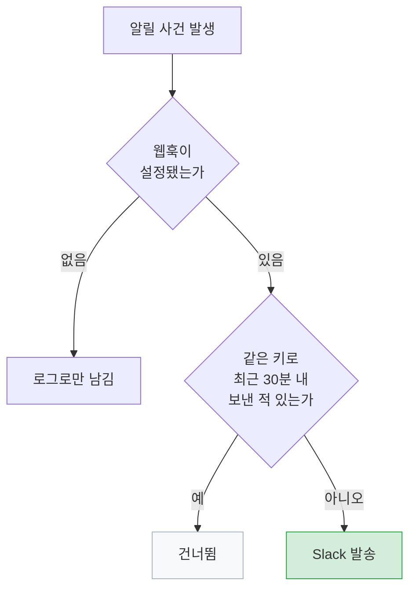
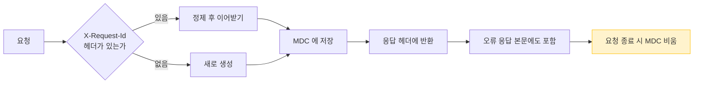

# 운영

> 관련 이슈: #68 #70

## 원칙

**사용자가 이미 실패를 겪은 뒤라면, 로그만 남겨서는 아무도 모릅니다.**

이 도메인의 기능들은 전부 "문제가 생겼을 때 사람이 알게 하는 것" 에 대한 것입니다.
동시에, **문제가 아닌 것으로 사람을 깨우지 않는 것** 도 똑같이 중요합니다.

## 운영 알림

`OperationalAlerter` 가 Slack 웹훅으로 보냅니다.



**키별 30분 쿨다운**이 있습니다. 같은 장애가 초당 수십 번 발생할 때
알림이 폭주하면 사람이 채널을 음소거하고, 그러면 알림 자체가 무의미해집니다.

웹훅이 없으면 기동을 막지 않고 로그로만 남깁니다. 로컬 개발에서 Slack 을 요구하면 안 됩니다.

### 무엇을 알리는가

| 사건 | 이유 |
|------|------|
| 동기화 미완료 | 데이터가 며칠씩 낡은 채로 서비스될 수 있음 |
| 동기화 부분 실패 | 특정 지역 데이터가 비어 있을 수 있음 |
| 공공데이터 한도 초과·키 만료 | 조용히 0건을 받으면 며칠 모르고 지나감 |
| 처리되지 않은 예외 | 5xx 는 사용자가 이미 실패를 겪은 뒤 |

### 무엇을 알리지 않는가

이게 더 중요합니다. 초기에는 **없는 URL 요청과 권한 거부까지 운영 알림**으로 올라갔습니다.

```
[운영알림] 처리되지 않은 예외: NoResourceFoundException - No static resource hospitals.
```

없는 URL 은 잘못된 요청이지 장애가 아닙니다. 봇이 `/wp-admin` 을 긁고 가면 알림이 울립니다.
그러면 **진짜 장애가 그 소음에 묻힙니다.**

전역 예외 핸들러에 다음을 추가해 걸러냅니다.

| 예외 | 응답 | 알림 |
|------|------|------|
| `NoResourceFoundException` | 404 | 안 보냄 |
| `AuthorizationDeniedException` | 403 | 안 보냄 |
| 그 외 미처리 예외 | 500 | 보냄 |

## 헬스체크

`/actuator/health` 는 로드밸런서와 컨테이너 오케스트레이터가 봅니다.
여기가 DOWN 이면 **멀쩡한 인스턴스가 내려갑니다.**

### 메일 헬스체크를 뺀 이유

기본 설정에서는 SMTP 에 연결하지 못하면 헬스체크 전체가 DOWN 이 됩니다.

```json
{"status":"DOWN","components":{"mail":{"error":"AuthenticationFailedException ..."}}}
```

메일은 부가 기능입니다. **메일 서버 장애 하나로 조회·검색·알림이 전부 멈추면** 안 됩니다.

```yaml
management:
  health:
    mail:
      enabled: false
```

메일 발송 실패는 알림 도메인에서 따로 잡습니다.

### 노출 범위

| 프로파일 | 노출 | Swagger |
|----------|------|---------|
| dev / docker | health, info, prometheus | 공개 |
| prod | health, info, prometheus | **비공개** |

운영에서 API 문서를 열어두면 공격 표면을 그대로 알려주는 셈입니다.

## 스케줄러

전부 `Asia/Seoul` 기준이며 프로퍼티로 덮어쓸 수 있습니다.

| 작업 | 기본 cron | 프로퍼티 |
|------|-----------|----------|
| 어린이집 동기화 | `0 0 3 * * MON` | `app.scheduler.public-data.facility-cron` |
| 정부지원 서비스 동기화 | `0 30 3 * * *` | `...benefit-cron` |
| 병원 동기화 | `0 0 3 * * TUE` | `...hospital-cron` |
| 유치원 동기화 | `0 0 4 * * MON` | `...kindergarten-cron` |
| 좌표 보정 | `0 0 5 * * *` | `...geocoding-cron` |
| 정책 변경 알림 | `0 0 9 * * *` | `...policy-change-cron` |
| 빈자리 알림 | `0 30 9 * * *` | `...vacancy-cron` |
| 마감 임박 알림 | `0 0 10 * * *` | `...policy-deadline-cron` |
| 제보 요청 | `0 0 10 * * WED` | `...report-ask-cron` |

순서의 근거는 [시스템 개요](../architecture/system-overview.md#배치-실행-시각)에 있습니다.

### 로그는 서비스에서만 남긴다

스케줄러와 서비스가 **같은 결과를 각각 로그**하던 시절이 있었습니다.

```
17:30:24 PolicyDeadlineNotifier   | 마감 임박 알림 - 정책 2건, 알림 1건 발송
17:30:24 PublicDataSyncScheduler  | 마감 임박 알림 - 정책 2건, 알림 1건 발송
```

검증 중에 이걸 **"두 번 실행되어 중복 발송됐다"** 고 잘못 읽었습니다.
운영 중에 같은 오해를 하면 없는 장애를 쫓게 됩니다. 스케줄러 쪽 로그를 걷어냈습니다.

## 수동 실행

스케줄러는 하루 한 번만 돕니다. 발송이 안 나갔을 때 원인을 확인하려면
**다음 날까지 기다려야 합니다.** 그래서 관리자 수동 실행을 열어 두었습니다.

| 경로 | 반환 |
|------|------|
| `POST /api/admin/public-data/facilities/sync` | 생성·갱신·실패 수 |
| `POST /api/admin/public-data/kindergartens/sync` | 동일 |
| `POST /api/admin/public-data/benefits/sync` | 동일 |
| `POST /api/admin/public-data/hospitals/sync` | 동일 |
| `POST /api/admin/public-data/facilities/geocode` | 보정·실패·남은 수 |
| `POST /api/admin/public-data/facilities/notify-vacancy` | **확인한 시설 수**, 자리 발생 시설 수, 발송 수 |
| `POST /api/admin/public-data/policies/notify-deadline` | 마감 임박 정책 수, 발송 수 |

빈자리 알림이 **확인한 시설 수**까지 돌려주는 이유는,
0건이 나왔을 때 **대기자가 없어서인지 자리가 안 나서인지** 구분하기 위해서입니다.

## 로깅

`logback-spring.xml` 에서 JSON 으로 남깁니다.

### 요청 추적

`TraceIdFilter` 가 모든 요청에 ID 하나를 붙입니다.



| 판단 | 이유 |
|------|------|
| 보안 필터보다 **먼저** 실행 | 401·404 처럼 컨트롤러에 닿기 전에 끝나는 요청도 추적해야 함 |
| 들어온 헤더를 **이어받음** | 로드밸런서·게이트웨이가 붙인 ID 와 같은 요청으로 묶임 |
| 응답 **헤더 + 오류 본문** 양쪽 | 사용자는 오류 화면을 캡처해 보내는데 헤더는 캡처에 안 나옴 |
| 외부 값 **정제** | 개행이 섞이면 로그 한 줄을 위조해 다른 요청인 것처럼 꾸밀 수 있음 |
| 종료 시 **MDC 비움** | 톰캣은 스레드를 재사용해서, 안 비우면 다음 요청 로그에 남의 ID 가 붙음 |

장애 조사는 사용자가 알려준 ID 하나로 시작합니다.

```bash
grep '"traceId":"notfound-77"' application.log
```

> 이전에는 `@LogExecutionTime` 안에서만 traceId 를 넣어서, 컨트롤러에 닿기 전에 끝난 요청은
> 아무 값도 없었습니다. 실제로 500 원인을 찾을 때 타임스탬프로 로그를 뒤져야 했습니다.

> Logback 의 기본값 문법은 `${VAR:-기본값}` 입니다.
> Spring 문법인 `${VAR:기본값}` 을 쓰면 변수가 없을 때 `..._IS_UNDEFINED` 경로가 되어
> **기동 자체가 실패합니다.** 자세한 내용은 [기동 안정화](../quality/runtime-hardening.md)에 있습니다.

## 필수 의존성

| 의존성 | 없으면 |
|--------|--------|
| MariaDB | 기동 불가 |
| Redis | **기동 불가** — `RateLimitingAspect` 가 `StringRedisTemplate` 을 요구 |
| SMTP | 메일만 실패 (헬스체크에는 영향 없음) |
| FCM | 푸시만 비활성화 |
| 카카오 지오코딩 키 | 좌표 보정만 건너뜀 |
| Slack 웹훅 | 운영 알림이 로그로만 남음 |

Redis 가 필수라는 점은 로컬 개발에서 자주 걸립니다.
캐시는 `spring.cache.type=none` 으로 끌 수 있지만 레이트리밋은 끌 수 없습니다.

## 배포

GitHub Actions → Docker 이미지 → **Blue/Green**.

Blue/Green 이라는 사실이 알림 설계에 직접 영향을 줍니다.
배포 중에는 인스턴스가 잠깐 2대가 되고, 각 인스턴스의 스케줄러가 모두 돌면
**중복 발송**이 생깁니다. 이 때문에 [마감 임박 알림](notification-and-retention.md#중복-방지--bluegreen-에서-드러난-결함)에
유니크 제약 기반 발송 이력을 넣었습니다.

## 미해결

| 항목 | 내용 | 이슈 |
|------|------|------|
| 배포 후 스모크 테스트 | 배포가 성공해도 실제로 도는지 확인하지 않습니다 | #51 |
| 스케줄러 단일 실행 보장 | 인스턴스별 중복 실행을 알림 쪽에서만 막고 있습니다. 분산 락이 근본 해결입니다 | — |
