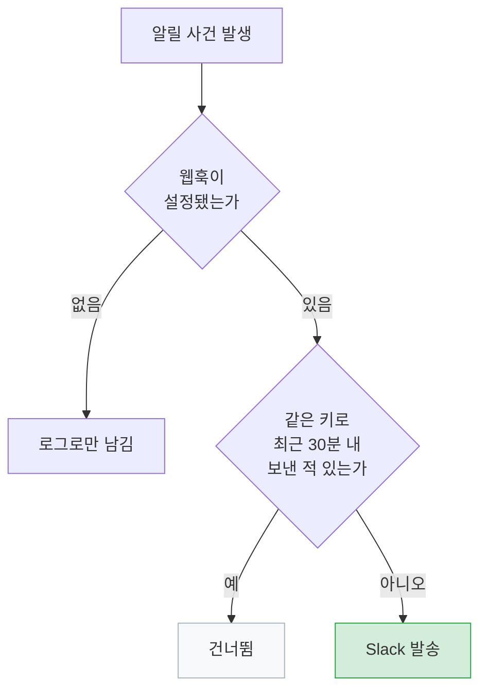
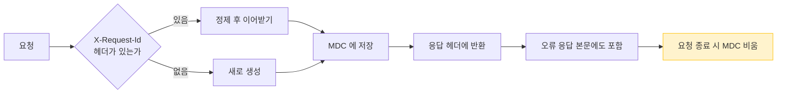

# 운영

> 관련 이슈: #68 #70

## 원칙

**사용자가 이미 실패를 겪은 뒤라면, 로그만 남겨서는 아무도 모릅니다.**

이 도메인의 기능들은 전부 "문제가 생겼을 때 사람이 알게 하는 것" 에 대한 것입니다.
동시에, **문제가 아닌 것으로 사람을 깨우지 않는 것** 도 똑같이 중요합니다.

## 운영 알림

`OperationalAlerter` 가 Slack 웹훅으로 보냅니다.



**키별 30분 쿨다운**이 있습니다. 같은 장애가 초당 수십 번 발생할 때
알림이 폭주하면 사람이 채널을 음소거하고, 그러면 알림 자체가 무의미해집니다.

웹훅이 없으면 기동을 막지 않고 로그로만 남깁니다. 로컬 개발에서 Slack 을 요구하면 안 됩니다.

### 무엇을 알리는가

| 사건 | 이유 |
|------|------|
| 동기화 미완료 | 데이터가 며칠씩 낡은 채로 서비스될 수 있음 |
| 동기화 부분 실패 | 특정 지역 데이터가 비어 있을 수 있음 |
| 공공데이터 한도 초과·키 만료 | 조용히 0건을 받으면 며칠 모르고 지나감 |
| 처리되지 않은 예외 | 5xx 는 사용자가 이미 실패를 겪은 뒤 |

### 무엇을 알리지 않는가

이게 더 중요합니다. 초기에는 **없는 URL 요청과 권한 거부까지 운영 알림**으로 올라갔습니다.

```
[운영알림] 처리되지 않은 예외: NoResourceFoundException - No static resource hospitals.
```

없는 URL 은 잘못된 요청이지 장애가 아닙니다. 봇이 `/wp-admin` 을 긁고 가면 알림이 울립니다.
그러면 **진짜 장애가 그 소음에 묻힙니다.**

전역 예외 핸들러에 다음을 추가해 걸러냅니다.

| 예외 | 응답 | 알림 |
|------|------|------|
| `NoResourceFoundException` | 404 | 안 보냄 |
| `AuthorizationDeniedException` | 403 | 안 보냄 |
| 그 외 미처리 예외 | 500 | 보냄 |

## 헬스체크

`/actuator/health` 는 로드밸런서와 컨테이너 오케스트레이터가 봅니다.
여기가 DOWN 이면 **멀쩡한 인스턴스가 내려갑니다.**

### 메일 헬스체크를 뺀 이유

기본 설정에서는 SMTP 에 연결하지 못하면 헬스체크 전체가 DOWN 이 됩니다.

```json
{"status":"DOWN","components":{"mail":{"error":"AuthenticationFailedException ..."}}}
```

메일은 부가 기능입니다. **메일 서버 장애 하나로 조회·검색·알림이 전부 멈추면** 안 됩니다.

```yaml
management:
  health:
    mail:
      enabled: false
```

메일 발송 실패는 알림 도메인에서 따로 잡습니다.

### 노출 범위

| 프로파일 | 노출 | Swagger |
|----------|------|---------|
| dev / docker | health, info, prometheus | 공개 |
| prod | health, info, prometheus | **비공개** |

운영에서 API 문서를 열어두면 공격 표면을 그대로 알려주는 셈입니다.

## 스케줄러

전부 `Asia/Seoul` 기준이며 프로퍼티로 덮어쓸 수 있습니다.

| 작업 | 기본 cron | 프로퍼티 |
|------|-----------|----------|
| 어린이집 동기화 | `0 0 3 * * MON` | `app.scheduler.public-data.facility-cron` |
| 정부지원 서비스 동기화 | `0 30 3 * * *` | `...benefit-cron` |
| 병원 동기화 | `0 0 3 * * TUE` | `...hospital-cron` |
| 유치원 동기화 | `0 0 4 * * MON` | `...kindergarten-cron` |
| 좌표 보정 | `0 0 5 * * *` | `...geocoding-cron` |
| 정책 변경 알림 | `0 0 9 * * *` | `...policy-change-cron` |
| 빈자리 알림 | `0 30 9 * * *` | `...vacancy-cron` |
| 마감 임박 알림 | `0 0 10 * * *` | `...policy-deadline-cron` |
| 제보 요청 | `0 0 10 * * WED` | `...report-ask-cron` |
| 데이터 신선도 점검 | `0 0 11 * * *` | `app.scheduler.freshness.cron` |
| 작업 이력 정리(90일) | `0 10 4 * * *` | `app.scheduler.sync-run-cleanup.cron` |

순서의 근거는 [시스템 개요](../architecture/system-overview.md#배치-실행-시각)에 있습니다.

### 데이터가 낡았는지 어떻게 아는가

동기화가 멈춰도 사용자 화면은 예전 데이터를 그대로 보여줍니다. 알림이 없으면 누군가
"요즘 목록이 안 늘던데" 라고 말할 때까지 모릅니다. 실제로 이 프로젝트에서 반복된 실패 방식입니다.

그래서 작업 실행을 `TBL_SYNC_RUN` 에 남깁니다. 로그는 지나가면 사라지고 질의할 수 없습니다.

| 상태 | 뜻 | 신선도로 인정 |
|------|-----|--------------|
| `SUCCESS` | 끝까지 돌았고 실패 건 없음 | O |
| `PARTIAL` | 끝까지 돌았지만 일부 항목 실패 | O (데이터는 갱신됨) |
| `INCOMPLETE` | 중간에 멈춤 (공공데이터 한도 초과 등) | X |
| `FAILED` | 예외로 죽음 | X |

예외는 `SyncRunTracker` 가 잡아 이력에 남기고 알린 뒤 **삼킵니다.** 한 작업의 실패가 뒤따르는
작업을 막지 않아야 하기 때문입니다. 이력 저장은 별도 트랜잭션이라, 작업이 자기 트랜잭션을
롤백해도 "돌았고 실패했다" 는 사실은 남습니다.

#### 기준과 알림

매일 11시에 작업별 기준을 넘겼는지 확인하고, 넘긴 작업을 **한 번에 묶어** 알립니다.
기준은 `app.sync.freshness.<작업코드>`(시간 단위)로 덮어쓸 수 있습니다.

| 작업 | 기본 기준 | 근거 |
|------|-----------|------|
| 어린이집·유치원 | 192시간(8일) | 주 1회 작업. 한 번 건너뛴 것은 견디고 두 번은 알린다 |
| 병원 | 216시간(9일) | 주 1회 작업 |
| 정부지원 서비스·좌표 보정 | 36시간 | 매일 작업 |
| 알림 작업 3종 | 36시간 | 매일 작업. 발송이 멈춘 것도 장애다 |
| 제보 요청 | 192시간 | 주 1회 작업 |

기동 직후에는 이력이 없어 전부 "낡음" 으로 보이므로, 성공 기록이 아예 없는 작업은
**기동 후 48시간이 지나서야** 알립니다. 새 서버가 첫 주기를 돌 시간을 주는 것입니다.

#### 어디서 보는가

| 경로 | 내용 |
|------|------|
| `GET /api/admin/sync/status` (ADMIN) | 작업별 마지막 성공 시각·경과 시간·기준 초과 여부·마지막 실행 결과 |
| `carecode.sync.last.success.age.seconds{job=...}` | 마지막 성공 이후 경과(초). 값이 없으면 한 번도 성공하지 않음 |
| `carecode.sync.stale{job=...}` | 기준 초과 여부(1=초과) |
| `GET /facilities/statistics`, `GET /health/hospitals/statistics` | 공개 통계의 `dataUpdatedAt` — 소개 사이트가 "○월 ○일 기준" 표시에 쓴다 |

수동 실행(`/api/admin/public-data/*/sync`)도 이력에 남습니다. 남기지 않으면 방금 돌린 동기화를
신선도 지표가 모르고 낡았다고 알립니다.

### 로그는 서비스에서만 남긴다

스케줄러와 서비스가 **같은 결과를 각각 로그**하던 시절이 있었습니다.

```
17:30:24 PolicyDeadlineNotifier   | 마감 임박 알림 - 정책 2건, 알림 1건 발송
17:30:24 PublicDataSyncScheduler  | 마감 임박 알림 - 정책 2건, 알림 1건 발송
```

검증 중에 이걸 **"두 번 실행되어 중복 발송됐다"** 고 잘못 읽었습니다.
운영 중에 같은 오해를 하면 없는 장애를 쫓게 됩니다. 스케줄러 쪽 로그를 걷어냈습니다.

## 수동 실행

스케줄러는 하루 한 번만 돕니다. 발송이 안 나갔을 때 원인을 확인하려면
**다음 날까지 기다려야 합니다.** 그래서 관리자 수동 실행을 열어 두었습니다.

| 경로 | 반환 |
|------|------|
| `POST /api/admin/public-data/facilities/sync` | 생성·갱신·실패 수 |
| `POST /api/admin/public-data/kindergartens/sync` | 동일 |
| `POST /api/admin/public-data/benefits/sync` | 동일 |
| `POST /api/admin/public-data/hospitals/sync` | 동일 |
| `POST /api/admin/public-data/facilities/geocode` | 보정·실패·남은 수 |
| `POST /api/admin/public-data/facilities/notify-vacancy` | **확인한 시설 수**, 자리 발생 시설 수, 발송 수 |
| `POST /api/admin/public-data/policies/notify-deadline` | 마감 임박 정책 수, 발송 수 |

빈자리 알림이 **확인한 시설 수**까지 돌려주는 이유는,
0건이 나왔을 때 **대기자가 없어서인지 자리가 안 나서인지** 구분하기 위해서입니다.

## 로깅

`logback-spring.xml` 에서 JSON 으로 남깁니다.

### 요청 추적

`TraceIdFilter` 가 모든 요청에 ID 하나를 붙입니다.



| 판단 | 이유 |
|------|------|
| 보안 필터보다 **먼저** 실행 | 401·404 처럼 컨트롤러에 닿기 전에 끝나는 요청도 추적해야 함 |
| 들어온 헤더를 **이어받음** | 로드밸런서·게이트웨이가 붙인 ID 와 같은 요청으로 묶임 |
| 응답 **헤더 + 오류 본문** 양쪽 | 사용자는 오류 화면을 캡처해 보내는데 헤더는 캡처에 안 나옴 |
| 외부 값 **정제** | 개행이 섞이면 로그 한 줄을 위조해 다른 요청인 것처럼 꾸밀 수 있음 |
| 종료 시 **MDC 비움** | 톰캣은 스레드를 재사용해서, 안 비우면 다음 요청 로그에 남의 ID 가 붙음 |

장애 조사는 사용자가 알려준 ID 하나로 시작합니다.

```bash
grep '"traceId":"notfound-77"' application.log
```

> 이전에는 `@LogExecutionTime` 안에서만 traceId 를 넣어서, 컨트롤러에 닿기 전에 끝난 요청은
> 아무 값도 없었습니다. 실제로 500 원인을 찾을 때 타임스탬프로 로그를 뒤져야 했습니다.

> Logback 의 기본값 문법은 `${VAR:-기본값}` 입니다.
> Spring 문법인 `${VAR:기본값}` 을 쓰면 변수가 없을 때 `..._IS_UNDEFINED` 경로가 되어
> **기동 자체가 실패합니다.** 자세한 내용은 [기동 안정화](../quality/runtime-hardening.md)에 있습니다.

## 필수 의존성

| 의존성 | 없으면 |
|--------|--------|
| MariaDB | 기동 불가 |
| Redis | **기동 불가** — `RateLimitingAspect` 가 `StringRedisTemplate` 을 요구 |
| SMTP | 메일만 실패 (헬스체크에는 영향 없음) |
| FCM | 푸시만 비활성화 |
| 카카오 지오코딩 키 | 좌표 보정만 건너뜀 |
| Slack 웹훅 | 운영 알림이 로그로만 남음 |

Redis 가 필수라는 점은 로컬 개발에서 자주 걸립니다.
캐시는 `spring.cache.type=none` 으로 끌 수 있지만 레이트리밋은 끌 수 없습니다.

## 배포

GitHub Actions → Docker 이미지 → **Blue/Green**.

Blue/Green 이라는 사실이 알림 설계에 직접 영향을 줍니다.
배포 중에는 인스턴스가 잠깐 2대가 되고, 각 인스턴스의 스케줄러가 모두 돌면
**중복 발송**이 생깁니다. 이 때문에 [마감 임박 알림](notification-and-retention.md#중복-방지--bluegreen-에서-드러난-결함)에
유니크 제약 기반 발송 이력을 넣었습니다.

### Blue/Green 을 뺀 이유

예전 워크플로는 두 색을 번갈아 띄우고 마지막에 라우터 HTTP API 를 호출해 전환했습니다.
그 API 를 제공하는 구현이 **어디에도 없습니다.** 호출은 항상 실패했고, 배포는 초록불이었지만
실제로는 트래픽이 새 컨테이너로 옮겨가지 않았습니다.

### 지금 방식 — 교체하고, 안 뜨면 되돌린다

```
docker pull
  → 현재 컨테이너가 쓰는 이미지 ID 를 기억 (태그가 아니라 ID: 같은 태그가 덮여도 예전 것을 가리킨다)
  → 기존 컨테이너 제거 → 새 이미지로 기동 → 헬스체크
      성공 → 끝 (오래된 이미지 정리)
      실패 → 기억해 둔 이전 이미지로 다시 기동 → 헬스체크 → 실패로 종료(서비스는 살아 있음)
```

교체 구간에 **20~40초 순단**이 있습니다. 무중단 검증(새 컨테이너를 먼저 띄워 확인)을 쓰지 않는 이유는
메모리입니다 — JVM 두 개가 동시에 뜨면 1GB 인스턴스에서는 그 순간 둘 다 죽습니다(측정: 제한 없을 때 858MB).
인스턴스를 2GB 이상으로 올리면 예비 포트 검증 방식으로 되돌릴 수 있습니다.

첫 배포에서 실패하면 되돌릴 이미지가 없으므로 서비스가 내려간 상태로 끝납니다. 로그와 함께 그 사실을 명시합니다.

### 필요한 GitHub 시크릿

배포 잡은 시작하자마자 아래를 확인하고, 비어 있으면 **이름을 찍어서** 실패합니다.
예전에는 `test -n "..."` 하나뿐이라 무엇이 없는지 로그에 남지 않았습니다.

| 시크릿 | 용도 |
|--------|------|
| `PRODUCTION_DEPLOY_HOST` / `PRODUCTION_DEPLOY_USER` | SSH 접속 대상 |
| `PRODUCTION_SSH_KEY` | SSH 개인키. **이 스텝이 없어서 시크릿을 채워도 인증에서 막혔습니다** |
| `PRODUCTION_HEALTH_URL` | 교체 후 외부에서 최종 확인 |

네 개면 됩니다. 라우터 시크릿 4종(`_ROUTER_STATUS_URL`, `_ROUTER_SWITCH_URL`,
`_ROUTER_TOKEN`, `_TARGET_HEALTH_URL_TEMPLATE`)은 더 이상 쓰지 않습니다.

스테이징은 `STAGING_` 접두사로 `DEPLOY_HOST` / `DEPLOY_USER` / `SSH_KEY` / `HEALTH_URL`.

선택 시크릿:

| 시크릿 | 없을 때 |
|--------|---------|
| `PRODUCTION_SSH_KNOWN_HOSTS` / `STAGING_SSH_KNOWN_HOSTS` | `ssh-keyscan` 으로 대체하고 경고를 남깁니다. 최초 접속을 그냥 믿는 건 같으므로, 중간자 공격을 막으려면 호스트키를 시크릿으로 고정하세요 |
| `OPS_SLACK_WEBHOOK_URL` | 잡 요약에만 남깁니다. 있으면 성공·실패를 슬랙으로 보냅니다 |

레지스트리 로그인은 잡 토큰(`GITHUB_TOKEN`)을 **stdin 으로** 서버에 흘려보냅니다.
ssh 인자로 넘기면 서버의 프로세스 목록에 그대로 보입니다.

### 서버 쪽 전제

- Docker 가 설치돼 있고 배포 사용자가 `docker` 를 실행할 수 있어야 합니다
- `/opt/carecode/.env` 가 있어야 합니다. 없으면 배포가 그 자리에서 멈춥니다
- 그 안에 `EMAIL_VERIFICATION_BASE_URL` 이 있어야 합니다. 없으면 애플리케이션이
  기동 단계에서 실패합니다(의도된 fail-fast). 검증 단계에서 걸리므로 **운영은 무사합니다**. 이슈 #90
- 컨테이너 이름은 `carecode` 로 통일합니다. 예전 워크플로가 만들던
  `carecode-blue` / `carecode-green` 은 교체 단계에서 함께 정리합니다
- **MariaDB 와 Redis 는 서버에 미리 있어야 합니다.** 배포는 앱 컨테이너만 교체합니다.
  Redis 는 운영에서 선택이 아닙니다 — 리프레시 토큰 폐기, 레이트 리밋, 이메일 인증코드가 여기에 있습니다.
  준비 명령은 [1GB 인스턴스(프리티어)에 올리기](#1gb-인스턴스프리티어에-올리기) 에 있습니다

## 1GB 인스턴스(프리티어)에 올리기

t2.micro·t3.micro 는 **메모리 1GB** 입니다. 여기서 앱·MariaDB·Redis 를 함께 돌릴 수 있는지
실제로 재봤습니다(같은 이미지, 같은 DB).

| 조건 | 결과 |
|------|------|
| 컨테이너 메모리 제한 없음 | **858MB 사용** — 제한이 없으면 JVM 이 호스트 전체(15.5GB)의 75%를 기준으로 잡는다 |
| `--memory=512m`, 예전 기본값(75%·G1) | **OOM 으로 죽음** (exit 137) |
| `--memory=512m`, 현재 기본값(55%·Serial) | 기동 성공, 464MB (91%) |
| `--memory=640m`, 현재 기본값 | 기동 성공, 520MB → 부하 후 575MB (90%) |

### 메모리 배분 (측정값)

| 구성 | 사용량 | 한도 |
|------|--------|------|
| 앱 | 520~575MB | `--memory=640m` |
| MariaDB (`innodb-buffer-pool-size=96M`) | 96~99MB | 320m |
| Redis | 9MB | 64m |
| OS + Docker | 150~200MB | — |
| **합계** | **약 800MB** | 1GB |

여유가 200MB 뿐이라 **스왑 2GB 는 필수**입니다. 배포 중 이미지 압축 해제와 주간 동기화가 겹치면
이 여유를 넘길 수 있습니다.

```bash
# 스왑 2GB (t2/t3.micro 에서 관례적으로 하는 설정)
sudo fallocate -l 2G /swapfile && sudo chmod 600 /swapfile
sudo mkswap /swapfile && sudo swapon /swapfile
echo '/swapfile none swap sw 0 0' | sudo tee -a /etc/fstab
```

### DB·Redis 준비

배포는 앱만 교체하므로 이 둘은 미리 띄워 둡니다. 앱은 같은 호스트의 `127.0.0.1` 로 붙습니다.

```bash
docker run -d --name carecode-mariadb --restart unless-stopped   --memory=320m -p 127.0.0.1:3306:3306   -e MARIADB_DATABASE=carecode -e MARIADB_USER=carecode   -e MARIADB_PASSWORD=... -e MARIADB_ROOT_PASSWORD=... -e TZ=Asia/Seoul   -v carecode-db:/var/lib/mysql mariadb:10.11   --character-set-server=utf8mb4 --collation-server=utf8mb4_unicode_ci   --lower-case-table-names=0 --innodb-buffer-pool-size=96M   --performance-schema=OFF --max-connections=30

docker run -d --name carecode-redis --restart unless-stopped   --memory=64m -p 127.0.0.1:6379:6379 redis:7-alpine   redis-server --maxmemory 48mb --maxmemory-policy noeviction
```

`--lower-case-table-names=0` 은 로컬·CI 와 같은 조건을 만들기 위한 것입니다. 이게 다르면
대문자 테이블명 마이그레이션과 매핑이 어긋나 기동이 실패합니다.

### 1GB 를 전제로 바꿔 둔 기본값

| 설정 | 값 | 이유 |
|------|-----|------|
| `JAVA_OPTS` | `-XX:MaxRAMPercentage=55 -XX:MaxMetaspaceSize=192m -XX:+UseSerialGC` | 힙 밖(메타스페이스·스레드·코드캐시)이 150MB 가까이 된다. 70%로 두면 한도를 넘겨 죽는다. vCPU 1~2개에서는 G1 의 백그라운드 스레드가 부담이다 |
| 배포 `--memory` | 640m (서버 `.env` 의 `APP_MEMORY` 로 변경) | 제한이 없으면 JVM 이 DB 몫까지 가져간다 |
| `DB_POOL_MAX_SIZE` | 8 (기존 20) | 커넥션마다 DB 가 버퍼를 잡는다. vCPU 수보다 조금 많은 정도가 처리량이 가장 좋다 |
| 이미지 | JRE + 레이어 분리 (1.25GB → 686MB) | 재배포 때 바뀐 애플리케이션 레이어(수 MB)만 받는다 |

### 진단 도구 (JRE 로 바꾼 뒤)

이미지에 `jcmd`·`jstack` 이 없습니다. 필요할 때 JDK 컨테이너를 같은 PID 공간에 붙여 씁니다.

```bash
docker run --rm --pid=container:carecode eclipse-temurin:17-jdk-jammy jcmd 1 VM.native_memory
docker run --rm --pid=container:carecode eclipse-temurin:17-jdk-jammy jstack 1
```

### 프리티어에서 더 볼 것

| 항목 | 내용 |
|------|------|
| CPU | 주 1회 전국 동기화가 202개 지역을 순회합니다(새벽 3시). t2.micro 는 CPU 크레딧이 고갈될 수 있습니다 — 서비스 지역만 남기면 크게 줄어듭니다 |
| 디스크 | 30GB EBS 로 충분합니다. 이미지가 쌓이지 않도록 배포가 `docker image prune` 을 돌립니다 |
| 업로드 파일 | 로컬 디스크입니다. 인스턴스를 늘리면 공유되지 않습니다 (이슈 #49) |
| 실시간 알림 | 연결이 인스턴스 메모리에 있습니다. 한 대 전제입니다 ([실시간 알림](realtime-notifications.md)) |

## 미해결

| 항목 | 내용 | 이슈 |
|------|------|------|
| 배포 후 스모크 테스트 | 배포가 성공해도 실제로 도는지 확인하지 않습니다 | #51 |
| 스케줄러 단일 실행 보장 | 인스턴스별 중복 실행을 알림 쪽에서만 막고 있습니다. 분산 락이 근본 해결입니다 | — |
