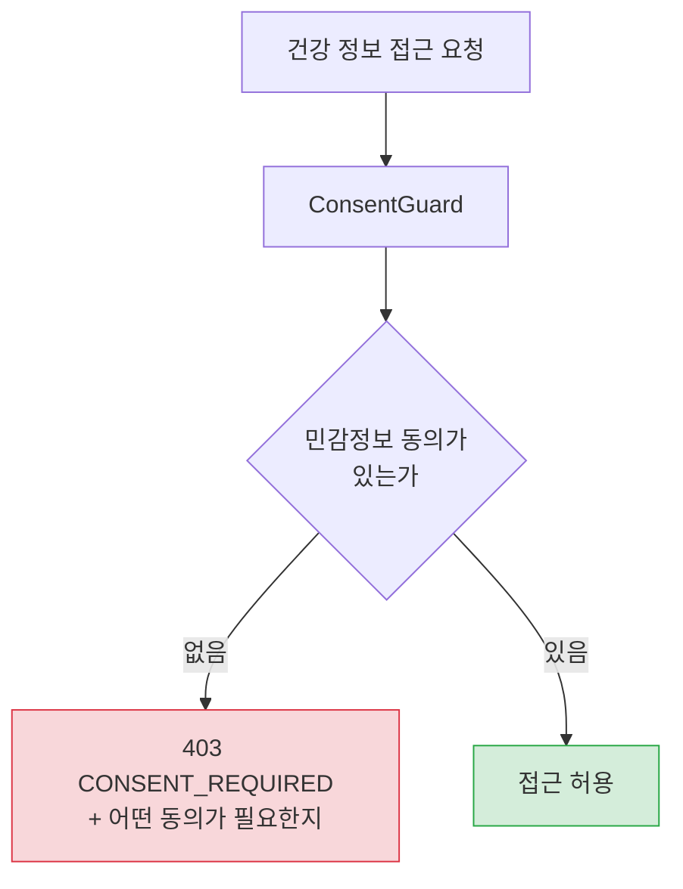

# 개인정보와 법적 문서

> 관련 이슈: #68 #71 · 관련 마이그레이션: V2, V15

## 문제

이 서비스는 **아이의 건강 정보**를 다룹니다. 진단명, 처방, 증상까지 저장합니다.
이건 개인정보보호법상 **민감정보**이고, 일반 개인정보와 같은 동의로 처리할 수 없습니다.

그런데 동의 기능(`UserConsent`, `ConsentGuard`)은 있는데
**정작 동의 대상 문서가 없었습니다.** 무엇에 동의하는지 모른 채 동의를 받고 있었습니다.

## 실제로 수집하는 항목

문서는 추상적인 양식이 아니라 **엔티티에 실재하는 필드**를 근거로 작성했습니다.

| 엔티티 | 항목 | 구분 |
|--------|------|------|
| `User` | 이메일, 이름, 전화번호, 주소, 위경도, 소득분위, 가구원수 | 일반 |
| `Child` | 이름, 생년월일, 성별, 특수보육 필요 여부 | 일반 (아동) |
| `HealthRecord` | 키, 몸무게, 체온, 혈압, 맥박, 접종명, **증상, 진단, 처방** | **민감정보** |

소득분위와 주소는 지원금 자격 판정에, 위경도는 반경 검색에 필요합니다.
필요 없는 항목은 받지 않는다는 원칙을 문서에 명시했습니다.

## 동의 분리와 접근 차단



거부할 때 **어떤 동의가 필요한지**를 응답에 담습니다.

```json
{
  "error": "CONSENT_REQUIRED",
  "consentType": "SENSITIVE_HEALTH",
  "displayName": "건강정보 수집·이용",
  "sensitive": true,
  "message": "...",
  "path": "..."
}
```

그냥 403만 주면 클라이언트가 동의 화면을 띄울 수 없습니다.
사용자는 왜 막혔는지 모른 채 화면만 보게 됩니다.

## 법적 문서

| 문서 | 경로 | 버전 |
|------|------|------|
| 개인정보 처리방침 | `src/main/resources/legal/privacy-policy-v1.0.md` | v1.0 |
| 서비스 이용약관 | `src/main/resources/legal/terms-of-service-v1.0.md` | v1.0 |

### 비로그인도 읽을 수 있어야 한다

```
.requestMatchers("/legal/**").permitAll()
```

**동의하기 전에 읽어야 하는 문서**입니다. 로그인해야 볼 수 있으면 순서가 뒤집힙니다.

### 버전을 파일명에 담는다

`LegalDocumentService` 가 `legal/privacy-policy-{version}.md` 를 읽습니다.
동의 이력에 버전을 남기므로, 나중에 "이 사용자가 어떤 내용에 동의했는지" 를 되짚을 수 있습니다.

> 처음에는 파일명을 `-v1.md`, 버전 상수를 `v1.0` 으로 두어 문서를 찾지 못했습니다.
> 파일명과 버전 문자열이 **정확히 일치**해야 합니다.

## 이용약관에 넣은 정확성 고지

이 서비스는 **추정치와 예측을 제공합니다.** 잘못된 기대는 그대로 분쟁이 됩니다.
그래서 약관 제6조에 명시했습니다.

| 기능 | 고지 내용 |
|------|-----------|
| 지원금 금액 | 참고자료이며 추정치입니다. 실제 수령액은 다를 수 있습니다 |
| 입소 예측 | 관측 기반 추정이며 입소를 보장하지 않습니다 |
| 성장 정보 | 의학적 진단이 아닙니다 |
| 빈자리 알림 | 시설 전체 기준이며 해당 반의 자리를 보장하지 않습니다 |

## 정보주체 권리

| 기능 | 경로 | 처리 |
|------|------|------|
| 내 데이터 열람 | `GET /users/privacy/export` | 저장된 개인정보 전체 반환 |
| 동의 관리 | `GET/POST /users/privacy/consents`<br/>`GET .../consents/history` | 동의 항목별 조회·변경 |
| 회원 탈퇴 | `DELETE /users/privacy/account` | 식별 정보 익명화 + 계정 비활성화 |

### 탈퇴는 물리 삭제가 아니다

식별 정보를 `deleted_{id}` 로 익명화하고 `deletedAt` 을 남깁니다.
`CustomUserDetailsService` 가 `deletedAt` 조건을 포함해 조회하므로 **탈퇴 계정은 로그인되지 않습니다.**

물리 삭제하지 않는 이유는, 커뮤니티 게시글이나 통계 표본처럼 다른 사용자의 데이터와
얽힌 부분이 함께 사라지면 서비스가 깨지기 때문입니다.

## 보관 기간

| 항목 | 기간 | 근거 |
|------|------|------|
| 회원 정보 | 탈퇴 시까지 | — |
| 동의 이력 | 5년 | 분쟁 대비 |
| 건강 정보 | 탈퇴 시 | (파기 방식 확정 필요) |

## 안전 조치

- 비밀번호는 단방향 해시로 저장합니다.
- 리프레시 토큰은 해시해서 저장하고 **HttpOnly 쿠키**로 발급합니다.
- 건강 정보는 소유권을 서비스 계층에서 검증합니다. (IDOR 방지)
- 개인정보는 로그·예외 메시지에 남기지 않습니다.

## 미해결 — **법률 검토 전까지 시행할 수 없습니다**

문서 안에 `[확인 필요]` 로 표시해 두었습니다. 제가 정할 수 없는 사실관계입니다.

| 항목 | 왜 필요한가 |
|------|-------------|
| 자녀 건강정보 파기 방식 | 익명화로 충분한지 완전삭제가 필요한지 |
| 클라우드 사업자 명시 | 처리 위탁 고지 의무 |
| 메일 발송 사업자 명시 | 처리 위탁 고지 의무 |
| 챗봇 Claude API 국외이전 | 국외 이전 동의를 별도로 받아야 하는지 |
| 개인정보 보호책임자 연락처 | 법정 필수 기재 사항 |

이 항목들이 채워지고 법률 검토를 받기 전에는 **v1.0 을 시행일 문서로 게시하면 안 됩니다.**
