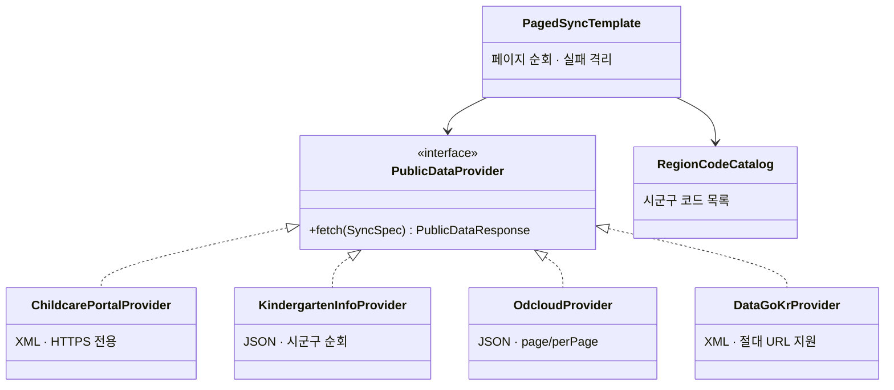
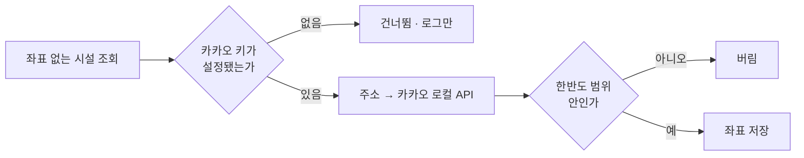

# 공공데이터 연동

> 관련 이슈: #61 #68 · 관련 마이그레이션: V3, V10

## 문제

이 서비스가 다루는 어린이집·유치원·병원·지원금은 전부 정부가 공개합니다.
그런데 **네 곳이 전부 다른 방식**입니다. 응답 형식도, 페이징 규칙도, 지역 코드 체계도 다릅니다.

각각에 맞춰 코드를 쓰면 새 데이터를 붙일 때마다 처음부터 다시 만들어야 하고,
한 곳이 장애를 내면 그게 어디서 온 문제인지 알기 어렵습니다.

## 연동한 4개 소스

| 소스 | 대상 | 형식 | 페이징 | 특이사항 |
|------|------|------|--------|----------|
| 보육통합정보시스템 | 어린이집 | XML | 없음 | **HTTPS 전용**, 시군구(`arcode`) 5자리, 지역당 50건 상한 |
| 유치원알리미 | 유치원 | JSON | 없음 | 시군구(`sggCode`) 순회 |
| 보조금24 (odcloud) | 정부지원 서비스 | JSON | `page`/`perPage` | 전국 단위 |
| 심평원 | 소아청소년과 | XML | `pageNo`/`numOfRows` | 요양기호가 자연키 |

### 실연동으로 확인한 수치

`./gradlew liveSyncCheck` 로 실제 키를 넣고 확인한 결과입니다.

| 소스 | 수집량 | 실패 |
|------|--------|------|
| 유치원 | 7,052곳 (212개 시군구) | 0건 |
| 어린이집 | 8,331곳 (202개 중 200개 시군구) | 2건 |
| 병원 | 200곳 수집 (전체 4,292곳) | 2건 |
| 정부지원 서비스 | 60건 | 0건 |

## 공급자 추상화



`PagedSyncTemplate` 이 순회와 실패 격리를 맡고, 공급자는 **"한 번 요청해서 목록을 준다"** 만 책임집니다.
새 데이터 소스를 붙일 때 작성할 코드가 공급자 하나로 줄어듭니다.

## 각 소스에서 실제로 겪은 문제

### 어린이집 — "연결 실패" 의 진짜 원인

처음에는 문서에 적힌 `http://api.childcare.go.kr` 로 붙였는데 계속 연결이 되지 않았습니다.
포트 80이 막혀 있었고 **HTTPS 로는 정상**이었습니다.

또 `arcode` 에 시도 코드(2자리)를 넣으면 빈 결과가 옵니다. **5자리 시군구 코드**여야 합니다.

### 어린이집 — 지역당 50건 상한

실연동 결과를 검증하다 지역마다 정확히 50건에서 끊기는 것을 발견했습니다.
페이징 파라미터가 명세에 없어서 더 가져올 방법이 없습니다.
**개발키의 제한으로 보이며, 운영키 전환이 필요합니다.** (미해결 — 아래 참조)

### 광주·전남이 두 API 모두에서 빈 결과

시도 코드 29(광주)와 46(전남)은 어린이집·유치원 **양쪽 모두** 데이터를 주지 않습니다.
우리 코드 문제가 아니라 정부 API 쪽 상태입니다.
이 사실을 `src/main/resources/public-data/*.txt` 주석에 남겨 두었습니다.
누군가 나중에 "왜 광주가 비었지" 를 다시 조사하지 않도록.

### 병원 — 진료과목과 종별을 섞어 담고 있었다

`clCdNm` 은 "상급종합", "종합병원" 같은 **요양기관 종별**인데 이걸 `type` 에 넣고 있었습니다.
그래서 "소아과" 로 검색하면 아무것도 나오지 않았습니다.

`type` 은 진료과목(소아청소년과), `grade` 는 종별로 분리했습니다. (V10)

### 정책 — 지자체 지역 매핑

보조금24 응답의 소관기관명은 "청주시청" 처럼 오지만 사용자 주소는 "충청북도 청주시 흥덕구" 입니다.
그대로 비교하면 매칭되지 않아서, 기관명에서 지자체명을 추출해 정규화합니다.

### 정책 — 금액 미상이 소실되던 문제

지원금 설명은 자유 텍스트라 `"국공립 100,000원, 사립 280,000원"`, `"융자(연 1.5%)"` 처럼 옵니다.
파싱에 실패한 정책을 그냥 버리면 **목록에서 사라져 사용자는 존재조차 모릅니다.**

버리지 않고 금액을 `null` 로 두되, 응답에 `unknownAmountCount` 로 몇 건이 미상인지 노출합니다.
정확한 척하는 것보다 모른다고 말하는 편이 낫습니다.

## 안전 장치

### XXE 차단

외부 XML 을 파싱하므로 `XmlResponseParser` 에서 외부 엔티티 확장을 끕니다.
정부 API 라고 신뢰할 이유가 없고, 중간자 공격이면 더욱 그렇습니다.

### 응답 코드 해석

보육통합정보시스템은 HTTP 200 으로 오면서 본문에 오류 코드를 담습니다.
`ChildcareApiStatus` 로 한도 초과·키 만료를 구분해 **운영 알림**으로 올립니다.
조용히 0건을 받아 "오늘은 데이터가 없네" 로 넘어가면 며칠씩 모르고 지나갑니다.

### 비밀값

API 키는 저장소에 넣지 않습니다. 환경변수로만 주입하고, 예외 메시지나 로그에도 남기지 않습니다.

## 좌표 보정

어린이집 API 는 **좌표를 주지 않습니다.** 반경 검색을 하려면 위경도가 필요합니다.



카카오 응답은 `x` 가 경도, `y` 가 위도입니다. 바꿔 넣으면 전국 시설이 동해 한가운데로 갑니다.
받은 좌표가 한반도 범위 안인지 검사하는 이유입니다.

키가 없으면 **기동을 막지 않고 건너뜁니다.** 좌표 보정은 부가 기능이라
로컬 개발자가 카카오 키 없이도 앱을 띄울 수 있어야 합니다.

## 관련 API

| 메서드 | 경로 | 설명 |
|--------|------|------|
| POST | `/api/admin/public-data/facilities/sync` | 전국 어린이집 동기화 |
| POST | `/api/admin/public-data/kindergartens/sync` | 전국 유치원 동기화 |
| POST | `/api/admin/public-data/benefits/sync` | 정부지원 서비스 동기화 |
| POST | `/api/admin/public-data/hospitals/sync` | 소아청소년과 동기화 |
| POST | `/api/admin/public-data/facilities/geocode` | 좌표 보정 |

전부 `ROLE_ADMIN` 이 필요합니다.

## 실연동 점검 방법

```bash
./gradlew liveSyncCheck \
  -Dchildcare.key=... -Dkindergarten.key=... -Dodcloud.key=... -Dhpsvc.key=...
```

`@Tag("live")` 가 붙어 있어 일반 빌드에서는 제외됩니다.
실제 정부 API 를 때리므로 CI 에서 매번 돌리면 한도를 소진합니다.

## 미해결

| 항목 | 내용 | 담당 |
|------|------|------|
| 어린이집 운영키 | 지역당 50건 상한 때문에 실제 수집량이 실제보다 적습니다 | 사용자 (키 신청) |
| 병원 전량 수집 | 현재 2페이지에서 끊습니다. 전체 4,292곳을 받으려면 상한 해제 필요 | 설정 변경 |
| 광주·전남 | 정부 API 가 비어 있습니다. 대체 소스 검토 필요 | 조사 필요 |
