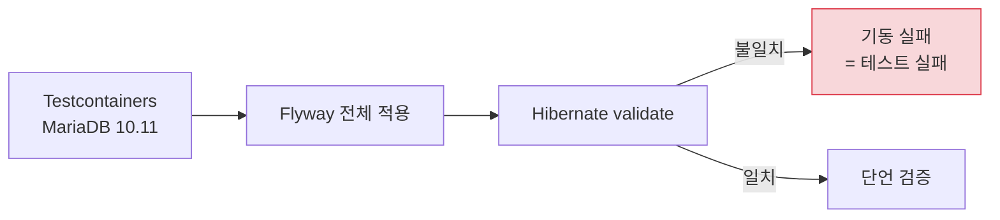
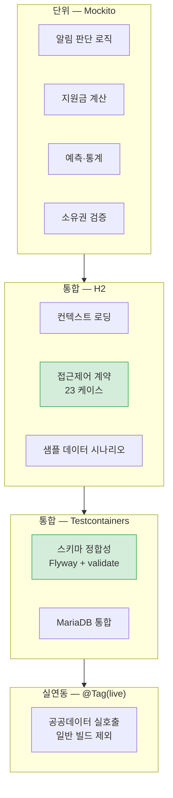

# 회귀 방지

> 관련 이슈: #72

## 문제 — 왜 CI 가 못 잡았나

[기동 안정화](runtime-hardening.md)에서 찾은 문제들은 전부 **CI 가 잡았어야 하는** 것들입니다.
테이블이 없고, 접근제어가 뒤집혀 있었는데 빌드는 계속 초록불이었습니다.

원인을 찾아보니 구조적이었습니다.

### 원인 1 — 모든 통합 테스트가 create-drop

```java
"spring.flyway.enabled=false",
"spring.jpa.hibernate.ddl-auto=create-drop",
```

통합 테스트 4개가 **전부** 이 설정이었습니다.
Hibernate 가 엔티티로부터 스키마를 만들어 내니, **Flyway 마이그레이션이 아무리 어긋나도 통과합니다.**

정책 북마크는 테이블 없이 API 와 리포지토리까지 있었고,
조회수는 컬럼이 없어 저장된 적이 없었는데, 그 상태로 모든 테스트가 초록불이었습니다.

**테스트가 검증한 것은 "엔티티끼리 앞뒤가 맞는가" 였지 "실제 스키마와 맞는가" 가 아니었습니다.**

### 원인 2 — 접근제어를 실제로 호출해 본 적이 없다

SecurityConfig 는 선언 순서에 따라 앞선 규칙이 뒤를 덮습니다.
게다가 클래스 레벨 `@PreAuthorize` 가 URL 규칙을 다시 덮습니다.

규칙 목록만 읽으면 "병원은 공개" 로 보이는데 실제로는 401 이었습니다.
**읽어서는 알 수 없고, 호출해 봐야 압니다.**

## 대응 1 — 스키마 정합성 테스트

`FlywaySchemaValidationTest` 는 **운영과 같은 방식**으로 띄웁니다.

```java
"spring.flyway.enabled=true",
"spring.jpa.hibernate.ddl-auto=validate",
```



엔티티에 필드를 추가하고 마이그레이션을 안 쓰면 **기동 단계에서 깨집니다.**

### MariaDB 컨테이너를 쓰는 이유

H2 로는 이 검증이 성립하지 않습니다.

- 마이그레이션에 MariaDB 전용 문법(FULLTEXT, COMMENT)이 있습니다.
- Linux MariaDB 는 `lower_case_table_names=0` 이라 **테이블명 대소문자를 구분**합니다.
  이 조건이어야 대문자 마이그레이션 / 소문자 매핑 불일치가 여기서 잡힙니다.

### 단언 항목

| 검증 | 목적 |
|------|------|
| 마이그레이션 성공 15건 이상 | 전부 적용됐는가 |
| 실패 0건 | 중간에 깨진 게 없는가 |
| `TBL_POLICY_BOOKMARKS`, `TBL_NOTIFICATION_CHANNEL` 존재 | 뒤늦게 채운 것들의 회귀 감시 |

가장 중요한 검증은 단언이 아니라 **컨텍스트가 뜬다는 사실 자체**입니다.
`validate` 가 실패하면 단언에 도달하기 전에 죽습니다.

## 대응 2 — 접근제어 계약 테스트

`AccessControlContractTest` 는 규칙을 읽는 대신 **실제 응답 코드**를 확인합니다.

```java
@ParameterizedTest
@ValueSource(strings = { "/actuator/health", "/legal/privacy-policy", "/policies",
                         "/facilities", "/health/hospitals", "/community/posts", ... })
void publicPathsDoNotRequireLogin(String path) {
    assertThat(status).isNotIn(401, 403);
}
```

| 구분 | 단언 | 이유 |
|------|------|------|
| 공개 경로 | 401·403 이 **아님** | 데이터가 없어 404 일 수는 있어도 인증을 요구하면 안 됨 |
| 보호 경로 | 정확히 **401** | 남의 개인정보가 걸린 경로는 뚫리면 그대로 사고 |

응답 **내용**이 아니라 **인가**만 봅니다. 그래야 테스트가 기능 변경에 흔들리지 않습니다.

### H2 를 쓰는 이유

접근제어는 DB 방언과 무관합니다. H2 in-memory 로 돌면 **Docker 없이도** 실행되므로
개발자가 로컬에서 항상 돌릴 수 있습니다.

현재 **23개 케이스, skip 0, 전부 통과**합니다.

## 대응 3 — 조용한 skip 방지

Testcontainers 테스트는 `disabledWithoutDocker = true` 라
**Docker 가 없으면 조용히 skip 되고 빌드는 초록불**이 됩니다.

스키마 검증이 그렇게 빠지면 이 테스트를 만든 의미가 없습니다.
CI 에 실행 여부 검사를 넣었습니다.

```yaml
- name: Assert schema validation actually ran
  run: |
    report=build/test-results/test/TEST-com.carecode.integration.FlywaySchemaValidationTest.xml
    if [ ! -f "$report" ]; then
      echo "::error::스키마 정합성 테스트 리포트가 없습니다."
      exit 1
    fi
    if grep -q 'skipped="0"' "$report"; then
      echo "스키마 정합성 테스트 실행 확인"
    else
      echo "::error::스키마 정합성 테스트가 skip 되었습니다. Docker 환경을 확인하세요."
      exit 1
    fi
```

CI 는 `ubuntu-latest` 라 Docker 가 있으므로 정상 실행됩니다.
이 검사는 **환경이 바뀌어 조용히 빠지는 상황**을 막습니다.

## 테스트 지형



| 계층 | 도구 | Docker | CI |
|------|------|--------|-----|
| 단위 | JUnit 5 + Mockito | 불필요 | 항상 |
| 통합(경량) | H2 in-memory | 불필요 | 항상 |
| 통합(스키마) | Testcontainers MariaDB | **필요** | 항상 (실행 여부 검사) |
| 실연동 | 실제 정부 API | 불필요 | **제외** (한도 소진) |

실연동 테스트를 CI 에서 빼는 이유는, 매 커밋마다 정부 API 를 때리면
**하루 호출 한도를 개발이 다 써버리기** 때문입니다. 필요할 때 수동으로 돕니다.

```bash
./gradlew liveSyncCheck -Dchildcare.key=... -Dkindergarten.key=...
```

## 새 기능을 추가할 때

| 바꾼 것 | 해야 할 일 |
|---------|-----------|
| 엔티티에 필드·테이블 추가 | 마이그레이션도 작성 (안 하면 스키마 테스트가 깨뜨림) |
| 컨트롤러에 경로 추가 | 접근제어 계약 테스트에 공개/보호 중 하나로 등록 |
| 클래스 레벨 `@PreAuthorize` 가 있는 컨트롤러에 공개 API 추가 | 메서드에도 `@PreAuthorize("permitAll()")` 필요 |
| 알림 발송 추가 | 중복 방지 수단 확보 (Blue/Green 에서 인스턴스가 2대가 됨) |

## 알려진 한계

| 항목 | 내용 |
|------|------|
| 로컬 Docker Desktop | 일부 환경에서 docker-java 가 Docker Desktop 29.x 에 붙지 못해 Testcontainers 테스트가 skip 됩니다. CI(ubuntu)에서는 정상입니다 |
| 접근제어 테스트 범위 | 전 경로가 아니라 대표 경로만 담았습니다. 새 경로는 수동 등록이 필요합니다 |
| 스케줄러 | 단위 테스트만 있고, 실제 cron 발화는 검증하지 않습니다 |
