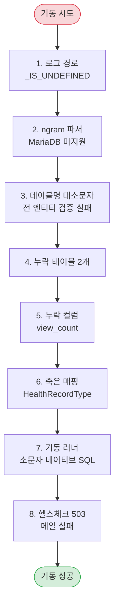

# 기동 안정화

> 관련 이슈: #70 · 관련 마이그레이션: V15

## 발단

기능을 여러 차례 추가하고 테스트도 전부 통과하던 시점에,
**"실제로 실행은 되는지"** 를 확인해 보기로 했습니다.

Docker 로 MariaDB 와 Redis 를 띄우고 `--spring.profiles.active=prod` 로 기동했습니다.

결과: **이 애플리케이션은 한 번도 정상 기동한 적이 없었습니다.**

여덟 개의 차단 요인이 **연쇄적으로** 나왔습니다. 하나를 고치면 다음 것이 나오는 식이었습니다.
그리고 기동에 성공한 뒤에도 접근제어 결함 두 건이 더 나왔습니다.

## 기동 차단 8건



### 1. Logback 기본값 문법

```xml
<!-- 잘못됨 — Spring 문법 -->
<file>${LOG_FILE:/var/log/carecode/application.log}</file>

<!-- 올바름 — Logback 문법 -->
<file>${LOG_FILE:-/var/log/carecode/application.log}</file>
```

Logback 은 `${VAR:-기본값}` 입니다. Spring 의 `${VAR:기본값}` 을 쓰면
변수가 없을 때 경로가 `..._IS_UNDEFINED` 가 되어 **기동 자체가 실패**합니다.

두 문법이 비슷해서 눈으로는 잘 안 보입니다.

### 2. ngram 파서는 MySQL 전용

```sql
-- 실패: Function 'ngram' is not defined
CREATE FULLTEXT INDEX ft_facility_search ON TBL_CARE_FACILITIES (NAME, ADDRESS) WITH PARSER ngram;
```

MariaDB 에는 `ngram` 파서가 없습니다. 마이그레이션 V4 가 실패하고 기동이 멈춥니다.

파서를 제거했습니다. MariaDB 내장 토크나이저는 공백 단위라 "행복어린이집" 같은 붙은 말은
부분 일치가 안 되지만, `FullTextSearchSupport` 가 짧은 키워드를 **LIKE 로 폴백**하므로
검색 자체는 동작합니다.

### 3. 테이블명 대소문자 불일치

Spring Boot 기본 네이밍 전략(`CamelCaseToUnderscoresNamingStrategy`)은 테이블 이름을 **소문자로** 바꿉니다.
그런데 마이그레이션은 `TBL_USER` 처럼 대문자로 만듭니다.

Linux MariaDB 는 `lower_case_table_names=0` 이라 대소문자를 구분하므로 **전 엔티티가 검증 실패**합니다.
(개발자 Windows 환경에서는 대소문자를 구분하지 않아 드러나지 않았습니다.)

반대로 이름을 전부 그대로 쓰면 `@Column` 없이 선언된 필드가 camelCase 로 남아 또 어긋납니다.

```java
public class CareCodeNamingStrategy extends CamelCaseToUnderscoresNamingStrategy {
    @Override
    public Identifier toPhysicalTableName(Identifier name, JdbcEnvironment context) {
        return name;   // @Table 로 선언한 이름은 손대지 않는다
    }
    // 컬럼은 기존처럼 snake_case 로 변환
}
```

### 4~5. DDL 에 없던 테이블과 컬럼

| 대상 | 상태 |
|------|------|
| `TBL_POLICY_BOOKMARKS` | **API 와 리포지토리까지 있는데 테이블이 없었습니다.** 한 번도 동작한 적이 없습니다 |
| `TBL_NOTIFICATION_CHANNEL` | 엔티티만 있고 테이블 없음 |
| `TBL_POLICIES.VIEW_COUNT` | 엔티티와 서비스는 쓰는데 컬럼이 없어 **조회수가 저장된 적이 없습니다** |

정책 북마크는 특히 나쁩니다. 컨트롤러·서비스·리포지토리가 다 있으니 **코드만 보면 완성된 기능**입니다.
호출하면 그때 터집니다.

이게 [회귀 방지 문서](regression-safety.md)를 쓰게 된 직접적인 계기입니다.

### 6. 참조 0건인 죽은 매핑

`HealthRecord` 가 `HealthRecordType` 을 `@ManyToOne` 으로 물고 있었는데,
**테이블이 존재한 적도 없고 코드에서 쓰는 곳도 없었습니다.** 매핑만 남아 검증을 막고 있었습니다.

엔티티와 매핑을 함께 제거했습니다.

### 7. 허구 데이터를 만들던 기동 러너

`CareFacilityDataMigrationService` 가 `CommandLineRunner` 로 **매 기동마다** 실행되면서
병원 데이터를 어린이집 테이블로 복사하고 있었습니다.

```java
.capacity(50)                    // 기본값
.rating(4.5)                     // 기본 평점
.facilityCode("CF" + System.currentTimeMillis() + (int)(Math.random() * 1000))
```

**정원 50, 평점 4.5는 지어낸 값**입니다. 초기 스캐폴딩 시절의 흔적인데,
지금은 전국 어린이집·유치원 동기화가 실데이터를 채우므로 **데이터를 오염시키기만** 합니다.

게다가 소문자 네이티브 SQL(`SELECT * FROM tbl_hospital`)을 써서 기동도 실패시켰습니다.

삭제했습니다. 다른 초기화 러너들은 전부 `@Profile("dev")` 로 막혀 있어 prod 에서 도는 건 이것뿐이었습니다.

### 8. 메일 헬스체크가 서비스 전체를 내린다

SMTP 인증에 실패하면 `/actuator/health` 가 503 을 반환합니다.
로드밸런서와 k8s 가 이걸 보고 **멀쩡한 인스턴스를 내려버립니다.**

메일은 부가 기능이라 헬스체크에서 분리했습니다. 자세한 내용은 [운영 문서](../features/operations.md#헬스체크)에.

## 기동 이후 발견한 접근제어 결함

### 병원 조회가 전부 로그인 필수였다

병원 API 의 실제 경로는 `/health/hospitals/**` 인데,
SecurityConfig 의 공개 규칙은 **존재하지 않는 경로**에 걸려 있었습니다.

```java
.requestMatchers("/health/**").authenticated()        // ← 이게 먼저 잡는다
.requestMatchers("/hospitals").permitAll()            // ← 이 경로는 없다
.requestMatchers("/hospitals/search").permitAll()     // ← 죽은 규칙
```

SecurityConfig 는 **앞선 규칙이 뒤를 덮습니다.** `/health/**` 가 전부 잡아버려서
병원 목록·검색·리뷰 조회가 통째로 로그인 필수였습니다.

규칙만 읽으면 "병원은 공개" 로 보입니다. **실제로 호출해 보기 전에는 알 수 없습니다.**

### 클래스 레벨 @PreAuthorize 가 URL 규칙을 덮는다

URL 규칙을 고쳤는데도 500 이 났습니다.

```java
@RestController
@RequestMapping("/health")
@PreAuthorize("isAuthenticated()")     // ← 클래스 전체에 적용
public class HealthController {
```

URL 규칙을 통과해도 메서드 진입 시 다시 막힙니다.
공개해야 할 GET 7개에 `@PreAuthorize("permitAll()")` 를 붙여야 실제로 열립니다.

**두 겹의 접근제어가 서로 다른 말을 하고 있었습니다.**

### 404·403 이 500 으로 새며 운영 알림을 울렸다

없는 URL 요청이 정적 리소스 핸들러까지 흘러가 `NoResourceFoundException` 이 되고,
최후 예외 핸들러가 이걸 잡아 **500 + 운영 알림**으로 처리했습니다.

`@PreAuthorize` 거부(`AuthorizationDeniedException`)도 마찬가지였습니다.

둘 다 장애가 아닙니다. 이걸 알리면 진짜 장애가 소음에 묻힙니다.
전용 핸들러를 추가해 각각 404·403 으로 응답하고 알림을 보내지 않게 했습니다.

## 검증 결과

prod 프로파일 + 실제 MariaDB·Redis 컨테이너.

| 항목 | 결과 |
|------|------|
| 기동 시간 | 약 16~22초 |
| 마이그레이션 | 17건 적용, 0건 실패 |
| 공개 경로 | `/actuator/health`, `/legal/*`, `/policies*`, `/facilities*`, `/health/hospitals*`, `/community/*` → **200** |
| 보호 경로 | `/policies/recommendations`, `/health/records/*`, `/notifications`, 관리자 경로 → **401** |
| `./gradlew clean build` | 통과 |

## 교훈

이 작업에서 얻은 것은 개별 버그 수정이 아니라 **테스트가 무엇을 증명하지 못하는지에 대한 이해**입니다.

- 모든 테스트가 초록불이어도 **애플리케이션은 기동조차 못할 수 있습니다.**
- 컨트롤러·서비스·리포지토리가 다 있어도 **테이블이 없으면 기능은 존재하지 않습니다.**
- 접근제어는 **규칙을 읽어서가 아니라 호출해 봐야** 알 수 있습니다.
- 개발자 환경(Windows, 대소문자 무시)과 운영 환경(Linux, 대소문자 구분)의 차이가
  **전 엔티티 검증 실패** 같은 큰 문제로 나타날 수 있습니다.

이 이해를 코드로 옮긴 것이 [회귀 방지](regression-safety.md)입니다.
