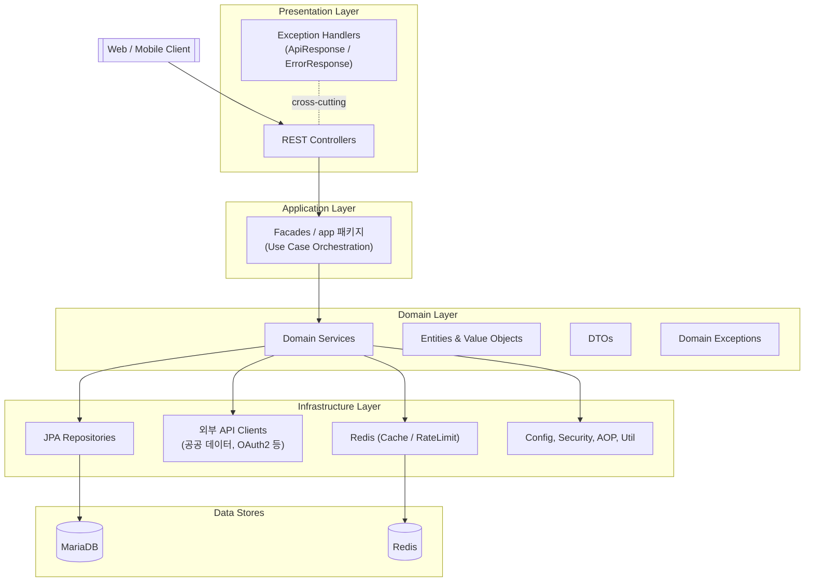
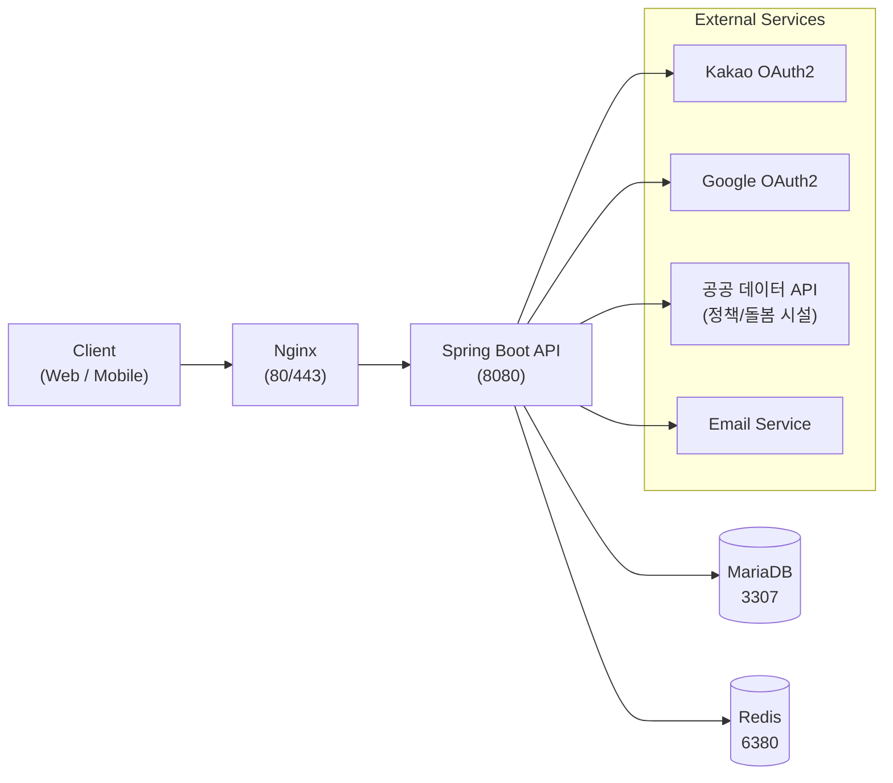
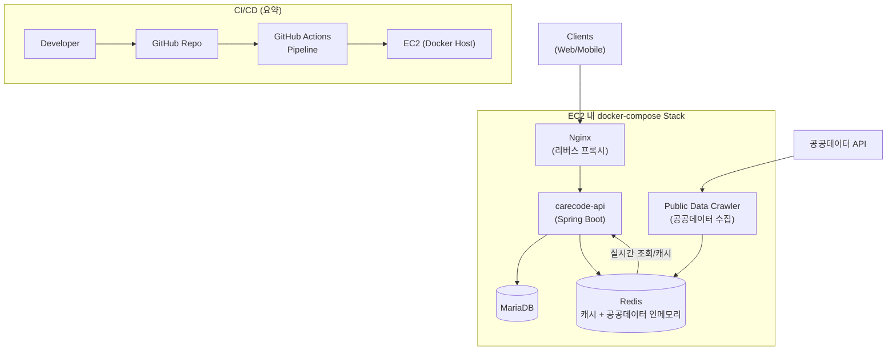
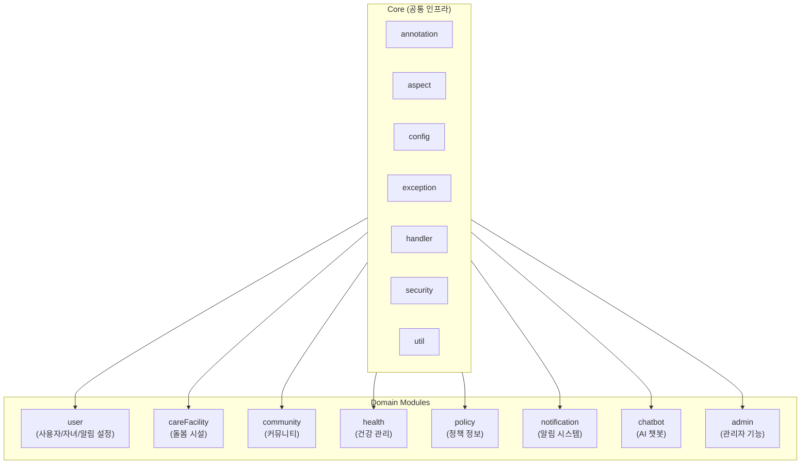

## CareCode 시스템 아키텍처 개요

**CareCode Interface (맘편한)**는 부모를 위한 통합 육아 지원 플랫폼으로, 전통적인 계층형 아키텍처 위에 도메인 주도 설계(DDD)와 AOP 기반 공통 모듈을 결합한 구조를 가지고 있습니다.

- **애플리케이션 계층 구조**
  - Presentation: `controller`, 전역 예외 핸들러, API 응답 래퍼
  - Application: 각 도메인의 `facade` / `app` 패키지 (유스케이스 오케스트레이션)
  - Domain: 도메인 서비스, 엔티티, DTO, 도메인별 예외
  - Infrastructure: JPA `repository`, 외부 API 클라이언트, Redis, 설정(`config`)

---

## 계층 구조 및 주요 패키지

- **엔트리 포인트**
  - `com.carecode.CareCodeApplication`
  - Spring Boot 3.3 기반 단일 모듈 API 서버

- **코어 공통 모듈 (`com.carecode.core`)**
  - `annotation`: `@LogExecutionTime`, `@RateLimit`, `@RequireAuthentication`, `@RequireAdminRole`, `@ValidateLocation`, `@ValidateChildAge`, `@CacheableResult` 등 공통 어노테이션
  - `aspect`: 로깅, 캐싱, 인증, 검증, Rate Limiting을 AOP로 분리
  - `config`: `ApiConfig`, `ApiVersionConfig`, `AuditConfig`, `CacheConfig`, `CorsConfig`, `RedisConfig`, `SwaggerConfig`, `TransactionConfig`, `WebMvcConfig` 등 인프라/크로스컷팅 설정
  - `exception`: `CareCodeException`, `BusinessException`, 도메인별 예외, `ErrorCode` enum
  - `handler`: `ApiResponse`, `ApiSuccess`, `ErrorResponse`, `CustomizedResponseEntityExceptionHandler` 등 전역 응답/예외 처리
  - `security`: JWT 기반 인증, `SecurityConfig`, `CustomUserDetailsService`, `JwtAuthenticationFilter`
  - `util`: `LoggingUtil`, `ValidationUtil`, `SortUtil`, `ChildAgeUtil`, `LocationUtil`, `RequestMapper`, `ResponseMapper` 등 재사용 유틸

- **도메인 계층 (`com.carecode.domain`)**
  - `user`: 회원/자녀/알림 설정, 소셜 로그인, JWT 발급
  - `careFacility`: 어린이집/유치원/돌봄시설 조회·예약·리뷰
  - `community`: 게시글, 댓글, 태그, 좋아요, 북마크, 카테고리
  - `health`: 건강 기록, 병원, 리뷰, 통계, 첨부파일
  - `policy`: 육아 정책/카테고리/문서, 맞춤형 정책 추천
  - `notification`: 알림 템플릿/이력/전략, 채널(이메일 등)
  - `chatbot`: 세션, 메시지, 컨텍스트 기반 상담
  - `admin`: 관리자용 사용자/콘텐츠/정책/통계 관리

각 도메인은 `controller`, `app`(또는 `facade`), `service`, `repository`, `entity`, `dto`로 구성되어 있어 **도메인 경계를 기준으로 한 계층형 구조**를 따릅니다.

---

## 시스템 컴포넌트 아키텍처

- **클라이언트**
  - Web/Mobile 클라이언트가 HTTP/HTTPS로 Nginx에 접속

- **API 서버 (Spring Boot)**
  - 포트 8080에서 동작하며 Nginx 뒤에 배치
  - JWT 기반 인증, 도메인별 REST API 제공
  - SpringDoc OpenAPI를 이용한 Swagger UI 제공

- **데이터 저장소**
  - MariaDB: 핵심 비즈니스 데이터(사용자, 자녀, 건강 기록, 정책, 커뮤니티 등)
  - Redis: 캐싱 + Rate Limiting을 위한 인메모리 저장소

- **외부 시스템**
  - 카카오/구글 OAuth2: 소셜 로그인
  - 공공 데이터 API: 돌봄 시설/정책 정보
  - 이메일 서비스: 인증 및 알림 메일 발송

Docker/Docker Compose로 MariaDB(3307), Redis(6380), Nginx, Spring Boot 애플리케이션을 하나의 스택으로 구성할 수 있도록 설계되어 있습니다.

---

## 배포/인프라 아키텍처 (AWS EC2 + Docker + GitHub Actions)

애플리케이션은 **AWS EC2** 위에서 Docker / Docker Compose를 사용해 실행되며, **GitHub Actions**를 통해 CI/CD가 구성되어 있습니다. 공공데이터 크롤러는 Redis를 인메모리 저장소로 사용하여 실시간으로 데이터를 갱신합니다.

---

## 도메인 구조와 경계

프로젝트는 육아 서비스의 주요 영역을 기준으로 7+1개의 도메인으로 나뉩니다.

- **User 도메인**
  - 엔티티: `User`, `Child`, `EmailVerificationToken`, `NotificationSettings` 등
  - 기능: 회원가입/로그인, 소셜 로그인, 토큰 갱신, 자녀 관리, 알림 설정

- **CareFacility 도메인**
  - 엔티티: `CareFacility`, `CareFacilityBooking`, `Review`, `FacilityType`
  - 기능: 시설 검색(유형/지역/연령), 위치 기반 검색, 예약, 리뷰

- **Community 도메인**
  - 엔티티: `Post`, `Comment`, `Tag`, `PostLike`, `Bookmark`, `PostCategory` 등
  - 기능: 게시글 CRUD, 댓글/대댓글, 태그, 좋아요/북마크, 익명 게시

- **Health 도메인**
  - 엔티티: `HealthRecord`, `HealthRecordAttachment`, `Hospital`, `HospitalReview`, `HospitalLike`
  - 기능: 건강 기록/성장 추적, 병원 검색/리뷰, 통계/시각화

- **Policy 도메인**
  - 엔티티: `Policy`, `PolicyCategory`, `PolicyDocument`
  - 기능: 정책 검색, 카테고리별 조회, 맞춤형 정책 추천, 공공 데이터 연동

- **Notification 도메인**
  - 엔티티: `Notification`, `NotificationTemplate`, `NotificationPreference`, `NotificationSettings`
  - 기능: 실시간 알림, 다중 채널(이메일/푸시/SMS), 알림 이력/야간 모드

- **Chatbot 도메인**
  - 엔티티: `ChatSession`, `ChatMessage`
  - 기능: 24/7 상담, 다중 세션, 히스토리 관리, 컨텍스트 기반 질의응답

- **Admin 도메인**
  - 기능: 사용자 관리, 시설/병원/정책 데이터 관리, 커뮤니티 모니터링, 대시보드

각 도메인은 **자체 예외 타입, DTO, 서비스 로직**을 가지며, 코어 모듈에서 제공하는 공통 인프라를 사용하도록 설계되어 있습니다.

---

## 공통 인프라 및 크로스컷팅 구조

### 1. AOP 기반 로깅

- **어노테이션**
  - `@LogExecutionTime`: 메서드 실행 시간을 측정하고 로깅
- **Aspect**
  - `LoggingAspect`
    - `StopWatch`로 실행 시간 측정
    - `MDC`에 `traceId`, `method`, `executionTime`, `error` 등을 기록
    - `warnThreshold` 초과 시 경고 로그
    - 인자 로깅 시 길이/민감정보를 일부 마스킹

이를 통해, **성능 모니터링과 문제 추적이 코드 침투 없이** 가능하도록 구현되어 있습니다.

### 2. Rate Limiting

- **어노테이션**
  - `@RateLimit(requests, windowSeconds, perUser, message)`
- **Aspect**
  - `RateLimitingAspect`
    - `ConcurrentHashMap` + `AtomicInteger`를 활용한 인메모리 Rate Limiting
    - `perUser=true`일 경우 IP 기반 키 구성 (X-Forwarded-For 헤더 고려)
    - 윈도우 단위로 요청 수를 리셋하고, 초과 시 `BusinessException` 발생

로그인 시도, 쓰기 API 등에서 **간단하지만 실용적인 Rate Limiting**을 제공하여 보안과 남용 방지에 기여합니다.

### 3. Redis 기반 캐싱

- **설정 (`RedisConfig`)**
  - 문자열 전용 `RedisTemplate<String, String>`: Rate Limiting, 단순 카운팅 등
  - 객체 전용 `RedisTemplate<String, Object>`: JSON 직렬화를 통한 객체 캐싱

- **어노테이션 & Aspect**
  - `@CacheableResult(cacheName, key, ttl)` + `CachingAspect`
    - 메서드 시그니처/인자 기반으로 캐시 키 생성
    - Redis에 JSON 문자열로 저장
    - 리플렉션으로 메서드 반환 타입을 분석해 역직렬화
    - 역직렬화 실패 시 캐시 삭제 후 재생성

기본 Spring Cache 추상화 외에, **세밀한 키/TTL 제어를 위한 커스텀 캐싱 레이어**를 제공하는 것이 특징입니다.

---

## 예외 처리 및 API 응답 구조

- **예외 계층**
  - `CareCodeException` (공통 베이스)
  - 도메인별 예외: `HealthRecordNotFoundException`, `ChildNotFoundException`, `HospitalNotFoundException` 등
  - `ErrorCode` enum: 도메인별 코드와 기본 메시지를 보유

- **전역 핸들러**
  - `CustomizedResponseEntityExceptionHandler`
    - `CareCodeException`을 일관된 `ErrorResponse`로 변환
    - HTTP Status, 에러 코드, 메시지, 타임스탬프 등을 표준화

- **공통 응답 래퍼**
  - `ApiResponse<T>`
    - 성공/실패 응답을 동일한 스키마(`code`, `message`, `data`, `timestamp`)로 제공

이를 통해, 클라이언트는 **모든 도메인에서 동일한 에러/응답 포맷**을 기대할 수 있으며, 모니터링/로깅 시스템과의 연계도 쉬워집니다.

---

## 설정/환경 아키텍처

- **환경별 설정 분리**
  - `application.yml`: 공통 기본 설정 및 프로파일 설정
  - `application-dev.yml`: 개발 환경 (상세 로그, H2 또는 개발 DB, 편의 옵션)
  - `application-prod.yml`: 프로덕션 (최소 로그 레벨, 외부 DB, 보안 옵션)
  - `application-docker.yml`: Docker Compose 환경용 설정

- **주요 설정 포인트**
  - 데이터베이스: MariaDB 연결 및 커넥션 풀
  - 캐시: `CacheConfig`를 통한 캐시 이름/TTL 정의
  - 로깅: `logback-spring.xml` + `logstash-logback-encoder`를 통한 JSON 로깅
  - 모니터링: Actuator + Prometheus 엔드포인트 활성화
  - API 버전 관리: `ApiVersion` 어노테이션 + `ApiVersionConfig`로 확장 가능 구조 마련

---

## 종합 정리

- **장점**
  - 도메인별로 잘 분리된 계층 구조와 공통 코어 모듈
  - AOP 기반 로깅/캐싱/Rate Limiting으로 비즈니스 코드의 단순성 유지
  - 일관된 예외/응답 포맷과 환경별 설정 분리로 운영/유지보수성 향상

- **유의 사항**
  - Health 도메인처럼 데이터가 많은 영역은 쿼리 최적화(JOIN FETCH, DTO Projection)와 캐싱 전략이 함께 설계되어 있어, 이 패턴을 다른 도메인에도 확장 적용하는 것이 좋습니다.
  - 현재 Rate Limiting은 인메모리 방식이므로, 대규모 분산 환경에서는 Redis 기반 Rate Limiting으로 확장하는 것이 권장됩니다.

