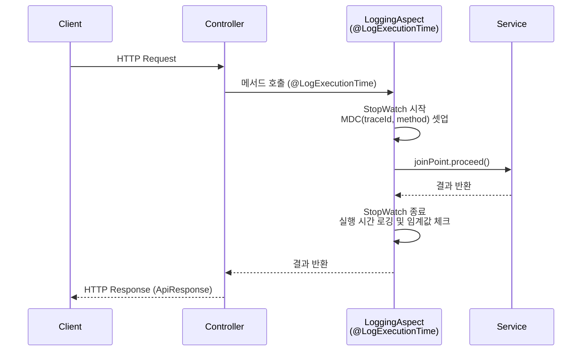
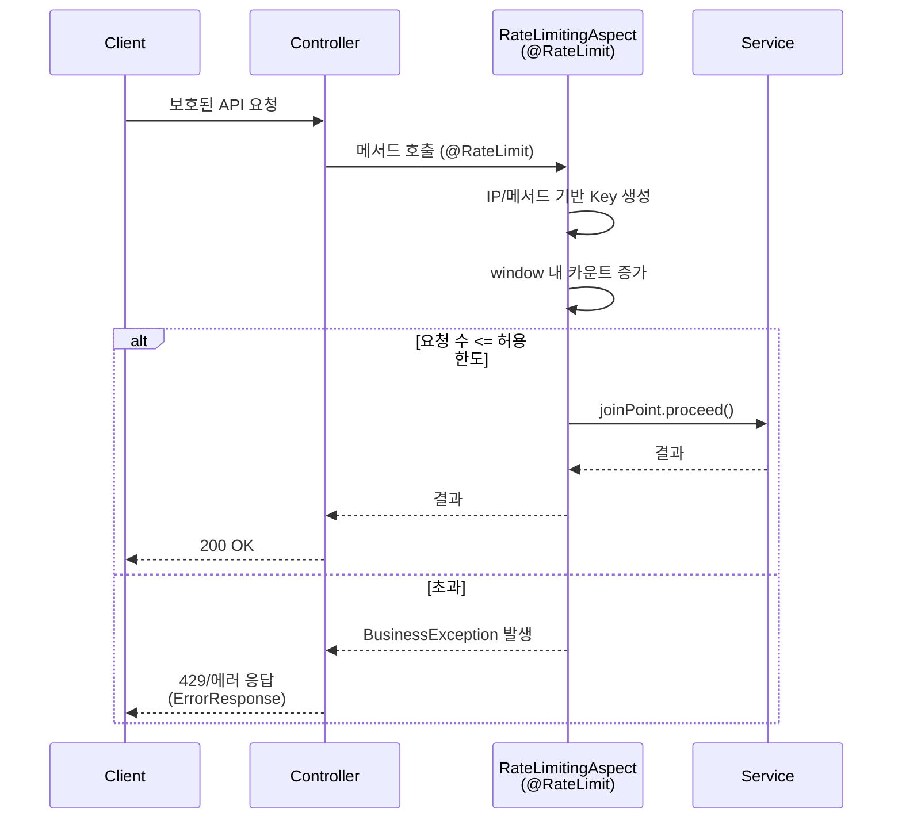
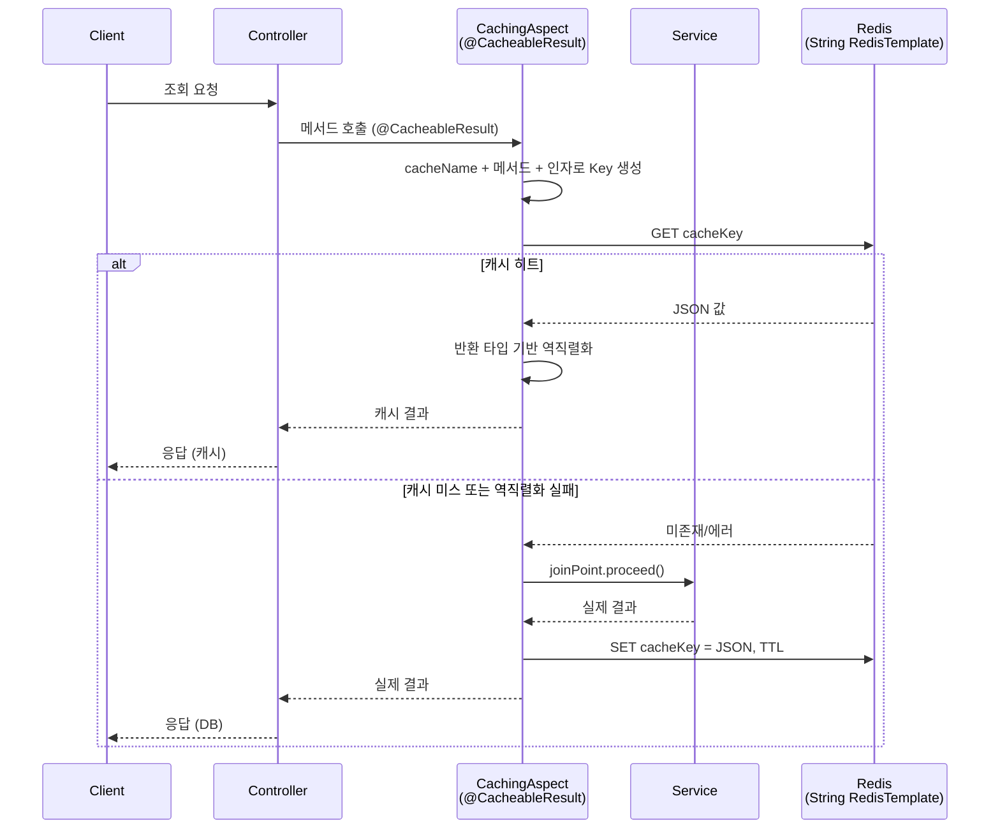
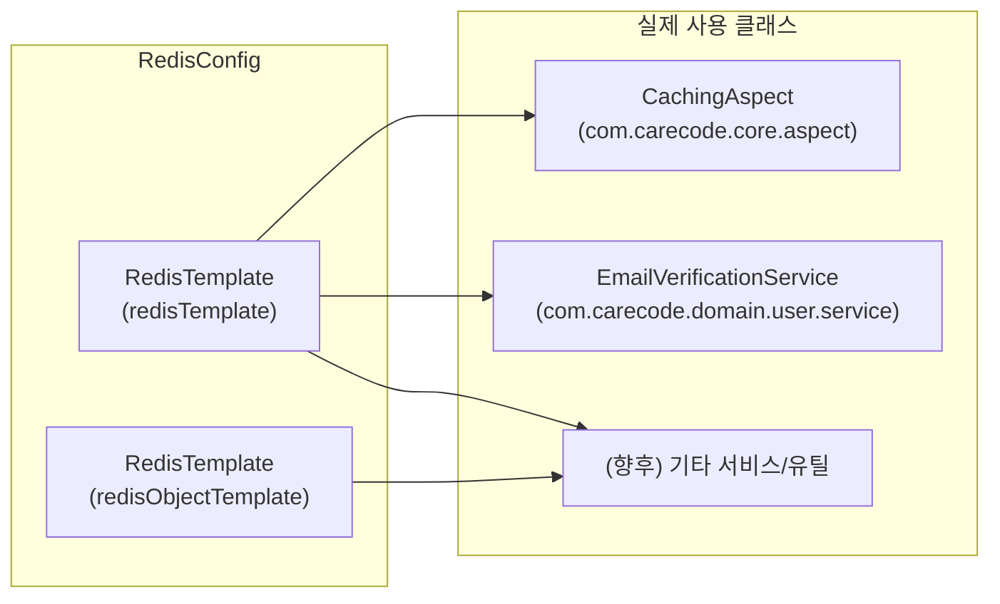
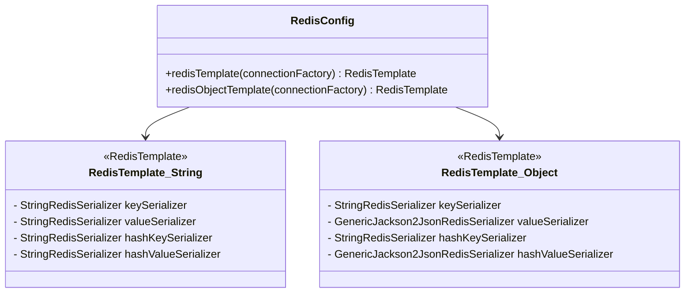
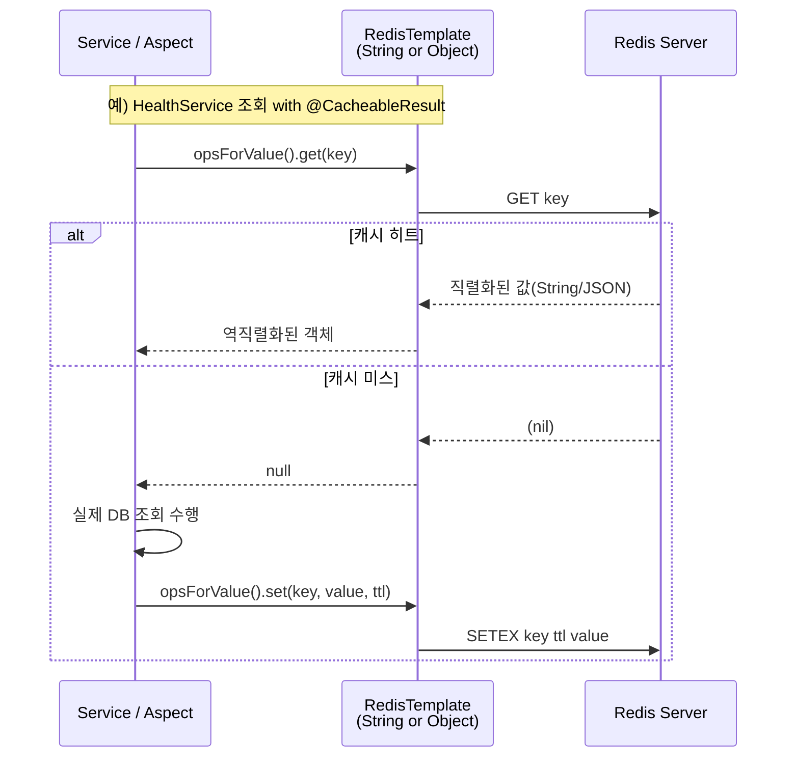

## 기술적으로 독특한/주요 구현 포인트 정리

이 문서는 CareCode Interface 프로젝트에서 **아키텍처적으로나 구현 관점에서 눈에 띄는 기술 요소**를 요약합니다.

---

## 1. AOP 기반 공통 기능 모듈

### 1.1 실행 시간 로깅 (`@LogExecutionTime` + `LoggingAspect`)

- **목적**
  - 서비스/도메인 메서드의 실행 시간을 측정해 성능 병목을 찾고, 운영 중 이슈를 빠르게 식별하기 위함
- **핵심 특징**
  - `@LogExecutionTime` 어노테이션만으로 실행 시간 로깅 활성화
  - `LoggingAspect`에서 `StopWatch`를 사용해 실행 시간을 ms 단위로 측정
  - `MDC`에 아래와 같은 컨텍스트 정보 자동 주입
    - `traceId`: 요청 단위 추적 ID
    - `method`: 실행 메서드(클래스.메서드)
    - `executionTime`: 실행 시간(ms)
    - `error`: 예외 발생 시 예외 타입
  - `warnThreshold`를 초과하면 WARN 로그로 별도 표기하여 **성능 경고** 역할 수행
  - 메서드 인자 로깅 시 길이 제한/민감정보 마스킹 적용

**의미**
- 비즈니스 코드에 로깅 코드가 섞이지 않고, 운영/성능 모니터링에 필요한 정보가 표준화된 형식으로 수집됩니다.

### 1.2 Rate Limiting (`@RateLimit` + `RateLimitingAspect`)

- **목적**
  - 로그인, 회원가입, 쓰기 API 등에 대한 **남용 방지 및 보안 강화**
- **구현 방식**
  - `@RateLimit(requests, windowSeconds, perUser, message)` 어노테이션으로 제어
  - `RateLimitingAspect`에서
    - `ConcurrentHashMap<String, RateLimitInfo>` + `AtomicInteger` 기반 인메모리 카운팅
    - `windowSeconds` 단위로 카운트 리셋
    - `perUser=true`인 경우 IP 기반 키(`X-Forwarded-For`, `Proxy-Client-IP` 등 헤더 고려)
  - 초과 시 `BusinessException`을 발생시키고, 경고 로그 남김

**의미**
- 별도 인프라 없이도 간단한 Rate Limiting을 구현하여 **API 보호**와 **로그 기반 모니터링**이 가능하고, 추후 Redis 기반 분산 Rate Limiting으로 확장할 수 있는 구조를 제공합니다.

### 1.3 Redis 기반 커스텀 캐싱 (`@CacheableResult` + `CachingAspect`)

- **목적**
  - 조회 빈도가 높은 건강 기록, 정책, 시설 정보 등을 Redis에 캐싱해 응답 속도와 DB 부하를 개선
- **구현 방식**
  - 커스텀 어노테이션 `@CacheableResult(cacheName, key, ttl)`
  - `CachingAspect`에서
    - `cacheName`, 메서드명, 인자를 조합해 키 생성
    - `RedisTemplate<String, String>` + `ObjectMapper`로 JSON 직렬화/역직렬화
    - 메서드 반환 타입(`Method#getGenericReturnType`)을 기반으로 타입 안전한 역직렬화 시도
    - 역직렬화 실패 시 캐시 삭제 후 다시 계산하여 복구

**의미**
- Spring Cache 추상화 위에 **도메인 친화적인 키 전략과 TTL 제어를 붙인 레이어**를 제공하여, 캐시 정책을 코드 차원에서 명시적으로 관리할 수 있게 합니다.

---

## 2. RedisConfig의 이중 템플릿 구성

`RedisConfig`는 두 종류의 `RedisTemplate`을 제공합니다.

- **문자열 기반 RedisTemplate (`RedisTemplate<String, String>`)**
  - 용도: Rate Limiting, 단순 카운터, 플래그, 경량 캐시
  - Key/Value/HashKey/HashValue 모두 `StringRedisSerializer` 사용

- **객체 기반 RedisTemplate (`RedisTemplate<String, Object>`)**
  - 용도: 도메인 객체/DTO 캐싱
  - Key/HashKey: `StringRedisSerializer`
  - Value/HashValue: `GenericJackson2JsonRedisSerializer`로 JSON 직렬화

**의미**
- 단일 템플릿에 모든 용도를 섞지 않고, **단순 문자열 작업과 도메인 객체 캐싱을 명확히 분리**하여 직렬화 오류와 운영 복잡도를 줄였습니다.

아래 다이어그램은 **직렬화기 관점의 구성**과 **런타임 호출 흐름**을 함께 보여줍니다.

---

## 3. 예외 처리와 에러 코드 체계

### 3.1 `CareCodeException` 기반 예외 계층

- **구조**
  - `CareCodeException` (공통 베이스, `ErrorCode`, `HttpStatus`, 메시지 포함)
  - 도메인별 예외: `HealthRecordNotFoundException`, `ChildNotFoundException`, `HospitalNotFoundException`, `PolicyNotFoundException` 등
  - `BusinessException`: 비즈니스 규칙 위반 표현

- **`ErrorCode` enum**
  - 각 도메인별 그룹화된 에러 코드(`H001`, `U001` 등)와 기본 메시지 정의
  - 클라이언트/로그/모니터링 시스템에서 **에러 유형을 정형화된 코드로 식별** 가능

### 3.2 전역 예외 핸들러와 표준 응답

- `CustomizedResponseEntityExceptionHandler`에서 모든 `CareCodeException`을 수신
- `ErrorResponse` DTO로 변환 (에러 코드, 메시지, HTTP Status, 타임스탬프 등)
- 일반 API 응답은 `ApiResponse<T>` 래퍼를 사용하여 성공/실패 모두 동일 스키마 적용

**의미**
- 예외 처리 방식이 컨트롤러/도메인마다 제각각이었던 상태에서, **에러 코드 중심의 일관된 예외/응답 모델**로 통합되어 유지보수성과 디버깅 효율이 크게 향상되었습니다.

---

## 4. Health 도메인 성능 최적화 (N+1 & 조회 패턴)

Health 도메인은 기록/병원/리뷰 등 관계가 복잡하고 데이터 양이 많은 편이라, 몇 가지 성능 최적화가 집중적으로 적용되어 있습니다.

- **JOIN FETCH 기반 N+1 해결**
  - `HealthRecordRepository`에 `JOIN FETCH` 쿼리들을 추가
  - 예: 사용자별/자녀별/기간별 조회 시 `HealthRecord`와 연관된 `Child`, `User`를 한 번에 로딩
  - 커밋: `perf: HealthRecordRepository에 JOIN FETCH 쿼리 추가 - N+1 쿼리 문제 해결`

- **Service 레이어 쿼리 최적화**
  - `HealthService`가 N+1을 유발하던 메서드를 최적화된 Repository 메서드로 교체
  - 조회 패턴에 맞는 메서드들로 분리 (기간별, 타입별, 정렬 옵션 등)
  - 커밋: `refactor: HealthService 예외 처리 및 쿼리 최적화`

**의미**
- 실제 사용량이 높은 도메인에 초점을 맞춰 **쿼리 수를 눈에 띄게 줄이고 응답 시간을 개선**한 사례로, 다른 도메인에도 참고할 수 있는 패턴입니다.

---

## 5. 트랜잭션 경계 정리 (Facade → Service)

초기 구조에서는 Facade와 Service 모두에 `@Transactional`이 혼용되어 있었습니다.

- **개선 방향**
  - 트랜잭션은 **Service 계층에만** 두고, Facade는 오케스트레이션/DTO 변환에 집중
  - 읽기 전용 메서드는 `@Transactional(readOnly = true)`를 기본으로 사용
  - 쓰기 작업(등록/수정/삭제)만 별도의 `@Transactional`로 명시

- **결과**
  - 커밋: `refactor: HealthFacade에서 트랜잭션 어노테이션 제거`
  - 트랜잭션 중첩/불필요한 경계 설정이 사라져 성능과 가독성이 개선되었습니다.

---

## 6. API 버전 관리 기본 구조

- **구성**
  - `ApiVersion` 어노테이션: API 버전을 메타데이터로 표현
  - `ApiVersionConfig`: 버전에 따른 요청 매핑 확장을 위한 설정 클래스
  - 현재는 v1 기준이지만, 향후 v2 이상을 안전하게 공존시킬 수 있는 기반을 마련

**의미**
- 아직 멀티 버전이 본격적으로 도입되지는 않았지만, **URI/헤더/미디어 타입 기반 버전 전략을 적용할 수 있는 훅**을 미리 심어 둔 상태입니다.

---

## 7. 로깅 전략과 모니터링

- **구조화 로깅**
  - `logstash-logback-encoder`를 사용한 JSON 형태 로깅
  - `logback-spring.xml`에서 환경별(Appender/Pattern/레벨) 설정 분리
  - `LoggingUtil` + `MDC`를 활용해 `traceId`, `userId`, `childId` 등 컨텍스트 정보 자동 부여

- **Actuator + Prometheus**
  - `/actuator` 기반 헬스/메트릭 엔드포인트 활성화
  - Prometheus 스크레이핑을 염두에 둔 `prometheus` 메트릭 노출
  - liveness/readiness probe 지원으로 컨테이너 환경에서의 안정적 롤링 배포 가능

**의미**
- 운영 환경에서 발생하는 문제를 **로그와 메트릭만으로도 역추적하기 쉽게 설계**되어 있으며, 외부 모니터링/로그 수집 시스템(ELK, Grafana 등)과의 연동을 전제로 한 구조입니다.

---

## 8. 요약

- AOP를 활용한 **로깅 / 캐싱 / Rate Limiting** 이 세 가지가 이 프로젝트의 가장 두드러진 기술적 특징입니다.
- Health 도메인에 집중된 **쿼리 최적화와 캐시 전략**은 성능 관점에서 좋은 레퍼런스입니다.
- `CareCodeException` + `ErrorCode` + `ApiResponse` 조합으로 **에러/응답 모델을 표준화**한 점은, 클라이언트와 운영 모두에게 큰 이점을 제공합니다.
- 이러한 패턴들은 다른 도메인 확장이나 신규 기능 추가 시에도 일관성을 유지하면서 빠르게 적용할 수 있는 기반이 됩니다.

