# CareCode 데이터베이스 ERD (Entity Relationship Diagram)

## 📋 목차
1. [개요](#개요)
2. [ERD 다이어그램](#erd-다이어그램)
3. [엔티티 상세 설명](#엔티티-상세-설명)
4. [관계 설명](#관계-설명)
5. [인덱스 및 제약조건](#인덱스-및-제약조건)

---

## 개요

CareCode 프로젝트는 돌봄 시설, 커뮤니티, 건강 관리, 정책 정보, 알림, 챗봇 등 다양한 도메인을 포함하는 종합 돌봄 플랫폼입니다.

### 주요 도메인
- **사용자 관리 (User)**: 회원 정보, 자녀 정보, 인증
- **돌봄 시설 (CareFacility)**: 시설 정보, 예약, 리뷰
- **커뮤니티 (Community)**: 게시글, 댓글, 태그, 좋아요, 북마크
- **건강 관리 (Health)**: 병원 정보, 건강 기록, 리뷰
- **정책 (Policy)**: 정책 정보, 카테고리, 문서
- **알림 (Notification)**: 알림, 템플릿, 사용자 설정
- **챗봇 (Chatbot)**: 채팅 세션, 메시지

### 데이터베이스 통계
- **총 테이블 수**: 25개
- **총 관계 수**: 40+ 개
- **인덱스**: 50+ 개
- **제약조건**: 30+ 개

---

## ERD 다이어그램

```mermaid
erDiagram
    %% ==========================================
    %% 사용자 도메인 (User Domain)
    %% ==========================================
    TBL_USER {
        BIGINT ID PK
        VARCHAR USER_ID UK
        VARCHAR EMAIL UK
        VARCHAR PASSWORD
        VARCHAR NAME
        VARCHAR PHONE_NUMBER
        DATE BIRTH_DATE
        ENUM GENDER
        VARCHAR ADDRESS
        DOUBLE LATITUDE
        DOUBLE LONGITUDE
        VARCHAR PROFILE_IMAGE_URL
        ENUM ROLE
        VARCHAR PROVIDER
        VARCHAR PROVIDER_ID
        BOOLEAN IS_ACTIVE
        BOOLEAN EMAIL_VERIFIED
        BOOLEAN REGISTRATION_COMPLETED
        DATETIME DELETED_AT
        DATETIME LAST_LOGIN_AT
        DATETIME CREATED_AT
        DATETIME UPDATED_AT
    }

    TBL_CHILD {
        BIGINT ID PK
        BIGINT USER_ID FK
        VARCHAR NAME
        DATE BIRTH_DATE
        ENUM GENDER
        TEXT SPECIAL_NOTES
        DATETIME CREATED_AT
        DATETIME UPDATED_AT
    }

    TBL_EMAIL_VERIFICATION_TOKEN {
        BIGINT ID PK
        BIGINT USER_ID FK
        VARCHAR TOKEN UK
        DATETIME EXPIRES_AT
        BOOLEAN VERIFIED
        DATETIME CREATED_AT
    }

    %% ==========================================
    %% 돌봄 시설 도메인 (CareFacility Domain)
    %% ==========================================
    TBL_CARE_FACILITY {
        BIGINT ID PK
        VARCHAR FACILITY_ID UK
        VARCHAR NAME
        VARCHAR TYPE
        VARCHAR ADDRESS
        DOUBLE LATITUDE
        DOUBLE LONGITUDE
        VARCHAR PHONE_NUMBER
        VARCHAR WEBSITE
        TEXT DESCRIPTION
        INTEGER CAPACITY
        VARCHAR OPERATING_HOURS
        TEXT FACILITIES
        DECIMAL AVG_RATING
        INTEGER REVIEW_COUNT
        BOOLEAN IS_ACTIVE
        DATETIME CREATED_AT
        DATETIME UPDATED_AT
    }

    TBL_CARE_FACILITY_BOOKING {
        BIGINT ID PK
        BIGINT USER_ID FK
        BIGINT CARE_FACILITY_ID FK
        BIGINT CHILD_ID FK
        DATE BOOKING_DATE
        TIME START_TIME
        TIME END_TIME
        ENUM STATUS
        TEXT NOTES
        TEXT CANCELLATION_REASON
        DATETIME CANCELLED_AT
        DATETIME CREATED_AT
        DATETIME UPDATED_AT
    }

    TBL_REVIEW {
        BIGINT ID PK
        BIGINT USER_ID FK
        BIGINT CARE_FACILITY_ID FK
        INTEGER RATING
        TEXT CONTENT
        DATETIME CREATED_AT
        DATETIME UPDATED_AT
    }

    %% ==========================================
    %% 커뮤니티 도메인 (Community Domain)
    %% ==========================================
    TBL_POST {
        BIGINT ID PK
        VARCHAR TITLE
        TEXT CONTENT
        ENUM CATEGORY
        ENUM STATUS
        BIGINT AUTHOR_ID FK
        VARCHAR AUTHOR_NAME
        BOOLEAN IS_ANONYMOUS
        INTEGER VIEW_COUNT
        INTEGER LIKE_COUNT
        INTEGER COMMENT_COUNT
        BOOLEAN IS_PINNED
        DATETIME CREATED_AT
        DATETIME UPDATED_AT
    }

    TBL_COMMENT {
        BIGINT ID PK
        BIGINT POST_ID FK
        BIGINT AUTHOR_ID FK
        VARCHAR AUTHOR_NAME
        TEXT CONTENT
        BIGINT PARENT_COMMENT_ID FK
        INTEGER LIKE_COUNT
        DATETIME CREATED_AT
        DATETIME UPDATED_AT
    }

    TBL_TAG {
        BIGINT ID PK
        VARCHAR NAME UK
        TEXT DESCRIPTION
        INTEGER USE_COUNT
        DATETIME CREATED_AT
    }

    TBL_POST_TAG {
        BIGINT POST_ID FK
        BIGINT TAG_ID FK
    }

    TBL_POST_LIKE {
        BIGINT ID PK
        BIGINT POST_ID FK
        BIGINT USER_ID FK
        DATETIME CREATED_AT
    }

    TBL_BOOKMARK {
        BIGINT ID PK
        BIGINT POST_ID FK
        BIGINT USER_ID FK
        DATETIME CREATED_AT
    }

    %% ==========================================
    %% 건강 도메인 (Health Domain)
    %% ==========================================
    TBL_HOSPITAL {
        BIGINT ID PK
        VARCHAR HOSPITAL_ID UK
        VARCHAR NAME
        VARCHAR TYPE
        VARCHAR ADDRESS
        DOUBLE LATITUDE
        DOUBLE LONGITUDE
        VARCHAR PHONE_NUMBER
        VARCHAR WEBSITE
        TEXT DESCRIPTION
        VARCHAR OPERATING_HOURS
        TEXT DEPARTMENTS
        DECIMAL AVG_RATING
        INTEGER REVIEW_COUNT
        INTEGER LIKE_COUNT
        BOOLEAN IS_ACTIVE
        DATETIME CREATED_AT
        DATETIME UPDATED_AT
    }

    TBL_HOSPITAL_REVIEW {
        BIGINT ID PK
        BIGINT USER_ID FK
        BIGINT HOSPITAL_ID FK
        INTEGER RATING
        TEXT CONTENT
        VARCHAR DEPARTMENT
        DATETIME VISIT_DATE
        INTEGER LIKE_COUNT
        DATETIME CREATED_AT
        DATETIME UPDATED_AT
    }

    TBL_HOSPITAL_LIKE {
        BIGINT ID PK
        BIGINT USER_ID FK
        BIGINT HOSPITAL_ID FK
        DATETIME CREATED_AT
    }

    TBL_HEALTH_RECORD {
        BIGINT ID PK
        BIGINT USER_ID FK
        BIGINT CHILD_ID FK
        ENUM RECORD_TYPE
        DATE RECORD_DATE
        VARCHAR TITLE
        TEXT DESCRIPTION
        DECIMAL HEIGHT
        DECIMAL WEIGHT
        DECIMAL TEMPERATURE
        TEXT SYMPTOMS
        TEXT DIAGNOSIS
        TEXT TREATMENT
        TEXT MEDICATION
        TEXT NOTES
        DATETIME CREATED_AT
        DATETIME UPDATED_AT
    }

    TBL_HEALTH_RECORD_ATTACHMENT {
        BIGINT ID PK
        BIGINT HEALTH_RECORD_ID FK
        VARCHAR FILE_NAME
        VARCHAR FILE_PATH
        VARCHAR FILE_TYPE
        BIGINT FILE_SIZE
        DATETIME CREATED_AT
    }

    %% ==========================================
    %% 정책 도메인 (Policy Domain)
    %% ==========================================
    TBL_POLICY_CATEGORY {
        BIGINT ID PK
        VARCHAR NAME UK
        TEXT DESCRIPTION
        INTEGER DISPLAY_ORDER
        DATETIME CREATED_AT
        DATETIME UPDATED_AT
    }

    TBL_POLICY {
        BIGINT ID PK
        VARCHAR POLICY_ID UK
        BIGINT CATEGORY_ID FK
        VARCHAR TITLE
        TEXT DESCRIPTION
        TEXT CONTENT
        VARCHAR TARGET_AUDIENCE
        TEXT ELIGIBILITY
        TEXT BENEFITS
        TEXT APPLICATION_METHOD
        VARCHAR CONTACT_INFO
        VARCHAR RELATED_LINK
        DATE START_DATE
        DATE END_DATE
        ENUM STATUS
        INTEGER VIEW_COUNT
        INTEGER BOOKMARK_COUNT
        DATETIME CREATED_AT
        DATETIME UPDATED_AT
    }

    TBL_POLICY_DOCUMENT {
        BIGINT ID PK
        BIGINT POLICY_ID FK
        VARCHAR DOCUMENT_NAME
        VARCHAR DOCUMENT_PATH
        VARCHAR DOCUMENT_TYPE
        BIGINT FILE_SIZE
        DATETIME CREATED_AT
    }

    %% ==========================================
    %% 알림 도메인 (Notification Domain)
    %% ==========================================
    TBL_NOTIFICATION {
        BIGINT ID PK
        BIGINT USER_ID FK
        VARCHAR TITLE
        TEXT CONTENT
        ENUM TYPE
        VARCHAR RELATED_ID
        VARCHAR RELATED_TYPE
        BOOLEAN IS_READ
        DATETIME READ_AT
        DATETIME CREATED_AT
    }

    TBL_NOTIFICATION_TEMPLATE {
        BIGINT ID PK
        VARCHAR TEMPLATE_ID UK
        VARCHAR NAME
        VARCHAR TITLE
        TEXT CONTENT
        ENUM TYPE
        TEXT VARIABLES
        BOOLEAN IS_ACTIVE
        DATETIME CREATED_AT
        DATETIME UPDATED_AT
    }

    TBL_NOTIFICATION_PREFERENCE {
        BIGINT ID PK
        BIGINT USER_ID FK
        ENUM NOTIFICATION_TYPE UK
        BOOLEAN EMAIL_ENABLED
        BOOLEAN PUSH_ENABLED
        BOOLEAN SMS_ENABLED
        DATETIME CREATED_AT
        DATETIME UPDATED_AT
    }

    TBL_NOTIFICATION_SETTINGS {
        BIGINT ID PK
        BIGINT USER_ID FK
        BOOLEAN EMAIL_NOTIFICATIONS
        BOOLEAN PUSH_NOTIFICATIONS
        BOOLEAN SMS_NOTIFICATIONS
        BOOLEAN MARKETING_NOTIFICATIONS
        BOOLEAN NIGHT_MODE
        TIME QUIET_TIME_START
        TIME QUIET_TIME_END
        DATETIME CREATED_AT
        DATETIME UPDATED_AT
    }

    %% ==========================================
    %% 챗봇 도메인 (Chatbot Domain)
    %% ==========================================
    TBL_CHAT_SESSION {
        BIGINT ID PK
        VARCHAR SESSION_ID UK
        BIGINT USER_ID FK
        VARCHAR TITLE
        ENUM STATUS
        DATETIME STARTED_AT
        DATETIME ENDED_AT
        DATETIME CREATED_AT
        DATETIME UPDATED_AT
    }

    TBL_CHAT_MESSAGE {
        BIGINT ID PK
        BIGINT SESSION_ID FK
        ENUM SENDER_TYPE
        TEXT MESSAGE
        TEXT RESPONSE
        BOOLEAN IS_HELPFUL
        DATETIME CREATED_AT
    }

    %% ==========================================
    %% 관계 정의 (Relationships)
    %% ==========================================

    %% User Domain Relationships
    TBL_USER ||--o{ TBL_CHILD : "has"
    TBL_USER ||--o| TBL_EMAIL_VERIFICATION_TOKEN : "has"
    TBL_USER ||--o{ TBL_POST : "writes"
    TBL_USER ||--o{ TBL_COMMENT : "writes"
    TBL_USER ||--o{ TBL_POST_LIKE : "likes"
    TBL_USER ||--o{ TBL_BOOKMARK : "bookmarks"
    TBL_USER ||--o{ TBL_REVIEW : "writes"
    TBL_USER ||--o{ TBL_CARE_FACILITY_BOOKING : "books"
    TBL_USER ||--o{ TBL_HOSPITAL_REVIEW : "writes"
    TBL_USER ||--o{ TBL_HOSPITAL_LIKE : "likes"
    TBL_USER ||--o{ TBL_HEALTH_RECORD : "creates"
    TBL_USER ||--o{ TBL_NOTIFICATION : "receives"
    TBL_USER ||--o{ TBL_NOTIFICATION_PREFERENCE : "has"
    TBL_USER ||--o| TBL_NOTIFICATION_SETTINGS : "has"
    TBL_USER ||--o{ TBL_CHAT_SESSION : "starts"

    %% CareFacility Domain Relationships
    TBL_CARE_FACILITY ||--o{ TBL_REVIEW : "has"
    TBL_CARE_FACILITY ||--o{ TBL_CARE_FACILITY_BOOKING : "accepts"
    TBL_CHILD ||--o{ TBL_CARE_FACILITY_BOOKING : "booked_for"
    TBL_CHILD ||--o{ TBL_HEALTH_RECORD : "has"

    %% Community Domain Relationships
    TBL_POST ||--o{ TBL_COMMENT : "has"
    TBL_POST ||--o{ TBL_POST_LIKE : "receives"
    TBL_POST ||--o{ TBL_BOOKMARK : "has"
    TBL_POST }o--o{ TBL_TAG : "tagged_with"
    TBL_COMMENT ||--o{ TBL_COMMENT : "replies_to"

    %% Health Domain Relationships
    TBL_HOSPITAL ||--o{ TBL_HOSPITAL_REVIEW : "has"
    TBL_HOSPITAL ||--o{ TBL_HOSPITAL_LIKE : "receives"
    TBL_HEALTH_RECORD ||--o{ TBL_HEALTH_RECORD_ATTACHMENT : "has"

    %% Policy Domain Relationships
    TBL_POLICY_CATEGORY ||--o{ TBL_POLICY : "categorizes"
    TBL_POLICY ||--o{ TBL_POLICY_DOCUMENT : "has"

    %% Chatbot Domain Relationships
    TBL_CHAT_SESSION ||--o{ TBL_CHAT_MESSAGE : "contains"
```



---

## 엔티티 상세 설명

### 1. 사용자 도메인 (User Domain)

#### TBL_USER (사용자)
**설명**: 시스템의 모든 사용자 정보를 저장하는 중심 테이블

| 컬럼명 | 타입 | 제약조건 | 설명 |
|--------|------|----------|------|
| ID | BIGINT | PK, AUTO_INCREMENT | 사용자 고유 식별자 |
| USER_ID | VARCHAR(50) | UNIQUE, NOT NULL | 사용자 ID (자동 생성) |
| EMAIL | VARCHAR(100) | UNIQUE, NOT NULL | 이메일 주소 |
| PASSWORD | VARCHAR(255) | NULL | 비밀번호 (OAuth 사용자는 NULL) |
| NAME | VARCHAR(50) | NOT NULL | 이름 |
| PHONE_NUMBER | VARCHAR(20) | NULL | 전화번호 |
| BIRTH_DATE | DATE | NULL | 생년월일 |
| GENDER | ENUM | NULL | 성별 (MALE, FEMALE, OTHER) |
| ADDRESS | VARCHAR(255) | NULL | 주소 |
| LATITUDE | DOUBLE | NULL | 위도 |
| LONGITUDE | DOUBLE | NULL | 경도 |
| PROFILE_IMAGE_URL | VARCHAR(500) | NULL | 프로필 이미지 URL |
| ROLE | ENUM | NOT NULL | 사용자 역할 (PARENT, CAREGIVER, ADMIN, GUEST) |
| PROVIDER | VARCHAR(20) | NULL | OAuth 제공자 (kakao, google, naver) |
| PROVIDER_ID | VARCHAR(100) | NULL | OAuth 제공자의 사용자 ID |
| IS_ACTIVE | BOOLEAN | NOT NULL, DEFAULT TRUE | 활성 상태 |
| EMAIL_VERIFIED | BOOLEAN | NOT NULL, DEFAULT FALSE | 이메일 인증 여부 |
| REGISTRATION_COMPLETED | BOOLEAN | NOT NULL, DEFAULT FALSE | 가입 프로세스 완료 여부 |
| DELETED_AT | DATETIME | NULL | 소프트 삭제 시간 |
| LAST_LOGIN_AT | DATETIME | NULL | 마지막 로그인 시간 |
| CREATED_AT | DATETIME | NOT NULL | 생성 시간 |
| UPDATED_AT | DATETIME | NULL | 수정 시간 |

**인덱스**:
- `idx_user_email`: 이메일 검색 최적화
- `idx_user_provider`: OAuth 제공자별 검색
- `idx_user_role`: 역할별 검색
- `idx_user_created_at`: 가입일 기준 정렬

#### TBL_CHILD (자녀)
**설명**: 사용자의 자녀 정보를 저장

| 컬럼명 | 타입 | 제약조건 | 설명 |
|--------|------|----------|------|
| ID | BIGINT | PK, AUTO_INCREMENT | 자녀 고유 식별자 |
| USER_ID | BIGINT | FK, NOT NULL | 부모 사용자 ID |
| NAME | VARCHAR(50) | NOT NULL | 자녀 이름 |
| BIRTH_DATE | DATE | NULL | 생년월일 |
| GENDER | ENUM | NULL | 성별 (MALE, FEMALE, OTHER) |
| SPECIAL_NOTES | TEXT | NULL | 특이사항 (알레르기, 건강 상태 등) |
| CREATED_AT | DATETIME | NOT NULL | 생성 시간 |
| UPDATED_AT | DATETIME | NULL | 수정 시간 |

**관계**:
- User (1:N) - 한 사용자는 여러 자녀를 가질 수 있음

#### TBL_EMAIL_VERIFICATION_TOKEN (이메일 인증 토큰)
**설명**: 이메일 인증을 위한 토큰 저장

| 컬럼명 | 타입 | 제약조건 | 설명 |
|--------|------|----------|------|
| ID | BIGINT | PK, AUTO_INCREMENT | 토큰 고유 식별자 |
| USER_ID | BIGINT | FK, NOT NULL | 사용자 ID |
| TOKEN | VARCHAR(255) | UNIQUE, NOT NULL | 인증 토큰 |
| EXPIRES_AT | DATETIME | NOT NULL | 만료 시간 |
| VERIFIED | BOOLEAN | NOT NULL, DEFAULT FALSE | 인증 완료 여부 |
| CREATED_AT | DATETIME | NOT NULL | 생성 시간 |

**관계**:
- User (1:1) - 한 사용자는 하나의 활성 토큰을 가짐

---

### 2. 돌봄 시설 도메인 (CareFacility Domain)

#### TBL_CARE_FACILITY (돌봄 시설)
**설명**: 어린이집, 유치원 등 돌봄 시설 정보

| 컬럼명 | 타입 | 제약조건 | 설명 |
|--------|------|----------|------|
| ID | BIGINT | PK, AUTO_INCREMENT | 시설 고유 식별자 |
| FACILITY_ID | VARCHAR(50) | UNIQUE, NOT NULL | 시설 ID |
| NAME | VARCHAR(200) | NOT NULL | 시설명 |
| TYPE | VARCHAR(50) | NULL | 시설 유형 (어린이집, 유치원 등) |
| ADDRESS | VARCHAR(500) | NULL | 주소 |
| LATITUDE | DOUBLE | NULL | 위도 |
| LONGITUDE | DOUBLE | NULL | 경도 |
| PHONE_NUMBER | VARCHAR(20) | NULL | 전화번호 |
| WEBSITE | VARCHAR(500) | NULL | 웹사이트 |
| DESCRIPTION | TEXT | NULL | 상세 설명 |
| CAPACITY | INT | NULL | 수용 인원 |
| OPERATING_HOURS | VARCHAR(100) | NULL | 운영 시간 |
| FACILITIES | TEXT | NULL | 편의시설 정보 |
| AVG_RATING | DECIMAL(3,2) | DEFAULT 0.0 | 평균 평점 |
| REVIEW_COUNT | INT | DEFAULT 0 | 리뷰 수 |
| IS_ACTIVE | BOOLEAN | NOT NULL, DEFAULT TRUE | 운영 여부 |
| CREATED_AT | DATETIME | NOT NULL | 생성 시간 |
| UPDATED_AT | DATETIME | NULL | 수정 시간 |

**인덱스**:
- `idx_care_facility_name`: 시설명 검색
- `idx_care_facility_type`: 시설 유형별 검색
- `idx_care_facility_location`: 위치 기반 검색 (SPATIAL)
- `idx_care_facility_rating`: 평점 정렬

#### TBL_CARE_FACILITY_BOOKING (시설 예약)
**설명**: 돌봄 시설 예약 정보

| 컬럼명 | 타입 | 제약조건 | 설명 |
|--------|------|----------|------|
| ID | BIGINT | PK, AUTO_INCREMENT | 예약 고유 식별자 |
| USER_ID | BIGINT | FK, NOT NULL | 예약한 사용자 ID |
| CARE_FACILITY_ID | BIGINT | FK, NOT NULL | 시설 ID |
| CHILD_ID | BIGINT | FK, NULL | 자녀 ID |
| BOOKING_DATE | DATE | NOT NULL | 예약 날짜 |
| START_TIME | TIME | NULL | 시작 시간 |
| END_TIME | TIME | NULL | 종료 시간 |
| STATUS | ENUM | NOT NULL | 예약 상태 (PENDING, CONFIRMED, CANCELLED, COMPLETED) |
| NOTES | TEXT | NULL | 특이사항 |
| CANCELLATION_REASON | TEXT | NULL | 취소 사유 |
| CANCELLED_AT | DATETIME | NULL | 취소 시간 |
| CREATED_AT | DATETIME | NOT NULL | 생성 시간 |
| UPDATED_AT | DATETIME | NULL | 수정 시간 |

**관계**:
- User (N:1) - 사용자가 여러 예약을 할 수 있음
- CareFacility (N:1) - 시설에 여러 예약이 있을 수 있음
- Child (N:1) - 자녀별 예약

#### TBL_REVIEW (리뷰)
**설명**: 돌봄 시설에 대한 사용자 리뷰

| 컬럼명 | 타입 | 제약조건 | 설명 |
|--------|------|----------|------|
| ID | BIGINT | PK, AUTO_INCREMENT | 리뷰 고유 식별자 |
| USER_ID | BIGINT | FK, NOT NULL | 작성자 ID |
| CARE_FACILITY_ID | BIGINT | FK, NOT NULL | 시설 ID |
| RATING | INT | NOT NULL | 평점 (1-5) |
| CONTENT | TEXT | NULL | 리뷰 내용 |
| CREATED_AT | DATETIME | NOT NULL | 생성 시간 |
| UPDATED_AT | DATETIME | NULL | 수정 시간 |

**관계**:
- User (N:1) - 사용자가 여러 리뷰 작성
- CareFacility (N:1) - 시설이 여러 리뷰를 받음

---

### 3. 커뮤니티 도메인 (Community Domain)

#### TBL_POST (게시글)
**설명**: 커뮤니티 게시글

| 컬럼명 | 타입 | 제약조건 | 설명 |
|--------|------|----------|------|
| ID | BIGINT | PK, AUTO_INCREMENT | 게시글 고유 식별자 |
| TITLE | VARCHAR(200) | NOT NULL | 제목 |
| CONTENT | TEXT | NOT NULL | 내용 |
| CATEGORY | ENUM | NOT NULL | 카테고리 (GENERAL, QUESTION, SHARE, REVIEW, NEWS, EVENT, NOTICE) |
| STATUS | ENUM | NOT NULL | 상태 (DRAFT, PUBLISHED, HIDDEN, DELETED) |
| AUTHOR_ID | BIGINT | FK, NOT NULL | 작성자 ID |
| AUTHOR_NAME | VARCHAR(50) | NULL | 작성자 이름 (익명 가능) |
| IS_ANONYMOUS | BOOLEAN | DEFAULT FALSE | 익명 여부 |
| VIEW_COUNT | INT | DEFAULT 0 | 조회수 |
| LIKE_COUNT | INT | DEFAULT 0 | 좋아요 수 |
| COMMENT_COUNT | INT | DEFAULT 0 | 댓글 수 |
| IS_PINNED | BOOLEAN | DEFAULT FALSE | 고정 여부 |
| CREATED_AT | DATETIME | NOT NULL | 생성 시간 |
| UPDATED_AT | DATETIME | NULL | 수정 시간 |

**인덱스**:
- `idx_post_category`: 카테고리별 검색
- `idx_post_status`: 상태별 검색
- `idx_post_author`: 작성자별 검색
- `idx_post_created_at`: 작성일 정렬

#### TBL_COMMENT (댓글)
**설명**: 게시글 댓글 및 대댓글

| 컬럼명 | 타입 | 제약조건 | 설명 |
|--------|------|----------|------|
| ID | BIGINT | PK, AUTO_INCREMENT | 댓글 고유 식별자 |
| POST_ID | BIGINT | FK, NOT NULL | 게시글 ID |
| AUTHOR_ID | BIGINT | FK, NOT NULL | 작성자 ID |
| AUTHOR_NAME | VARCHAR(50) | NULL | 작성자 이름 |
| CONTENT | TEXT | NOT NULL | 댓글 내용 |
| PARENT_COMMENT_ID | BIGINT | FK, NULL | 상위 댓글 ID (대댓글인 경우) |
| LIKE_COUNT | INT | DEFAULT 0 | 좋아요 수 |
| CREATED_AT | DATETIME | NOT NULL | 생성 시간 |
| UPDATED_AT | DATETIME | NULL | 수정 시간 |

**관계**:
- Post (N:1) - 게시글에 여러 댓글
- Comment (1:N) - 댓글에 여러 대댓글 (Self-referencing)

#### TBL_TAG (태그)
**설명**: 게시글 태그

| 컬럼명 | 타입 | 제약조건 | 설명 |
|--------|------|----------|------|
| ID | BIGINT | PK, AUTO_INCREMENT | 태그 고유 식별자 |
| NAME | VARCHAR(50) | UNIQUE, NOT NULL | 태그명 |
| DESCRIPTION | TEXT | NULL | 태그 설명 |
| USE_COUNT | INT | DEFAULT 0 | 사용 횟수 |
| CREATED_AT | DATETIME | NOT NULL | 생성 시간 |

#### TBL_POST_TAG (게시글-태그 매핑)
**설명**: 게시글과 태그의 다대다 관계 매핑

| 컬럼명 | 타입 | 제약조건 | 설명 |
|--------|------|----------|------|
| POST_ID | BIGINT | FK, PK | 게시글 ID |
| TAG_ID | BIGINT | FK, PK | 태그 ID |

**관계**:
- Post (M:N) Tag - 게시글과 태그는 다대다 관계

#### TBL_POST_LIKE (게시글 좋아요)
**설명**: 게시글에 대한 사용자 좋아요

| 컬럼명 | 타입 | 제약조건 | 설명 |
|--------|------|----------|------|
| ID | BIGINT | PK, AUTO_INCREMENT | 고유 식별자 |
| POST_ID | BIGINT | FK, NOT NULL | 게시글 ID |
| USER_ID | BIGINT | FK, NOT NULL | 사용자 ID |
| CREATED_AT | DATETIME | NOT NULL | 생성 시간 |

**제약조건**: UNIQUE(POST_ID, USER_ID) - 중복 좋아요 방지

#### TBL_BOOKMARK (북마크)
**설명**: 게시글 북마크

| 컬럼명 | 타입 | 제약조건 | 설명 |
|--------|------|----------|------|
| ID | BIGINT | PK, AUTO_INCREMENT | 고유 식별자 |
| POST_ID | BIGINT | FK, NOT NULL | 게시글 ID |
| USER_ID | BIGINT | FK, NOT NULL | 사용자 ID |
| CREATED_AT | DATETIME | NOT NULL | 생성 시간 |

**제약조건**: UNIQUE(POST_ID, USER_ID) - 중복 북마크 방지

---

### 4. 건강 도메인 (Health Domain)

#### TBL_HOSPITAL (병원)
**설명**: 병원 및 의료기관 정보

| 컬럼명 | 타입 | 제약조건 | 설명 |
|--------|------|----------|------|
| ID | BIGINT | PK, AUTO_INCREMENT | 병원 고유 식별자 |
| HOSPITAL_ID | VARCHAR(50) | UNIQUE, NOT NULL | 병원 ID |
| NAME | VARCHAR(200) | NOT NULL | 병원명 |
| TYPE | VARCHAR(50) | NULL | 병원 유형 (종합병원, 소아과 등) |
| ADDRESS | VARCHAR(500) | NULL | 주소 |
| LATITUDE | DOUBLE | NULL | 위도 |
| LONGITUDE | DOUBLE | NULL | 경도 |
| PHONE_NUMBER | VARCHAR(20) | NULL | 전화번호 |
| WEBSITE | VARCHAR(500) | NULL | 웹사이트 |
| DESCRIPTION | TEXT | NULL | 상세 설명 |
| OPERATING_HOURS | VARCHAR(100) | NULL | 운영 시간 |
| DEPARTMENTS | TEXT | NULL | 진료 과목 |
| AVG_RATING | DECIMAL(3,2) | DEFAULT 0.0 | 평균 평점 |
| REVIEW_COUNT | INT | DEFAULT 0 | 리뷰 수 |
| LIKE_COUNT | INT | DEFAULT 0 | 좋아요 수 |
| IS_ACTIVE | BOOLEAN | NOT NULL, DEFAULT TRUE | 운영 여부 |
| CREATED_AT | DATETIME | NOT NULL | 생성 시간 |
| UPDATED_AT | DATETIME | NULL | 수정 시간 |

**인덱스**:
- `idx_hospital_name`: 병원명 검색
- `idx_hospital_type`: 병원 유형별 검색
- `idx_hospital_location`: 위치 기반 검색

#### TBL_HOSPITAL_REVIEW (병원 리뷰)
**설명**: 병원에 대한 사용자 리뷰

| 컬럼명 | 타입 | 제약조건 | 설명 |
|--------|------|----------|------|
| ID | BIGINT | PK, AUTO_INCREMENT | 리뷰 고유 식별자 |
| USER_ID | BIGINT | FK, NOT NULL | 작성자 ID |
| HOSPITAL_ID | BIGINT | FK, NOT NULL | 병원 ID |
| RATING | INT | NOT NULL | 평점 (1-5) |
| CONTENT | TEXT | NULL | 리뷰 내용 |
| DEPARTMENT | VARCHAR(100) | NULL | 진료 과목 |
| VISIT_DATE | DATETIME | NULL | 방문 날짜 |
| LIKE_COUNT | INT | DEFAULT 0 | 좋아요 수 |
| CREATED_AT | DATETIME | NOT NULL | 생성 시간 |
| UPDATED_AT | DATETIME | NULL | 수정 시간 |

#### TBL_HOSPITAL_LIKE (병원 좋아요)
**설명**: 병원에 대한 사용자 좋아요

| 컬럼명 | 타입 | 제약조건 | 설명 |
|--------|------|----------|------|
| ID | BIGINT | PK, AUTO_INCREMENT | 고유 식별자 |
| USER_ID | BIGINT | FK, NOT NULL | 사용자 ID |
| HOSPITAL_ID | BIGINT | FK, NOT NULL | 병원 ID |
| CREATED_AT | DATETIME | NOT NULL | 생성 시간 |

**제약조건**: UNIQUE(USER_ID, HOSPITAL_ID) - 중복 좋아요 방지

#### TBL_HEALTH_RECORD (건강 기록)
**설명**: 자녀의 건강 기록 및 진료 기록

| 컬럼명 | 타입 | 제약조건 | 설명 |
|--------|------|----------|------|
| ID | BIGINT | PK, AUTO_INCREMENT | 기록 고유 식별자 |
| USER_ID | BIGINT | FK, NOT NULL | 사용자 ID (부모) |
| CHILD_ID | BIGINT | FK, NULL | 자녀 ID |
| RECORD_TYPE | ENUM | NOT NULL | 기록 유형 (CHECKUP, VACCINATION, ILLNESS, GROWTH) |
| RECORD_DATE | DATE | NOT NULL | 기록 날짜 |
| TITLE | VARCHAR(200) | NOT NULL | 제목 |
| DESCRIPTION | TEXT | NULL | 상세 설명 |
| HEIGHT | DECIMAL(5,2) | NULL | 키 (cm) |
| WEIGHT | DECIMAL(5,2) | NULL | 체중 (kg) |
| TEMPERATURE | DECIMAL(4,2) | NULL | 체온 (°C) |
| SYMPTOMS | TEXT | NULL | 증상 |
| DIAGNOSIS | TEXT | NULL | 진단 |
| TREATMENT | TEXT | NULL | 치료 |
| MEDICATION | TEXT | NULL | 투약 |
| NOTES | TEXT | NULL | 특이사항 |
| CREATED_AT | DATETIME | NOT NULL | 생성 시간 |
| UPDATED_AT | DATETIME | NULL | 수정 시간 |

**인덱스**:
- `idx_health_record_user`: 사용자별 검색
- `idx_health_record_child`: 자녀별 검색
- `idx_health_record_date`: 날짜별 정렬

#### TBL_HEALTH_RECORD_ATTACHMENT (건강 기록 첨부파일)
**설명**: 건강 기록 관련 첨부파일

| 컬럼명 | 타입 | 제약조건 | 설명 |
|--------|------|----------|------|
| ID | BIGINT | PK, AUTO_INCREMENT | 고유 식별자 |
| HEALTH_RECORD_ID | BIGINT | FK, NOT NULL | 건강 기록 ID |
| FILE_NAME | VARCHAR(255) | NOT NULL | 파일명 |
| FILE_PATH | VARCHAR(500) | NOT NULL | 파일 경로 |
| FILE_TYPE | VARCHAR(50) | NULL | 파일 유형 |
| FILE_SIZE | BIGINT | NULL | 파일 크기 (bytes) |
| CREATED_AT | DATETIME | NOT NULL | 생성 시간 |

---

### 5. 정책 도메인 (Policy Domain)

#### TBL_POLICY_CATEGORY (정책 카테고리)
**설명**: 정책 분류 카테고리

| 컬럼명 | 타입 | 제약조건 | 설명 |
|--------|------|----------|------|
| ID | BIGINT | PK, AUTO_INCREMENT | 카테고리 고유 식별자 |
| NAME | VARCHAR(100) | UNIQUE, NOT NULL | 카테고리명 |
| DESCRIPTION | TEXT | NULL | 설명 |
| DISPLAY_ORDER | INT | DEFAULT 0 | 표시 순서 |
| CREATED_AT | DATETIME | NOT NULL | 생성 시간 |
| UPDATED_AT | DATETIME | NULL | 수정 시간 |

#### TBL_POLICY (정책)
**설명**: 정부 및 지자체 정책 정보

| 컬럼명 | 타입 | 제약조건 | 설명 |
|--------|------|----------|------|
| ID | BIGINT | PK, AUTO_INCREMENT | 정책 고유 식별자 |
| POLICY_ID | VARCHAR(50) | UNIQUE, NOT NULL | 정책 ID |
| CATEGORY_ID | BIGINT | FK, NULL | 카테고리 ID |
| TITLE | VARCHAR(500) | NOT NULL | 정책 제목 |
| DESCRIPTION | TEXT | NULL | 간략 설명 |
| CONTENT | TEXT | NULL | 상세 내용 |
| TARGET_AUDIENCE | VARCHAR(200) | NULL | 대상 |
| ELIGIBILITY | TEXT | NULL | 신청 자격 |
| BENEFITS | TEXT | NULL | 혜택 |
| APPLICATION_METHOD | TEXT | NULL | 신청 방법 |
| CONTACT_INFO | VARCHAR(200) | NULL | 문의처 |
| RELATED_LINK | VARCHAR(500) | NULL | 관련 링크 |
| START_DATE | DATE | NULL | 시작일 |
| END_DATE | DATE | NULL | 종료일 |
| STATUS | ENUM | NOT NULL | 상태 (ACTIVE, INACTIVE, EXPIRED) |
| VIEW_COUNT | INT | DEFAULT 0 | 조회수 |
| BOOKMARK_COUNT | INT | DEFAULT 0 | 북마크 수 |
| CREATED_AT | DATETIME | NOT NULL | 생성 시간 |
| UPDATED_AT | DATETIME | NULL | 수정 시간 |

**인덱스**:
- `idx_policy_category`: 카테고리별 검색
- `idx_policy_status`: 상태별 검색
- `idx_policy_dates`: 기간별 검색

#### TBL_POLICY_DOCUMENT (정책 문서)
**설명**: 정책 관련 첨부 문서

| 컬럼명 | 타입 | 제약조건 | 설명 |
|--------|------|----------|------|
| ID | BIGINT | PK, AUTO_INCREMENT | 고유 식별자 |
| POLICY_ID | BIGINT | FK, NOT NULL | 정책 ID |
| DOCUMENT_NAME | VARCHAR(255) | NOT NULL | 문서명 |
| DOCUMENT_PATH | VARCHAR(500) | NOT NULL | 문서 경로 |
| DOCUMENT_TYPE | VARCHAR(50) | NULL | 문서 유형 |
| FILE_SIZE | BIGINT | NULL | 파일 크기 (bytes) |
| CREATED_AT | DATETIME | NOT NULL | 생성 시간 |

---

### 6. 알림 도메인 (Notification Domain)

#### TBL_NOTIFICATION (알림)
**설명**: 사용자 알림 메시지

| 컬럼명 | 타입 | 제약조건 | 설명 |
|--------|------|----------|------|
| ID | BIGINT | PK, AUTO_INCREMENT | 알림 고유 식별자 |
| USER_ID | BIGINT | FK, NOT NULL | 사용자 ID |
| TITLE | VARCHAR(200) | NOT NULL | 알림 제목 |
| CONTENT | TEXT | NOT NULL | 알림 내용 |
| TYPE | ENUM | NOT NULL | 알림 유형 (BOOKING, REVIEW, COMMENT, POLICY, SYSTEM) |
| RELATED_ID | VARCHAR(50) | NULL | 관련 엔티티 ID |
| RELATED_TYPE | VARCHAR(50) | NULL | 관련 엔티티 타입 |
| IS_READ | BOOLEAN | DEFAULT FALSE | 읽음 여부 |
| READ_AT | DATETIME | NULL | 읽은 시간 |
| CREATED_AT | DATETIME | NOT NULL | 생성 시간 |

**인덱스**:
- `idx_notification_user`: 사용자별 검색
- `idx_notification_read`: 읽음 여부별 검색
- `idx_notification_created`: 생성일 정렬

#### TBL_NOTIFICATION_TEMPLATE (알림 템플릿)
**설명**: 알림 메시지 템플릿

| 컬럼명 | 타입 | 제약조건 | 설명 |
|--------|------|----------|------|
| ID | BIGINT | PK, AUTO_INCREMENT | 템플릿 고유 식별자 |
| TEMPLATE_ID | VARCHAR(50) | UNIQUE, NOT NULL | 템플릿 ID |
| NAME | VARCHAR(100) | NOT NULL | 템플릿명 |
| TITLE | VARCHAR(200) | NOT NULL | 알림 제목 |
| CONTENT | TEXT | NOT NULL | 알림 내용 템플릿 |
| TYPE | ENUM | NOT NULL | 알림 유형 |
| VARIABLES | TEXT | NULL | 변수 목록 (JSON) |
| IS_ACTIVE | BOOLEAN | DEFAULT TRUE | 활성 여부 |
| CREATED_AT | DATETIME | NOT NULL | 생성 시간 |
| UPDATED_AT | DATETIME | NULL | 수정 시간 |

#### TBL_NOTIFICATION_PREFERENCE (알림 설정)
**설명**: 사용자별 알림 채널 선호도

| 컬럼명 | 타입 | 제약조건 | 설명 |
|--------|------|----------|------|
| ID | BIGINT | PK, AUTO_INCREMENT | 고유 식별자 |
| USER_ID | BIGINT | FK, NOT NULL | 사용자 ID |
| NOTIFICATION_TYPE | ENUM | NOT NULL | 알림 유형 |
| EMAIL_ENABLED | BOOLEAN | DEFAULT TRUE | 이메일 알림 활성화 |
| PUSH_ENABLED | BOOLEAN | DEFAULT TRUE | 푸시 알림 활성화 |
| SMS_ENABLED | BOOLEAN | DEFAULT FALSE | SMS 알림 활성화 |
| CREATED_AT | DATETIME | NOT NULL | 생성 시간 |
| UPDATED_AT | DATETIME | NULL | 수정 시간 |

**제약조건**: UNIQUE(USER_ID, NOTIFICATION_TYPE)

#### TBL_NOTIFICATION_SETTINGS (알림 전역 설정)
**설명**: 사용자별 알림 전역 설정

| 컬럼명 | 타입 | 제약조건 | 설명 |
|--------|------|----------|------|
| ID | BIGINT | PK, AUTO_INCREMENT | 고유 식별자 |
| USER_ID | BIGINT | FK, UNIQUE, NOT NULL | 사용자 ID |
| EMAIL_NOTIFICATIONS | BOOLEAN | DEFAULT TRUE | 이메일 알림 사용 |
| PUSH_NOTIFICATIONS | BOOLEAN | DEFAULT TRUE | 푸시 알림 사용 |
| SMS_NOTIFICATIONS | BOOLEAN | DEFAULT FALSE | SMS 알림 사용 |
| MARKETING_NOTIFICATIONS | BOOLEAN | DEFAULT FALSE | 마케팅 알림 사용 |
| NIGHT_MODE | BOOLEAN | DEFAULT FALSE | 야간 모드 |
| QUIET_TIME_START | TIME | NULL | 방해 금지 시작 시간 |
| QUIET_TIME_END | TIME | NULL | 방해 금지 종료 시간 |
| CREATED_AT | DATETIME | NOT NULL | 생성 시간 |
| UPDATED_AT | DATETIME | NULL | 수정 시간 |

---

### 7. 챗봇 도메인 (Chatbot Domain)

#### TBL_CHAT_SESSION (채팅 세션)
**설명**: 사용자의 챗봇 대화 세션

| 컬럼명 | 타입 | 제약조건 | 설명 |
|--------|------|----------|------|
| ID | BIGINT | PK, AUTO_INCREMENT | 세션 고유 식별자 |
| SESSION_ID | VARCHAR(50) | UNIQUE, NOT NULL | 세션 ID |
| USER_ID | BIGINT | FK, NULL | 사용자 ID (비로그인 가능) |
| TITLE | VARCHAR(200) | NULL | 대화 제목 |
| STATUS | ENUM | NOT NULL | 상태 (ACTIVE, CLOSED, ARCHIVED) |
| STARTED_AT | DATETIME | NOT NULL | 시작 시간 |
| ENDED_AT | DATETIME | NULL | 종료 시간 |
| CREATED_AT | DATETIME | NOT NULL | 생성 시간 |
| UPDATED_AT | DATETIME | NULL | 수정 시간 |

**인덱스**:
- `idx_chat_session_user`: 사용자별 검색
- `idx_chat_session_status`: 상태별 검색

#### TBL_CHAT_MESSAGE (채팅 메시지)
**설명**: 챗봇 대화 메시지

| 컬럼명 | 타입 | 제약조건 | 설명 |
|--------|------|----------|------|
| ID | BIGINT | PK, AUTO_INCREMENT | 메시지 고유 식별자 |
| SESSION_ID | BIGINT | FK, NOT NULL | 세션 ID |
| SENDER_TYPE | ENUM | NOT NULL | 발신자 유형 (USER, BOT) |
| MESSAGE | TEXT | NOT NULL | 사용자 메시지 |
| RESPONSE | TEXT | NULL | 봇 응답 |
| IS_HELPFUL | BOOLEAN | NULL | 도움 여부 피드백 |
| CREATED_AT | DATETIME | NOT NULL | 생성 시간 |

**인덱스**:
- `idx_chat_message_session`: 세션별 검색
- `idx_chat_message_created`: 시간순 정렬

---

## 관계 설명

### 주요 관계 (Key Relationships)

#### 1. 사용자 중심 관계
```
TBL_USER (1) ----< (N) TBL_CHILD
TBL_USER (1) ----< (N) TBL_POST
TBL_USER (1) ----< (N) TBL_COMMENT
TBL_USER (1) ----< (N) TBL_REVIEW
TBL_USER (1) ----< (N) TBL_CARE_FACILITY_BOOKING
TBL_USER (1) ----< (N) TBL_HOSPITAL_REVIEW
TBL_USER (1) ----< (N) TBL_HEALTH_RECORD
TBL_USER (1) ----< (N) TBL_NOTIFICATION
TBL_USER (1) ----o (1) TBL_NOTIFICATION_SETTINGS
```

#### 2. 돌봄 시설 관계
```
TBL_CARE_FACILITY (1) ----< (N) TBL_REVIEW
TBL_CARE_FACILITY (1) ----< (N) TBL_CARE_FACILITY_BOOKING
TBL_USER (1) ----< (N) TBL_CARE_FACILITY_BOOKING >---- (1) TBL_CARE_FACILITY
TBL_CHILD (1) ----< (N) TBL_CARE_FACILITY_BOOKING
```

#### 3. 커뮤니티 관계
```
TBL_POST (1) ----< (N) TBL_COMMENT
TBL_POST (1) ----< (N) TBL_POST_LIKE
TBL_POST (1) ----< (N) TBL_BOOKMARK
TBL_POST (N) ----< >---- (N) TBL_TAG (through TBL_POST_TAG)
TBL_COMMENT (1) ----< (N) TBL_COMMENT (Self-referencing)
```

#### 4. 건강 관계
```
TBL_HOSPITAL (1) ----< (N) TBL_HOSPITAL_REVIEW
TBL_HOSPITAL (1) ----< (N) TBL_HOSPITAL_LIKE
TBL_HEALTH_RECORD (1) ----< (N) TBL_HEALTH_RECORD_ATTACHMENT
TBL_CHILD (1) ----< (N) TBL_HEALTH_RECORD
```

#### 5. 정책 관계
```
TBL_POLICY_CATEGORY (1) ----< (N) TBL_POLICY
TBL_POLICY (1) ----< (N) TBL_POLICY_DOCUMENT
```

#### 6. 챗봇 관계
```
TBL_CHAT_SESSION (1) ----< (N) TBL_CHAT_MESSAGE
TBL_USER (1) ----< (N) TBL_CHAT_SESSION
```

### 카디널리티 (Cardinality)

| 관계 | 유형 | 설명 |
|------|------|------|
| User - Child | 1:N | 한 사용자는 여러 자녀를 가질 수 있음 |
| User - Post | 1:N | 한 사용자는 여러 게시글 작성 가능 |
| Post - Comment | 1:N | 한 게시글에 여러 댓글 가능 |
| Comment - Comment | 1:N | 한 댓글에 여러 대댓글 가능 (Self-referencing) |
| Post - Tag | N:M | 게시글과 태그는 다대다 관계 |
| User - PostLike | 1:N | 한 사용자는 여러 게시글에 좋아요 가능 |
| Post - PostLike | 1:N | 한 게시글은 여러 좋아요 받을 수 있음 |
| CareFacility - Review | 1:N | 한 시설은 여러 리뷰 받을 수 있음 |
| Hospital - HospitalReview | 1:N | 한 병원은 여러 리뷰 받을 수 있음 |
| HealthRecord - Attachment | 1:N | 한 건강 기록은 여러 첨부파일 가능 |
| Policy - PolicyDocument | 1:N | 한 정책은 여러 문서를 가질 수 있음 |
| User - NotificationSettings | 1:1 | 한 사용자는 하나의 알림 설정을 가짐 |
| ChatSession - ChatMessage | 1:N | 한 세션은 여러 메시지를 포함 |

---

## 인덱스 및 제약조건

### 주요 인덱스

#### 성능 최적화 인덱스
1. **검색 최적화**
   - `idx_user_email`: 이메일 로그인 검색
   - `idx_care_facility_name`: 시설명 검색
   - `idx_hospital_name`: 병원명 검색
   - `idx_policy_title`: 정책 제목 검색

2. **정렬 최적화**
   - `idx_post_created_at`: 게시글 최신순 정렬
   - `idx_care_facility_rating`: 평점순 정렬
   - `idx_notification_created`: 알림 시간순 정렬

3. **필터링 최적화**
   - `idx_post_category`: 카테고리별 필터링
   - `idx_post_status`: 상태별 필터링
   - `idx_hospital_type`: 병원 유형별 필터링

4. **위치 기반 검색**
   - `idx_care_facility_location`: 시설 위치 검색 (SPATIAL)
   - `idx_hospital_location`: 병원 위치 검색 (SPATIAL)

### 주요 제약조건

#### UNIQUE 제약조건
```sql
-- 중복 방지
UNIQUE (USER_ID, NOTIFICATION_TYPE)  -- 알림 설정 중복 방지
UNIQUE (POST_ID, USER_ID)            -- 좋아요 중복 방지
UNIQUE (POST_ID, USER_ID)            -- 북마크 중복 방지
UNIQUE (USER_ID, HOSPITAL_ID)        -- 병원 좋아요 중복 방지
```

#### FOREIGN KEY 제약조건
```sql
-- CASCADE 삭제: 부모 엔티티 삭제 시 자식도 삭제
ON DELETE CASCADE:
- TBL_COMMENT (POST_ID references TBL_POST)
- TBL_POST_LIKE (POST_ID references TBL_POST)
- TBL_HEALTH_RECORD_ATTACHMENT (HEALTH_RECORD_ID references TBL_HEALTH_RECORD)

-- SET NULL: 부모 엔티티 삭제 시 NULL 설정
ON DELETE SET NULL:
- TBL_POST (AUTHOR_ID references TBL_USER)
- TBL_COMMENT (AUTHOR_ID references TBL_USER)
```

#### CHECK 제약조건
```sql
-- 데이터 유효성 검사
CHECK (RATING >= 1 AND RATING <= 5)         -- 평점 범위
CHECK (AVG_RATING >= 0.0 AND AVG_RATING <= 5.0)  -- 평균 평점 범위
CHECK (END_DATE IS NULL OR END_DATE >= START_DATE)  -- 종료일이 시작일보다 이후
```

---

## 데이터 무결성 및 보안

### 1. 참조 무결성 (Referential Integrity)
- 모든 외래 키에 대한 적절한 CASCADE/SET NULL 설정
- 고아 레코드 방지를 위한 제약조건

### 2. 도메인 무결성 (Domain Integrity)
- NOT NULL 제약조건으로 필수 필드 보장
- CHECK 제약조건으로 유효한 값 범위 설정
- ENUM 타입으로 허용된 값만 저장

### 3. 엔티티 무결성 (Entity Integrity)
- 모든 테이블에 PRIMARY KEY 설정
- UNIQUE 제약조건으로 중복 방지

### 4. 소프트 삭제 (Soft Delete)
- `TBL_USER.DELETED_AT`: 사용자 소프트 삭제
- 실제 데이터는 보존하면서 논리적으로 삭제 처리

### 5. 감사 (Auditing)
- 모든 테이블에 `CREATED_AT` 필드
- 대부분의 테이블에 `UPDATED_AT` 필드
- 생성/수정 시간 자동 추적

---

## 확장성 고려사항

### 1. 수평적 확장 (Horizontal Scaling)
- 사용자 데이터는 USER_ID로 샤딩 가능
- 지역 기반 데이터는 위치 정보로 샤딩 가능

### 2. 수직적 확장 (Vertical Scaling)
- 인덱스 최적화로 쿼리 성능 향상
- 파티셔닝 전략 적용 가능 (날짜 기반)

### 3. 캐싱 전략
- 자주 조회되는 데이터 (시설 정보, 병원 정보, 정책 정보)
- 읽기 전용 복제본 활용

### 4. 아카이빙
- 오래된 알림 데이터 아카이빙
- 완료된 채팅 세션 아카이빙

---

## 마이그레이션 및 버전 관리

### 버전 관리 전략
1. Flyway/Liquibase 사용 권장
2. 스키마 변경 이력 추적
3. 롤백 스크립트 준비

### 마이그레이션 체크리스트
- [ ] 인덱스 생성 (대량 데이터 적재 후)
- [ ] 외래 키 제약조건 설정
- [ ] 초기 데이터 적재 (카테고리, 템플릿 등)
- [ ] 성능 테스트 및 쿼리 최적화
- [ ] 백업 및 복구 절차 수립

---

## 참고사항

### 테이블 명명 규칙
- 모든 테이블은 `TBL_` 접두사 사용
- 언더스코어(`_`) 구분자 사용
- 대문자 사용

### 컬럼 명명 규칙
- 언더스코어(`_`) 구분자 사용
- 대문자 사용
- ID 필드는 `ID`, 외래 키는 `[TABLE_NAME]_ID`

### 데이터 타입 선택
- 문자열: VARCHAR (가변), TEXT (긴 텍스트)
- 숫자: BIGINT (ID), INT (카운트), DECIMAL (정확한 소수)
- 날짜/시간: DATE (날짜만), DATETIME (날짜+시간), TIME (시간만)
- 불린: BOOLEAN (TRUE/FALSE)
- 열거형: ENUM (고정된 값 목록)

---

**문서 버전**: 1.0
**작성일**: 2025-11-02
**작성자**: CareCode Development Team
**데이터베이스**: MariaDB 10.x 이상
**문자셋**: utf8mb4 (한글 및 이모지 지원)
